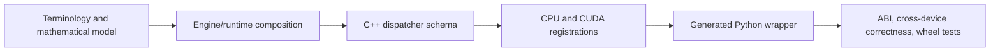

# Developer Guide

The Developer Guide explains how FHElium is implemented: Eager and Compile
execution, shared Backend operation dispatch, CPU and CUDA arithmetic,
distributed transport, reusable execution, persistent artifacts, live
Residency, source ownership, and contributor validation.

## Implementation map

<DocGrid>
  <DocCard
    title="Current source tree and ownership"
    description="Locate the Eager, Compile, Backend, native, runtime, storage, and distributed implementation owners and their focused tests."
    href="/developer/source-tree"
  />
  <DocCard
    title="Eager, Compile, and native execution"
    description="Follow both Python use models into shared Backend implementations, generated wrappers, torch.ops dispatch, CPU execution, and CUDA kernels."
    href="/developer/engine-native-stack"
  />
  <DocCard
    title="Arithmetic internals"
    description="Inspect RNS/NTT layouts, multiplication, key switching, rescale, compressed plaintexts, and bootstrapping."
    href="/developer/rns-and-ntt"
  />
  <DocCard
    title="Distributed internals"
    description="Trace torch.distributed initialization, value descriptors, payload collectives, limb reconstruction, and modular ciphertext reduction."
    href="/developer/distributed-internals"
  />
  <DocCard
    title="Buffers and CUDA Graphs"
    description="Inspect execution signatures, fixed-address value buffers, CUDA-event copy lifetime, graph capture, replay, and output ownership."
    href="/developer/execution-buffers-and-cuda-graphs"
  />
  <DocCard
    title="Compiler stack internals"
    description="Inspect neutral xDSL IR, Compile passes, Backend linking, and Experimental JIT runtime specialization."
    href="/developer/compiler-stack-internals"
  />
  <DocCard
    title="Compiler state and eager execution"
    description="Understand why compiler passes reason about CKKS state while Eager applies operation metadata directly and Backend kernels dispatch from Tensor dimensions."
    href="/developer/compiler-state-and-eager-execution"
  />
  <DocCard
    title="Operation declaration and implementation selection"
    description="Follow dialect-owned operation semantics, named lowerings, Backend registration, Compile assignments, Backend resolution, and Eager routing."
    href="/developer/operation-registration-and-selection"
  />
  <DocCard
    title="IR operation and implementation index"
    description="Map every registered IR operation to its lowering, CPU, CUDA, Triton, interpreter, direct, or value implementation owner."
    href="/developer/ir-operation-implementation-index"
  />
  <DocCard
    title="Storage and residency"
    description="Separate durable ArtifactStore generations from process-local live materializations, accounting, plans, leases, and admission."
    href="/developer/artifact-store-v1"
  />
</DocGrid>

## Contributor workflows

<DocGrid>
  <DocCard
    title="Contributor guide"
    description="Prepare the source tree, preserve state and numerical requirements, and select the relevant validation surface."
    href="/developer/contributing"
  />
  <DocCard
    title="Native operator workflow"
    description="Change one torch.ops schema coherently across Python, generated wrappers, CPU/CUDA registrations, kernels, and ABI tests."
    href="/developer/native-operator-workflow"
  />
  <DocCard
    title="Documentation workflow"
    description="Choose the right documentation family, preserve source ownership, and validate VitePress, Mermaid, generated API pages, and examples."
    href="/developer/documentation"
  />
  <DocCard
    title="Binary packaging and release"
    description="Build the declared Torch and CUDA wheel matrix, publish immutable artifacts and cumulative package indexes, and operate the self-hosted release workflow."
    href="/developer/binary-packaging-and-release"
  />
</DocGrid>

## Cross-layer rule

A native operation is implemented as one cross-layer path:

Changes to shape, mutation, row mapping, polynomial domain, modulus basis, or residue range must be
represented consistently at every layer.
Project vocabulary and equations are defined in
[Terminology and mathematical model](../concepts/terminology-and-mathematical-model.md).

## Start from an execution path

Before changing an implementation, trace one concrete path from its public
entry point to the storage or native operation that performs the work. Record:

- public method and typed input state;
- Python orchestration and parameter/table selection;
- `torch.ops` schema and CPU/CUDA registrations when native;
- tensor axes, mutation, allocation, thread, and stream behavior;
- source commit and loaded native ABI manifest;
- smallest correctness oracle and focused tests.

For numerical work, retain the preset, level, scale, NTT backend, and
first failing stage. Synchronize only around the suspected CUDA stage when
locating asynchronous failures.
