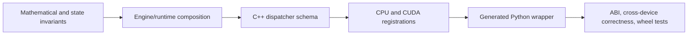

# Developer Guide

The Developer Guide explains how FHElium is implemented: Python CKKS
orchestration, PyTorch operator dispatch, CPU and CUDA arithmetic, distributed
transport, reusable execution, persistent artifacts, live Residency, JIT
lowering, source ownership, and contributor validation.

## Implementation map

<DocGrid>
  <DocCard
    title="Repository and implementation map"
    description="Locate values, engine algorithms, native registrations, runtime subsystems, generated interfaces, and focused tests."
    href="/developer/source-tree"
  />
  <DocCard
    title="Python-to-native execution stack"
    description="Follow the Python API, generated wrappers, torch.ops schemas, PyTorch dispatch, CPU/OpenMP execution, CUDA kernels, and native ABI loading."
    href="/developer/engine-native-stack"
  />
  <DocCard
    title="Arithmetic internals"
    description="Inspect RNS/NTT layouts, multiplication, key switching, rescale, compressed plaintexts, and bootstrapping."
    href="/developer/rns-and-ntt"
  />
  <DocCard
    title="Distributed internals"
    description="Trace torch.distributed initialization, exact-value descriptors, payload collectives, limb reconstruction, and modular ciphertext reduction."
    href="/developer/distributed-internals"
  />
  <DocCard
    title="Buffers and CUDA Graphs"
    description="Inspect exact execution signatures, fixed-address value buffers, CUDA-event copy lifetime, graph capture, replay, and output ownership."
    href="/developer/execution-buffers-and-cuda-graphs"
  />
  <DocCard
    title="JIT internals"
    description="Inspect the xDSL vocabulary, pass interfaces, executable schemas, readiness, and extension handling."
    href="/developer/unified-jit-internals"
  />
  <DocCard
    title="Storage and residency"
    description="Separate durable ArtifactStore generations from process-local live materializations, accounting, plans, leases, and admission."
    href="/developer/artifact-store-v1"
  />
</DocGrid>

## Contributor workflows

<DocGrid>
  <DocCard
    title="Contributor guide"
    description="Prepare the source tree, preserve state and numerical requirements, and select the relevant validation surface."
    href="/developer/contributing"
  />
  <DocCard
    title="Mathematical and state invariants"
    description="Use the canonical symbols, tensor axes, CKKS states, scale laws, and frontend-to-backend terminology."
    href="/developer/mathematical-notation-and-invariants"
  />
  <DocCard
    title="Native operator workflow"
    description="Change one torch.ops schema coherently across Python, generated wrappers, CPU/CUDA registrations, kernels, and ABI tests."
    href="/developer/native-operator-workflow"
  />
  <DocCard
    title="Documentation workflow"
    description="Choose the right documentation family, maintain source ownership, and validate VitePress, Mermaid, generated API pages, and examples."
    href="/developer/documentation"
  />
  <DocCard
    title="Binary packaging and release"
    description="Build the exact Torch and CUDA wheel matrix, publish immutable artifacts and cumulative package indexes, and operate the self-hosted release workflow."
    href="/developer/binary-packaging-and-release"
  />
</DocGrid>

## Cross-layer rule

A native operation is implemented as one cross-layer path:

Changes to shape, mutation, row mapping, polynomial domain, modulus basis, or residue range must be
represented consistently at every layer.

## Start from an execution path

Before changing an implementation, trace one concrete path from its public
entry point to the storage or native operation that performs the work. Record:

- public method and typed input state;
- Python orchestration and parameter/table selection;
- `torch.ops` schema and CPU/CUDA registrations when native;
- tensor axes, mutation, allocation, thread, and stream behavior;
- source commit and loaded native ABI manifest;
- smallest correctness oracle and focused tests.

For numerical work, retain the exact preset, level, scale, NTT backend, and
first failing stage. Synchronize only around the suspected CUDA stage when
locating asynchronous failures.
