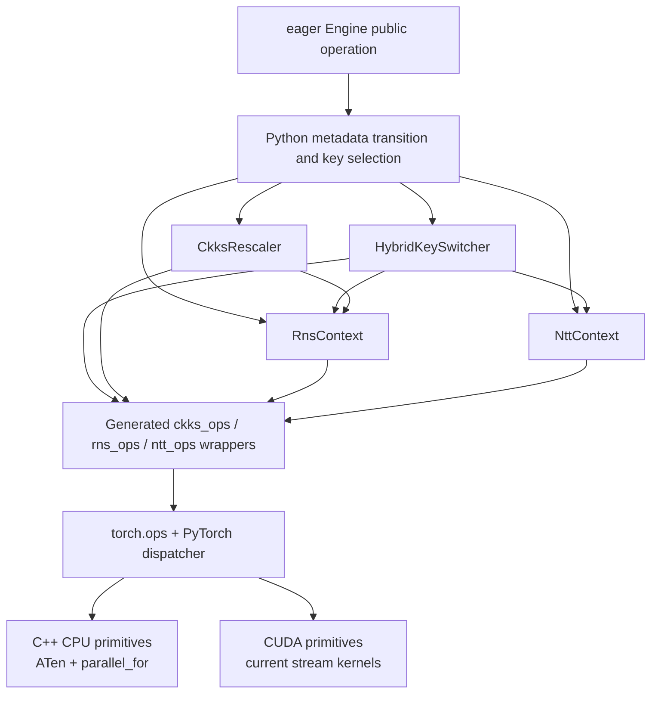
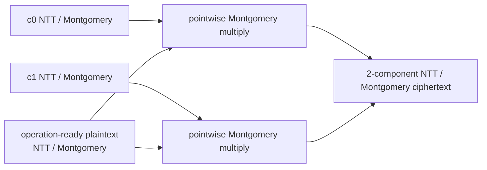
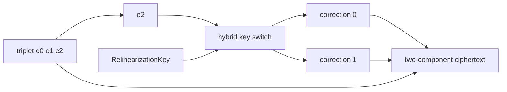
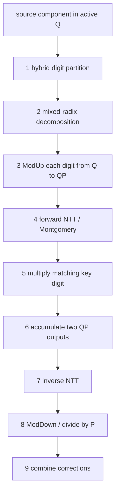
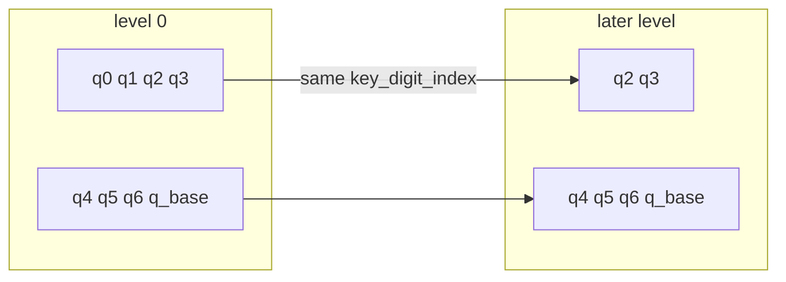
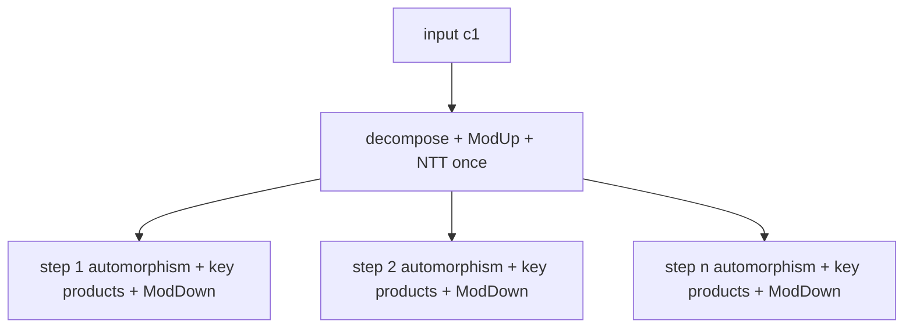
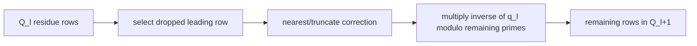

# Multiplication, key switching, and rescale

These paths combine many arithmetic stages and CKKS state transitions. They
are frequent correctness and performance hotspots because they depend on
active rows, hybrid digits, Q/QP conversion, NTT/Montgomery representation, and
large evaluation keys.

## Implementation stack



The engine owns public state transitions and output construction.
`HybridKeySwitcher` and `CkksRescaler` compose tensor stages in Python.
Pointwise RNS arithmetic and NTT transitions enter the `fhelium_rns_ops` and
`fhelium_ntt_ops` namespaces; Galois, key-switch accumulation, ModDown, and
rescale kernels enter `fhelium_ckks_ops`. CPU and CUDA registrations implement
the same schemas where the primitive is shared across devices.

## Plaintext multiplication

Conceptual data flow:



The output scale is multiplied, but level is unchanged until a rescale. `multiply_plaintext` does not perform hidden forward or inverse NTTs;
the caller or JIT places transitions around a multiplication region. Compatible
products may be added in NTT form and converted to coefficient-domain standard
residues once before rescale. Prepared plaintext reuse must match level, scale,
basis, prime IDs, domain, and residue representation exactly.

## Ciphertext multiplication

For two components $(c_0,c_1)$ and $(d_0,d_1)$:

$$
(e_0,e_1,e_2)=
(c_0d_0,\;c_0d_1+c_1d_0,\;c_1d_1).
$$

The engine requires compatible two-component NTT/Montgomery inputs and returns
a three-component NTT/Montgomery ciphertext. Relinearization is a later,
key-switch stage. Fresh direct-CKKS operands enter at scale $\Delta$;
the triplet carries scale $\Delta^2$, and rescale follows
relinearization.

## Relinearization



The original first two components are combined with corrections that replace
the $s^2$ dependency represented by `e2`. Coefficient output inverses all
required terms. NTT output inverses only `e2` for digit decomposition, retains
the first two components as evaluations, and adds NTT-domain corrections.

## Hybrid key-switch pipeline



Each stage has distinct row, basis, and representation requirements. Fusing stages may
be useful, but a fused operator must preserve the same observable state and
residue-range assumptions.

## Hybrid digits across levels

All Q primes, including the base prime, are partitioned into contiguous digits
of at most `num_p_primes` rows. The base prime can share the last digit with scale
primes. At later levels, an active digit can become shorter or disappear.



`RnsDigitSpec` keeps both the active digit index and stable level-zero
`key_digit_index` used to select the correct evaluation-key axis. A local digit
index is not necessarily the key tensor index.

The partition determines evaluation-key storage. Keys generated with the former
separate-base partition must be regenerated when the partition changes; their
digit axes cannot be reused with the new decomposition. Q/P primes, ciphertext
level and message scale are unchanged by this layout change.

## Rotation and hoisting

Rotation applies a Galois automorphism and then key-switches the transformed
secret dependency. For several steps on the same input component, preparation
can be shared:



Step-specific work and outputs remain. Hoist chunking must account for live
prepared digits, accumulators, rotated outputs, and key residency.

The native product accumulator can gather the prepared digit's NTT indices while
reading it. This combines the rotation-specific permutation with multiplication
by the key, avoiding a separate permuted-digit tensor. It changes neither the
key's row order nor the destination accumulator order.

### Keeping key-switch outputs in NTT representation

`Engine.rotate_with_key(..., output_domain="ntt")`,
`Engine.rotate_many_with_keys(..., output_domain="ntt")`, `relinearize`,
`switch_key`, `conjugate`, and the corresponding CKKS operation attributes
request NTT/Montgomery outputs. The default remains coefficient/standard. Both
choices preserve Q rows, level and actual scale.

The logical `rns.ModDownNttQpToQOp` removes P without inverting the Q rows. For
QP NTT data $\widehat{x}$, let $r\in[0,P)$ be the coefficient representative
reconstructed from the P residues. Then

$$
\widehat{y}_{q_i}
=\widehat{x}_{q_i}P^{-1}
+\operatorname{NTT}_{q_i}(-rP^{-1})\pmod{q_i}.
$$

This is coefficient-domain ModDown followed by forward NTT. The implementation
inverts only P rows, builds the correction in Q, and adds its forward transform
to the retained Q evaluations multiplied by $P^{-1}$. Shared rotations also
transform the input's $c_0$ once and permute those evaluations for each output.
The consumer can multiply these results by NTT plaintexts without another
coefficient-to-NTT transition. Output representation is a caller-selected part
of the operation, independent of CPU or CUDA execution.

An independent `rotate_with_key` may also consume NTT/Montgomery input. The
automorphism permutes both components in NTT representation; only the second
component is inverted for hybrid decomposition and key switching. When NTT
output is requested, the permuted first component remains in NTT and receives
the NTT-domain correction directly. This form is useful when both the producer
and consumer already use NTT values, but it is not assumed to be the fastest
form on every CPU and GPU workload.

For independent rotations with coefficient input, the $c_0$ contribution is
added to the coefficient correction before its forward NTT. Linearity gives
$\operatorname{NTT}(c_0+\delta)$ instead of separate transforms of $c_0$ and
$\delta$. The compact radix-2 implementation folds multiplication of the retained
Q evaluations by $P^{-1}$ and addition of the correction into the final NTT write.

The same NTT policy also supports streaming digit consumption: the last NTT
stages directly multiply the digit by both evaluation-key components and add
the products to QP accumulators. The digit scratch is disposable; its completed
NTT values are not written back. Each scratch is released before the next digit
is prepared. Other NTT policies retain their separate transform and product
implementation, with the same CKKS operation semantics.

## Rescale

For leading active prime $q_l$:

$$
c'\approx\operatorname{round}(c/q_l)\pmod{Q_{l+1}}.
$$



The implementation must select constants using configured prime identity, not
an ambiguous compact row position. Output metadata must increase level, remove
the dropped prime ID, reduce row count, and update scale.

NTT/Montgomery input can remain in that representation. The implementation
inverts only the dropped row to obtain the rounding value, forms the quotient
correction on surviving Q rows, transforms that correction, and adds it to the
surviving evaluations multiplied by $q_l^{-1}$. This is congruent to
coefficient rescale followed by a forward NTT without inverting the surviving
input rows.

## Correctness hazards

High-risk errors include:

- using local row count to infer the wrong configured modulus;
- selecting the wrong key digit after earlier primes are dropped;
- mixing Q and QP parameter rows;
- applying NTT tables for another active slice/device;
- treating singleton digits as a normal full group;
- violating lazy/standard residue-range assumptions across fused operators;
- copying or overwriting staged data before another stream/device is done;
- reconstructing correct tensor values with wrong public metadata.

## Validation matrix

For a change in these paths, cover:

```text
fresh single operation
chained operation across several levels
level 0 / middle / last legal level
single-row digit and shortened digit
Q / QP
2 / 3 components
functional / in-place
multiple NTT backends
logN = 14 smoke and target logN = 15 or logN = 16
source build and installed wheel
world size 1 and 2+ if transport/partition is involved
```

Decrypt after every legal materialization step to localize the first
incorrect stage.

## Continue

- [Scale and level lifecycle](../concepts/ckks/scale-and-level-lifecycle.md)
- [RNS and NTT architecture](rns-and-ntt.md)
- [Native operator workflow](native-operator-workflow.md)
- [Evaluator operation transitions](../concepts/ckks/evaluator-operation-transitions.md)
- [Rotation-hoisting tutorial](../tutorial/rotation-hoisting.md)

## Source map

| Path | Source owner |
| --- | --- |
| Public multiplication, relinearization, rotation, and plaintext calls | `fhelium/eager/_engine.py` |
| Hybrid decomposition, ModUp, key products, and ModDown | `fhelium/backend/rns/`, `fhelium/backend/ckks/rotation/` |
| Whole-operation streaming implementations | `fhelium/backend/ckks/operations.py` |
| Rescale resources and quotient construction | `fhelium/backend/ckks/resources.py`, `fhelium/backend/ckks/operations.py` |
| RNS/NTT arithmetic and active parameters | `fhelium/backend/rns/context.py`, `fhelium/backend/ntt/` |
| CKKS-local operator schemas | `csrc/ops/ckks/ckks.cpp` |
| CPU CKKS tensor primitives | `csrc/ops/ckks/cpu/ckks_cpu.cpp` |
| CUDA Galois, key-switch, plaintext, and rescale kernels | `csrc/ops/ckks/cuda/` |
