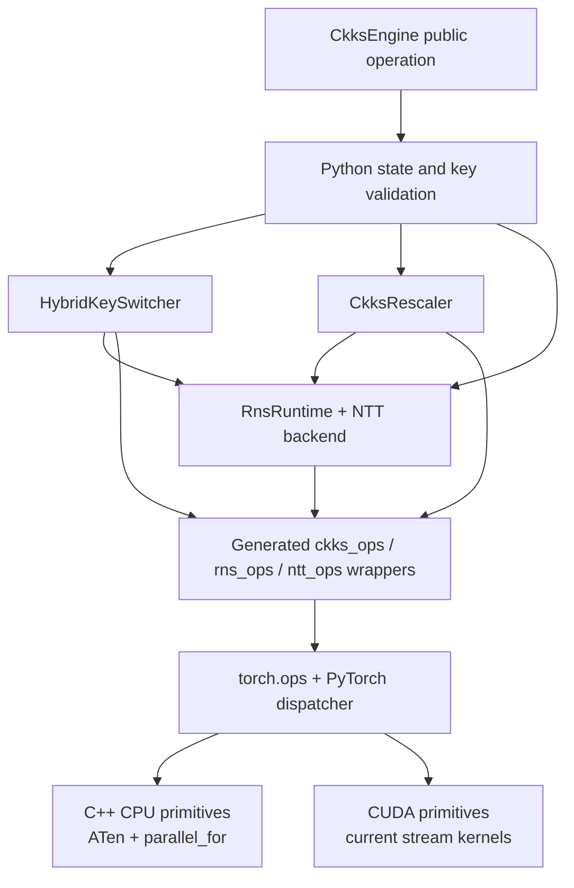
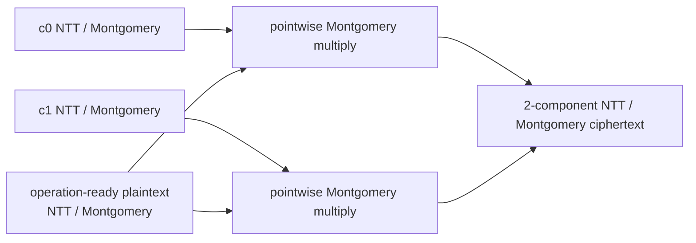
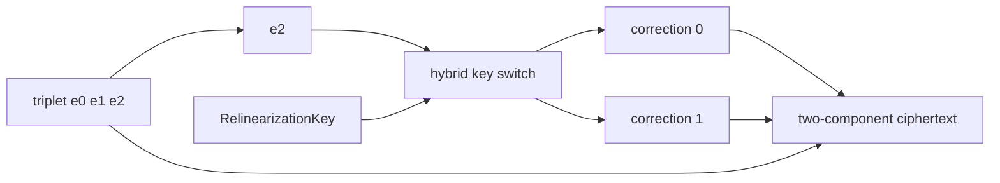
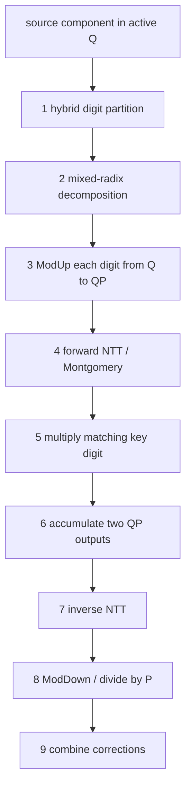
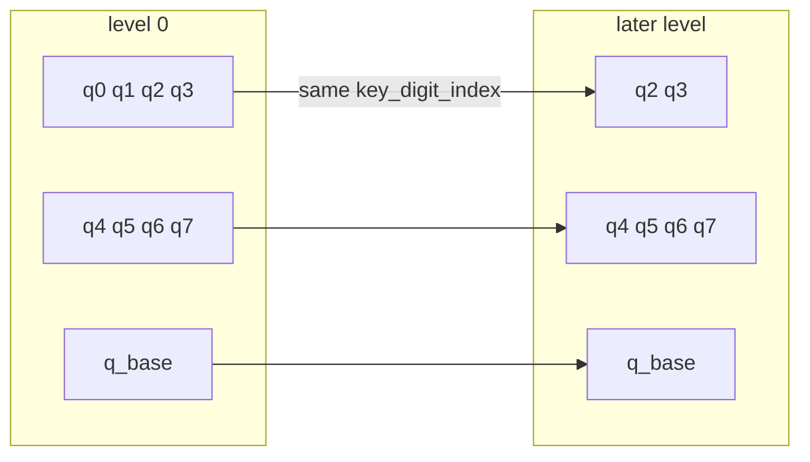
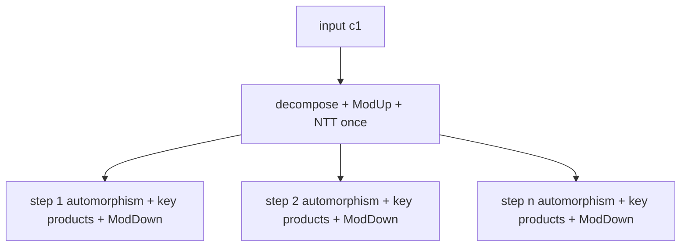
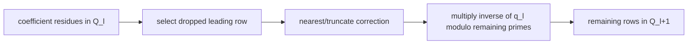

# Multiplication, key switching, and rescale

These paths combine many arithmetic stages and exact-state transitions. They
are frequent correctness and performance hotspots because they depend on
active rows, hybrid digits, Q/QP conversion, NTT/Montgomery representation, and
large evaluation keys.

## Implementation stack



The engine owns public state transitions and output construction.
`HybridKeySwitcher` and `CkksRescaler` compose tensor stages in Python.
Pointwise RNS arithmetic and NTT transitions enter the `fhelium_rns_ops` and
`fhelium_ntt_ops` namespaces; Galois, key-switch accumulation, ModDown, and
rescale kernels enter `fhelium_ckks_ops`. CPU and CUDA registrations implement
the same schemas where the primitive is shared across devices.

## Plaintext multiplication

Conceptual data flow:



The output scale is multiplied, but level is unchanged until a rescale. `multiply_plaintext` does not perform hidden forward or inverse NTTs;
the caller or JIT places transitions around a multiplication region. Compatible
products may be added in NTT form and converted to coefficient-domain standard
residues once before rescale. Prepared plaintext reuse must match level, scale,
basis, prime IDs, domain, and residue representation exactly.

## Ciphertext multiplication

For two components $(c_0,c_1)$ and $(d_0,d_1)$:

$$
(e_0,e_1,e_2)=
(c_0d_0,\;c_0d_1+c_1d_0,\;c_1d_1).
$$

The engine requires compatible two-component NTT/Montgomery inputs and returns
a three-component NTT/Montgomery ciphertext. Relinearization is a later,
key-switch stage. Fresh direct-CKKS operands enter at scale $\Delta$;
the triplet carries scale $\Delta^2$, and rescale follows
relinearization.

## Relinearization



The original first two components are combined with corrections that replace
the $s^2$ dependency represented by `e2`.

## Hybrid key-switch pipeline



Each stage has distinct row, basis, and representation requirements. Fusing stages may
be useful, but a fused operator must preserve the same observable state and
residue-range assumptions.

## Hybrid digits across levels

Scale Q primes are partitioned into composite digits, while the base Q prime is
a final singleton digit. At later levels, an active digit can become shorter or
disappear.



`RnsDigitSpec` keeps both the active digit index and stable level-zero
`key_digit_index` used to select the correct evaluation-key axis. A local digit
index is not necessarily the key tensor index.

## Rotation and hoisting

Rotation applies a Galois automorphism and then key-switches the transformed
secret dependency. For several steps on the same input component, preparation
can be shared:



Step-specific work and outputs remain. Hoist chunking must account for live
prepared digits, accumulators, rotated outputs, and exact key residency.

## Rescale

For leading active prime $q_l$:

$$
c'\approx\operatorname{round}(c/q_l)\pmod{Q_{l+1}}.
$$



The implementation must select constants using canonical prime identity, not
an ambiguous compact row position. Output metadata must increase level, remove
the dropped prime ID, reduce row count, and update scale.

## Correctness hazards

High-risk errors include:

- using local row count to infer the wrong canonical modulus;
- selecting the wrong key digit after earlier primes are dropped;
- mixing Q and QP parameter rows;
- applying NTT tables for another active slice/device;
- treating singleton digits as a normal full group;
- violating lazy/canonical residue assumptions across fused operators;
- copying or overwriting staged data before another stream/device is done;
- reconstructing correct tensor values with wrong public metadata.

## Validation matrix

For a change in these paths, cover:

```text
fresh single operation
chained operation across several levels
level 0 / middle / last legal level
single-row digit and shortened digit
Q / QP
2 / 3 components
functional / in-place
multiple NTT backends
logN = 14 smoke and target logN = 15 or logN = 16
source build and installed wheel
world size 1 and 2+ if transport/partition is involved
```

Decrypt after every legal materialization step to localize the first
incorrect stage.

## Continue

- [Scale and level lifecycle](../concepts/ckks/scale-and-level-lifecycle.md)
- [RNS and NTT architecture](rns-and-ntt.md)
- [Native operator workflow](native-operator-workflow.md)
- [Evaluator operation transitions](../concepts/ckks/evaluator-operation-transitions.md)
- [Rotation-hoisting tutorial](../tutorial/rotation-hoisting.md)

## Source map

| Path | Source owner |
| --- | --- |
| Public multiplication, relinearization, rotation, and plaintext calls | `fhelium/engine/ckks_engine.py` |
| Hybrid decomposition, ModUp, prepared rotations, key products, ModDown | `fhelium/engine/hybrid_keyswitch.py` |
| Direct fused key-digit consumption | `fhelium/engine/direct_keyswitch_consumer.py` |
| Rescale state validation and quotient construction | `fhelium/engine/ckks_rescale.py` |
| RNS/NTT arithmetic and active parameters | `fhelium/engine/rns/runtime.py`, `fhelium/engine/ntt/` |
| CKKS-local operator schemas | `csrc/ops/ckks/ckks.cpp` |
| CPU CKKS tensor primitives | `csrc/ops/ckks/cpu/ckks_cpu.cpp` |
| CUDA Galois, key-switch, plaintext, and rescale kernels | `csrc/ops/ckks/cuda/` |
