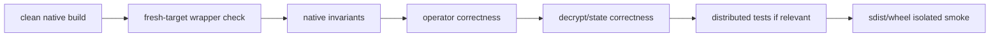

# Native operator workflow

Add or modify a native operator from the public mathematical specification
outward. One operator uses a backend-neutral schema and device-specific
registrations; its Python semantics, dispatcher mutation rules, row mapping,
CPU implementation, CUDA implementation, generated wrappers, and tests must
agree wherever those backends are supported.

## 1. Define the operation requirements first

Write down:

```text
mathematical operation
input/output tensor shapes and axes
dtypes and devices
level and active prime-row mapping
Q or QP basis
coefficient/NTT domain
standard/Montgomery representation
canonical or lazy residue range
functional or mutating behavior
supported singleton/partial-layout cases
```

Decide which layer reconstructs public output metadata and which invalid inputs
must fail before native launch.

## 2. Add a deterministic public reproducer

Before editing CUDA, create a minimal test/harness that:

- builds a fixed preset and indexed device;
- reaches the target operation through public state transitions;
- compares against a cleartext or trusted reference;
- checks output state as well as tensor values;
- identifies the first failing operation/level;
- synchronizes narrowly enough to locate asynchronous errors.

For a chained bug, add checkpoints after every legal materialization step.

## 3. Define or update the dispatcher schema

The C++ registration layer owns:

- operator namespace and name;
- argument and return schema;
- device implementation registration;
- mutation and alias annotations;
- pre-launch shape/dtype/device checks.

Use a trailing underscore and correct alias schema for mutating operators. Do
not make a functional name mutate storage silently.

Names should describe mathematical/state transitions; backend execution policy
such as grouping or shared-memory strategy belongs at the backend/operator
variant layer rather than public CKKS semantics.

## 4. Implement the selected device paths

Pass operand, table, and parameter tensors. Avoid hidden device-global context whose
state cannot be represented in the dispatcher schema.

For CPU support, register the schema under the `CPU` dispatch key and use ATen
tensor accessors, integral dtype dispatch, and `at::parallel_for` where the
work size justifies intra-op parallelism. Compile against the parallel backend
selected by the installed Torch package; do not introduce an independent FHElium
thread pool or link a second OpenMP runtime.

For CUDA support, register the same schema under the `CUDA` dispatch key. The
C++ adapter validates the tensors before launch; the CUDA implementation uses
the operand device and PyTorch's current CUDA stream. Do not add a hidden host
copy or a device fallback to make a schema appear portable.

Audit:

- canonical prime row for every compact input row;
- level-specific table/parameter offsets;
- Q/QP row order;
- key-digit index versus active local digit index;
- tensor strides and contiguous assumptions;
- current CUDA stream behavior;
- temporary ownership and lifetime;
- lazy/canonical residue preconditions and outputs;
- integer overflow and modular reduction bounds.

If an operation is intentionally supported by only one backend, document that
support in its Python owner and tests. Missing CPU or CUDA registration must
fail through normal PyTorch dispatch or the engine's backend validation rather
than execute a different algorithm silently.

## 5. Build from a clean enough state

The repository provides direct build/install recipes through `just`:

```bash
just clean-build
just build
```

or an editable installation with the configured build backend:

```bash
just install-uv
```

Set the intended native build when backend coverage matters:

```bash
just install NATIVE_BACKENDS=CPU
just install NATIVE_BACKENDS=CPU+CUDA
```

Use the project environment and the selected Python/Torch/CUDA toolchain.
Confirm which shared library Python actually loads and which native backends
its ABI manifest records.

## 6. Regenerate and check wrappers

Generated wrapper files live under `fhelium/native/wrapper/`. After compiled
schemas are available, generate or verify them through the generator rather
than editing files manually:

```bash
python scripts/generate_native_wrappers.py \
  --path fhelium/native/torchops

python scripts/generate_native_wrappers.py \
  --path fhelium/native/torchops \
  --check
```

The direct script is the canonical invocation; it is deliberately outside the
runtime package so generating wrappers never imports a partially initialized
`fhelium.native.wrapper` package. Callable wrappers retain `require_native()`
guards, resolved lazily at call time. The generated FakeTensor registration
module omits that import and is loaded by `fhelium.native` only after `_ops` has
registered its schemas.

For a configured CMake tree, prefer its fresh-target check:

```bash
cmake --build <build-directory> --target native_wrappers_check
```

That target depends on `_ops`, so the schemas being compared cannot come from
an unrelated installed extension. Adjust paths only if a direct invocation
uses a different compiled-op directory.

## 7. Run the validation ladder



At minimum run the focused tests and then the broader relevant suite. Include:

- output shape/dtype/device;
- mutation/alias behavior;
- fake/meta behavior where registered;
- level zero, middle, and final legal level;
- Q and QP;
- singleton row/digit;
- functional and in-place variants;
- CPU/CUDA parity for every shared schema;
- CPU thread-count coverage for parallel kernels;
- current-stream execution and asynchronous error localization on CUDA;
- multiple `logN` values and NTT policies;
- chained evaluator correctness;
- source build and installed wheel import.

## 8. Profile only after correctness

Profile the actual target shape and surrounding workload. Report whether a
kernel change alters:

- launch count;
- global-memory traffic;
- register/shared-memory pressure;
- temporary/live memory;
- end-to-end operator or workload latency.

Do not claim an application speedup from a microbenchmark alone.

## 9. Keep generated and derived artifacts clean

Before review:

```bash
git status --short
git diff --check
```

Ensure wrapper diffs are intentional, build products are not accidentally
tracked, and source/build/wheel tests use matching commits.

## 10. Document the operation

Update:

- public docstring when the behavior is public;
- Developer Guide if architecture or invariants changed;
- tests describing edge cases;
- benchmark profile/report if performance policy changed;
- changelog/release notes when user-visible.

## Related documentation

- [Python-to-native execution stack](engine-native-stack.md)
- [RNS and NTT architecture](rns-and-ntt.md)
- [Multiplication, key switching, and rescale](multiplication-keyswitch-rescale.md)
- [Diagnose a value-state mismatch](../how-to/diagnose-value-state-mismatch.md)
