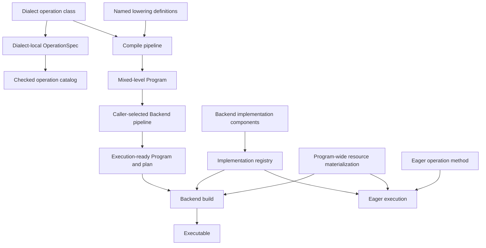

# Operation declaration and implementation selection

FHElium represents work at several intermediate representation (IR) abstraction levels. A source operation may stay at its current level for a whole-operation implementation, or a Compile pass may replace it with lower-level operations.

Operation declarations define meaning, lowering recipes define rewrites, and Backend implementations define execution.

## Responsibility map



The responsibilities are:

| Owner | Responsibility |
| --- | --- |
| IR dialect | Operation structure, value types, attributes, local meaning, effect, and local diagnostics |
| Compile lowering | A named transformation from one operation to lower-level IR |
| Compile Backend-assignment pass | A caller-selected implementation requirement recorded in serializable IR |
| Backend execution pass | Execution validation, Program-wide resource materialization, and binding |
| Backend implementation | Tensor execution of one or more operation classes under one stable name |
| Backend registry | Candidate storage, duplicate detection, and resolution by operation and name |
| Eager | Fixed CKKS configuration, device-local resources, per-method operation choice, key lifecycle, and public value transitions |
| Native dispatcher | Torch operator schemas and CPU/CUDA kernel dispatch below the IR Backend |

IR dialects depend on operation and type infrastructure. Backend assembly constructs registries from supplied implementation objects in a stable order.

## Operation declarations

An xDSL operation class defines operands, results, attributes, traits, and textual name in its dialect module. The same module contributes an immutable `OPERATION_SPECS` tuple. An `OperationSpec` records the operation family, effect, supported roles, and local diagnostics needed by executable consumers.

For example, CKKS operation classes and their specifications live in:

```text
fhelium/ir/dialects/ckks.py
```

RNS and NTT use the corresponding modules:

```text
fhelium/ir/dialects/rns.py
fhelium/ir/dialects/ntt.py
```

`fhelium/ir/_operation_specs.py` assembles the dialect tuples in a deterministic order. During import it compares the names in every first-party `Dialect.operations` list with the names in the dialect-owned specifications. A missing or extra specification raises an error before `DEFAULT_OPERATION_SPECS` is constructed.

This arrangement keeps three properties separate:

- an operation class defines IR structure;
- its dialect owns the operation's local semantic description;
- the aggregate catalog checks coverage and provides lookup.

Permissive `Program` parsing preserves unknown vendor operations. A consumer requests catalog entries when it applies FHElium semantic knowledge.

## Named lowering recipes

A lowering recipe is a named function that replaces one operation with lower-level IR. `CkksLoweringDefinition` records:

```text
(lowering name, source operation class, lowering function, default status)
```

The declaration is stored beside the function that performs the rewrite:

```text
fhelium/compile/passes/lowering/_arithmetic.py
fhelium/compile/passes/lowering/_representation.py
fhelium/compile/passes/lowering/_keyswitch.py
```

These modules export `ARITHMETIC_LOWERINGS`, `REPRESENTATION_LOWERINGS`, and `KEY_SWITCH_LOWERINGS`. `fhelium/compile/passes/lowering/_driver.py` concatenates those definition tuples when it constructs `DEFAULT_CKKS_LOWERINGS`.

`CkksLoweringRegistry` indexes each definition by:

```text
(source operation class, lowering name)
```

Several recipes may therefore target the same source operation. One recipe may be marked as the default. If several candidates exist without a default, the caller supplies the recipe name.

### Preserve or lower

`LowerCkksToRnsNttPass` exposes three controls:

- the default recipe declared for each operation;
- `selections`, which maps an operation name to a named recipe;
- `preserve`, which leaves selected CKKS operations in the Program.

For example:

```python
from fhelium import compile as fh_compile
from fhelium import ir

pipeline = fh_compile.Pipeline(
    (
        fh_compile.LowerCkksToRnsNttPass(
            selections={
                "fhelium_ckks.rescale": "rns-drop-leading-prime",
            },
            preserve={"fhelium_ckks.multiply"},
        ),
    )
)
```

Pipeline composition and pass parameters determine which operations are lowered. Unhandled operations stay in mixed-level IR. The pass records each selected recipe or preservation decision in its report.

An operation carrying `fhelium.execution.implementation` stays at its current
level through `preserve`. Lowering rejects an assigned source operation so the
recorded Backend choice cannot be erased by a rewrite.

CPU, CUDA, Triton, and native-kernel selection occurs after the rewritten Program has recorded the chosen composition through its result operations.

## Backend implementations

A Backend implementation class declares its identity and operation classes
beside its execution code:

```text
name
operation_types
```

The identity used for candidate lookup is:

```text
(operation class, implementation name)
```

Built-in implementations are organized by the operation's mathematical or
runtime category. `native` describes the numerical kernel within that category;
Tensor and resource placement determines device dispatch:

```text
fhelium/backend/
├── ckks/
│   ├── operations.py     # whole-operation CKKS implementations
│   ├── materialization.py # device-local reusable resource construction
│   ├── rescale.py        # CKKS rescale implementation
│   └── resources.py      # rescale and key-switch table owners
├── rns/
│   ├── context.py        # device-local RNS parameters and arithmetic
│   ├── resources.py      # RNS resource kind
│   └── operations.py     # RNS arithmetic primitives
├── ntt/
│   ├── context.py        # NTT policy, tables, executor, and transforms
│   ├── resources.py      # NTT resource kind
│   └── operations.py     # NTT transitions
├── memory/
│   ├── operations.py
│   └── resources.py
├── distributed/
│   ├── operations.py
│   └── resources.py
├── planning.py            # Program-wide implementation and resource plan
└── assembly.py           # built-in registry construction
```

Backend-stage passes live under `fhelium/compile/passes/backend/` with the
other caller-composable Compile passes.

`backend/assembly.py` constructs one `OperationImplementationRegistry`. An
`OperationBackend` combines that registry with an immutable Backend workspace
and lets its linking pipeline materialize and match the remaining Program-wide
environment. Each class's
`operation_types` tuple defines its operation association, regardless of whether
the operation belongs to the CKKS, RNS, NTT, or another dialect.

Every operation implementation uses the same execution interface:

```text
name
operation_types
supports_in_place
resource_requirements(invocation)
execute(invocation, Tensor payloads, BoundResources, in_place) -> Tensor payloads
```

The operation class identifies its abstraction level. A preserved
`fhelium_ckks.multiply`, a lowered `fhelium_rns.montgomery_multiply`, and an
NTT operation are therefore ordinary entries in the same registry; the
registry does not add another execution-route category.

Encode, decode, encrypt, decrypt, and integer-coefficient conversion also use
this Tensor execution interface. Eager adapts public `Message`, `Plaintext`,
`Ciphertext`, and key objects to Tensor payloads and concrete resources before
execution, then constructs the public result. These public-object adapters are
not a second Backend ABI or registry. Key generation remains a resource-creation
operation owned by stateless material factories. The codec, encryption,
decryption, and key-generation algorithms receive the selected device's RNS,
NTT, random-stream, reconstruction, and key resources at each binding; none
owns a fixed Engine device.

The registered boundary implementations live with their algorithms:

```text
fhelium/backend/ckks/codec/_implementation.py
fhelium/backend/ckks/crypto/_encryption.py
fhelium/backend/ckks/crypto/_decryption.py
fhelium/backend/ckks/crypto/_key_generation.py
```

Registry construction consumes implementation contributions in a declared
order. Duplicate operation/name identities are rejected. When several
names are available, selection requires an implementation name.

## Compile implementation assignments

`AssignImplementationsPass` writes a requested name on each operation matched by textual operation name:

```python
pipeline = fh_compile.Pipeline(
    (
        fh_compile.AssignImplementationsPass(
            {
                "fhelium_rns.rescale_drop_leading_prime": "native-rescale",
            }
        ),
    )
)
```

The resulting IR attribute is:

```text
fhelium.execution.implementation
```

The pass records names and reports its assignments while remaining locally
applicable to a mixed-level Program. Backend construction checks the registered
implementation and its bound resources. An execution owner assembles a registry
containing the implementations available for its device resources.

`AssignNttImplementationPass(name)` is a thin convenience pass for the four registered NTT operations:

```python
pipeline = fh_compile.Pipeline(
    (
        fh_compile.LowerCkksToRnsNttPass(),
        fh_compile.AssignNttImplementationPass("radix2_indexed"),
    )
)
```

The NTT implementation name is the executor identity owned by `NttContext`, such as `radix2_indexed` or a compact fixed-radix name. A registry created for one selected executor advertises that executor. Assigning another name produces a Backend build error.

A custom pass may assign different names to individual operation instances. `AssignImplementationsPass` provides the common operation-name mapping; pass authors may implement finer-grained assignment rules.

## Backend resolution

The operation builder consults the assignment recorded on every operation. If
no assignment is present, exactly one registered implementation must be
available; ambiguity stops construction.

A caller-composed Backend-stage pipeline has three required stages:

1. `ResolveBackendOperationsPass` scans the Program without lowering it,
   rejects unsupported operations, and records each resolved implementation in
   a `ProgramDispatchTable`;
2. `InitializeResourceBindingsPass` starts this build from its base live
   resource table rather than bindings retained by an earlier build;
3. `LinkProgramPass` resolves each `MaterialRefOp` from the Compilation's
   `ConstantBundle` plus Backend material overrides, matches every
   `ResourceRefOp` and implementation-owned
   `ResourceRequirement` against the supplied `ResourceBindings`, prelinks the
   Program-wide resource table, and produces `ProgramExecutable`.

`OperationBackend` owns an immutable `BackendWorkspace` containing ordinary
keys, named low-level resources, one optional resource materializer, and
material overrides. `InitializeResourceBindingsPass` starts each link from
that workspace's named-resource table. `BindCkksKeysPass` may then run after
resolution. It accepts ordinary CKKS key objects and matches the key roles
required by the current Program. Rotation-key
resource operands match by their represented rotation step. Other concrete key
kinds match when one unbound role remains; multiple same-kind roles require
caller-named low-level bindings.
Participant and user identities remain in caller-owned key selection.

`MaterializeResourcesPass` may also run between resolution and linking when an
execution owner wants to construct missing RNS, NTT, codec, or key-switch
resources. It adds live bindings. Program linking checks the final set and
rejects absent material/resource symbols and resource-kind mismatches.
`BoundResource` and
`ResourceBindings` represent the matched, low-level execution environment.
Linked materials enter SSA execution as ordinary Tensor or value operands.

Compile lowering and other Program transformations run before Backend
resolution. A Program may retain any IR level covered by the selected Backend.
`ResolveBackendOperationsPass` scans that Program and reports unsupported
operations while preserving the IR. Live Python and Tensor resources stay in
`BackendWorkspace`, build-local linking state, and the executable.
`OperationBackend.link()` runs against a shallow copy of Compile workspace data;
the source Compilation retains its Program and durable workspace entries.

```python
operation_backend = OperationBackend(
    keys=rotation_keys,
    materializer=device_resources,
)
executable = operation_backend.link(compilation)
result = executable.run(*inputs)
```

An advanced caller may pass a complete pipeline to `link()`. The standard
ordering is available as `backend_linking_pipeline(operation_backend)`; a
caller-supplied pipeline replaces that ordering rather than extending it
implicitly.

The materializer receives the deduplicated missing requirement set once for the
whole Program. Implementations may describe operation-local requirements, but
they do not initialize or link resources during dispatch. Without a
materializer, the materialization stage is omitted.

An absent or ambiguous implementation stops resolution. A missing material or
resource, or a resource kind mismatch, stops linking. The executable retains
the dispatch table and uses prelinked resource indices during invocation.
Runtime Tensor placement selects PyTorch CPU or CUDA dispatch.

The path for a lowered CKKS rescale is therefore:

```text
fhelium_ckks.rescale
  -- rns-drop-leading-prime -->
fhelium_rns.rescale_drop_leading_prime
  -- native-rescale on CPU or CUDA -->
NativeRescaleImplementation
  --> torch.ops.fhelium_ckks_ops rescale kernel
```

A pipeline may preserve `fhelium_ckks.rescale` and assign a whole-operation implementation while this lowering remains available to another pipeline.

## Eager operation selection

`fhelium.eager.Engine` owns one CKKS configuration and lazily constructed
device-local state. Each device state contains one shared `OperationBackend`
plus Eager-only direct-dispatch, key, and random-stream state. Evaluator methods do
not construct an IR Program. Each method chooses the registered operation it
needs and calls:

```python
self._execute(operation_type, *tensor_payloads, ...)
```

The chosen operation type states the decision. Calling
`fhelium_ckks.multiply` selects a whole CKKS operation implementation; calling
`fhelium_rns.add_standard` selects the RNS operation. The Backend does not
infer a lowering route and does not substitute another operation.

Compile or JIT callers execute Programs by choosing lowering and implementation
assignments, assembling an `OperationBackend`, and calling
`OperationBackend.link()` with its workspace or a caller-selected linking
pipeline. An implementation
recorded in the Program remains a hard constraint. Hoisted multi-rotation is a
caller- or pass-selected CKKS schedule, and Backend executes the recorded
group.

Eager encode, decode, encrypt, decrypt, and integer-to-RNS methods adapt public
objects at the Engine interface. Factory calls accept a target `device`;
ordinary operations select resources from the first Tensor operand and pass
all operands to Torch/native execution without an Engine placement precheck.
Their numerical work is dispatched through the same operation registry.
Material factories create keys from the selected device's
`KeyGenerationResource`. Cross-device key replication is disabled by default
and must be enabled on the Engine or performed by the caller.

## Native dispatcher registration

The IR Backend eventually calls generated Python wrappers for `torch.ops` schemas. Native C++ registers schemas in backend-neutral translation units and registers device kernels beside the device implementation:

```cpp
TORCH_LIBRARY_FRAGMENT(fhelium_ckks_ops, m) {
    // schema
}

TORCH_LIBRARY_IMPL(fhelium_ckks_ops, CPU, m) {
    // CPU kernel
}

TORCH_LIBRARY_IMPL(fhelium_ckks_ops, CUDA, m) {
    // CUDA kernel
}
```

Torch's dispatcher selects CPU or CUDA from Tensor devices. An IR implementation may compose several Torch operators, and one Torch operator may have separate CPU and CUDA kernels.

## Add an operation

1. Define the xDSL operation class in its dialect module.
2. Add it to that module's `Dialect.operations` list.
3. Add one dialect-local `OperationSpec` to `OPERATION_SPECS`.
4. Add a structural and diagnostic test. The aggregate catalog check rejects an omitted specification.
5. Add the operation to the [IR operation and implementation index](./ir-operation-implementation-index.md).

Keep the dialect declaration dependent on IR types and attributes; connect execution through a Backend implementation.

## Add a lowering

1. Implement the rewrite in the source-family lowering module.
2. Declare a `CkksLoweringDefinition` beside the function with a stable name.
3. Add the definition to that module's immutable definition tuple.
4. Mark it as the default only when unqualified lowering should select it.
5. Test named selection, resulting IR, preservation behavior, and pass reports.
6. Update the operation index with the recipe name and result operations.

A second recipe for the same source operation uses another name, so callers can select either definition.

## Add an implementation

1. Implement the Tensor operation interface in the relevant Backend family module.
2. Declare `name` and `operation_types` on the implementation.
3. Contribute the implementation object to the Backend assembly tuple.
4. State every required resource through `resource_requirements`.
5. Test candidate discovery, ambiguity, named resolution, manifest identity,
   and CPU/CUDA behavior where applicable.
6. Update the operation index with the implementation name and source path.

Add the implementation object to the owning assembly function.
