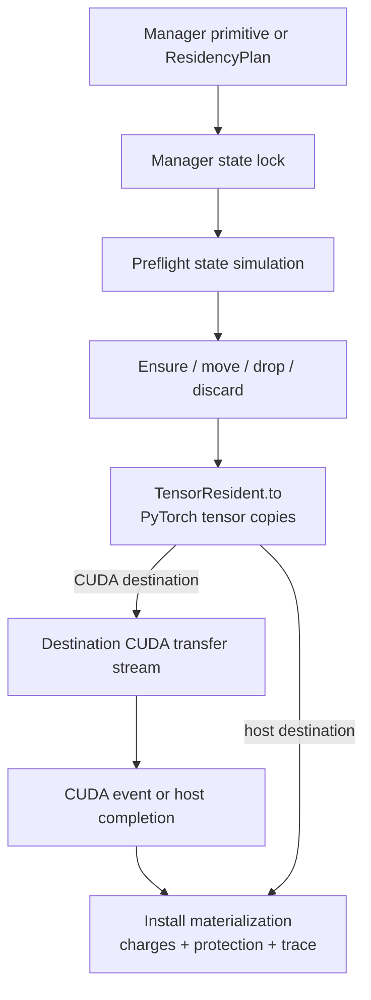
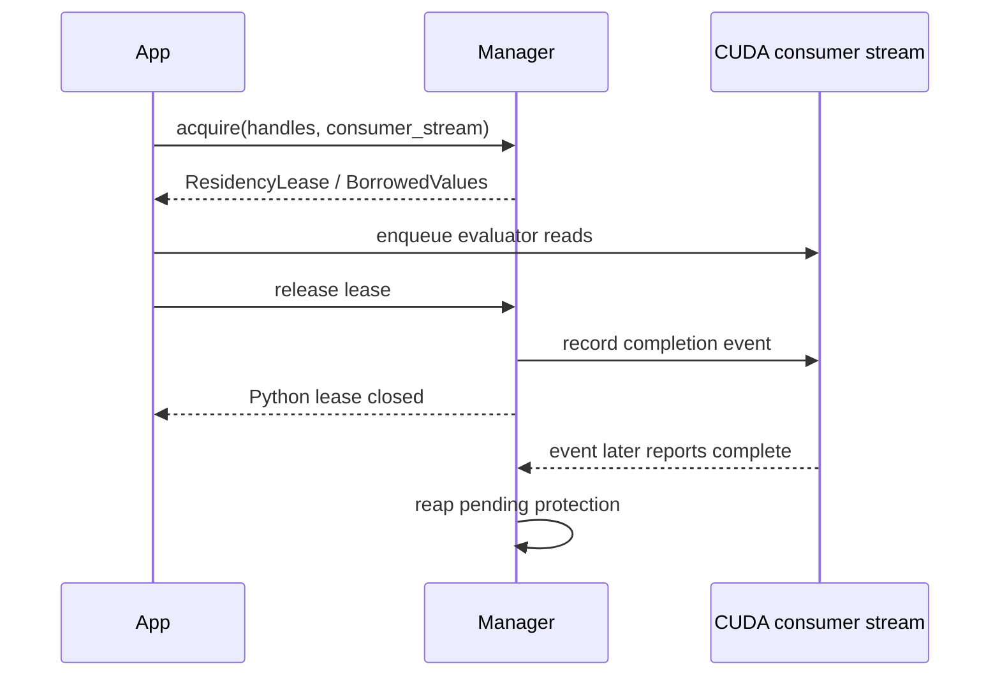
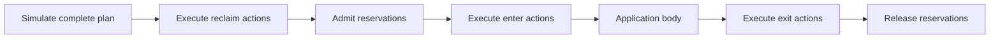

# Residency plans and execution internals

The stable residency runtime applies local materialization
transitions with complete byte accounting, optional per-location admission
budgets, and lifetime protection. It provides ordered plan intermediate
representation (IR), dry-run explanations, event-backed CUDA leases, scoped
accounting reservations, snapshots, and transition traces.

The underlying handle and ownership invariants are defined in
[Residency state and ownership internals](residency-state-and-ownership.md).

## Transition execution stack

The manager interprets each ordered `ResidencyPlan` in Python: it simulates
actions against locked manager state, then executes ordinary
`TensorResident.to(...)` movement, records CUDA completion where applicable,
and commits each successful materialization/accounting transition. Native CKKS
kernels consume a materialization only through a later lease and ordinary
engine call.

## Primitive transition semantics

`ResidencyManager` exposes four primitive operations. Each public method
constructs and executes the corresponding low-level action:

| Method | IR action | Execution behavior |
| --- | --- | --- |
| `ensure(handle, at)` | `EnsureResident` | Keep existing replicas and install the managed value at `at`. It is a no-op if already resident and rejects replication of a currently materialized `EXCLUSIVE` value. |
| `move(handle, to, from_location=...)` | `MoveResident` | Install at `to`, then remove the selected source. It is a no-op if the destination is already the only materialization. |
| `drop(handle, at)` | `DropResident` | Remove one unprotected materialization while retaining the managed value. It is a no-op if already absent and rejects loss of the final `MUST_PRESERVE` copy. |
| `discard(handle)` | `DiscardValue` | End the managed value, remove all unprotected materializations and its source, and retain the opaque handle for discarded-state diagnostics. |

Source selection is deterministic when omitted: pageable host precedes pinned
host, followed by indexed CUDA locations. An explicit source must exist, and
the action always supplies its destination.

Host materialization is synchronous. CUDA materialization selects the supplied
copy stream or current stream on the destination device, enqueues functional
movement, records completion, and synchronizes that copy before
installing the ready destination. Failed transfer submission cleans temporary
state before propagating the failure.

## Managed accounting and optional admission budgets

Each budgeted or observed location maintains:

- `budget_bytes`, an optional strict admission limit;
- `remaining_budget_bytes`, the unused strict budget or `None` when
  unbudgeted;
- `used_bytes`, current materialization storage charges;
- `reserved_bytes`, current `MemoryReservation` or temporary charges;
- `peak_used_bytes`, the highest materialization-only charge;
- `peak_charged_bytes`, the highest `used_bytes + reserved_bytes` charge.

For a location with budget $B$, admission requires:

$$
\text{used} + \text{reserved} + \text{new charge}
\leq B.
$$

For an unbudgeted location, the manager performs the same charge and peak
updates without applying that inequality. The zero-argument
`ResidencyManager()` uses this mode for every valid location. Supplying
`budgets={location: bytes}` adds the inequality only to listed locations;
other valid pageable, pinned, or indexed CUDA locations remain available and
receive state lazily on their first successful managed use.

Every replica pays the full value-specification `storage_nbytes` at its
location. A reconstruction source is temporarily charged while `load()`
returns an uninstalled value. `MemoryReservation` objects are also
charged as accounting headroom. A reservation reduces
`remaining_budget_bytes` at a budgeted location and remains attributable
accounting at an unbudgeted location; the consuming operation owns its tensor
or workspace allocation. Peak charged bytes therefore expose transient
reconstruction and scoped headroom that peak used bytes intentionally excludes.

The registered charge is a conservative ceiling. A functional transition may
compact a view-backed allocation, so the destination's actual unique storage
may be smaller; it may never exceed the charge. Accounting continues to debit
the full fixed charge at every location so movement cannot silently weaken
accounting or budget guarantees.

CUDA snapshots additionally sample process-wide
`torch.cuda.memory_allocated()` and `torch.cuda.memory_reserved()` for each
budgeted or observed device. Transition reports sample allocator values around
affected CUDA actions and name the sampled device. A cross-device action reports the
destination device; inspect per-location snapshots for the complete multi-GPU
state. These process-wide metrics complement manager-local budget and charge
measurements; they remain observations rather than implicit budget inputs.

## Lease execution lifetime

`acquire(handles, at=..., consumer_stream=...)` is atomic with respect to
manager state. It normalizes duplicate handles, verifies that every requested
materialization is already ready at one location, then installs use tokens for
the whole set. It never triggers implicit materialization.

The lease implements a trust-based immutable borrow. Its `BorrowedValues`
mapping validates that the lease is active on every lookup and preserves
handle-specific value typing, then returns the direct concrete managed object.
Reading that object while the lease is active is supported. Mutating it at any
time, retaining an extracted alias after release, initiating a later CPU read
or mutation, or submitting new CUDA work through such an alias is unsupported.
Protection and asynchronous lifetime safety apply only while callers obey these
rules; closing the mapping cannot revoke a previously extracted Python
object.

CUDA lifetime is split into Python borrow and asynchronous consumer protection:

Release with `wait=False` moves active use tokens to pending-event tokens and
returns without a full-device synchronization. Operations that need current
protection state, including transitions, `acquire`, `hold`, and `snapshot`, reap
completed tokens. `explain()` instead queries event completion for its
point-in-time simulation without mutating the live tokens. `wait=True`
synchronizes the recorded events before returning. CPU leases release
immediately.

A CUDA caller must supply the first `consumer_stream` at acquire
time. A caller using additional CUDA streams must register each with
`lease.add_consumer_stream(...)` before release. Capturing the stream object at
acquisition makes release and finalization safe across Python threads instead
of resolving thread-local ambient stream state later.

An abandoned CUDA lease finalizer emits a `ResourceWarning` and synchronizes
all registered consumer streams before releasing protection. If safe release
itself fails, a process-global strong root retains the manager and its storage
rather than allowing allocator reuse while a kernel may still read it. This is
a safety fallback, not a cleanup strategy; applications must close leases.

## Hold and reservation lifetimes

`hold(handles, at=...)` installs longer-lived retention tokens on already-ready
materializations. A `ResidencyHold` exposes handles and location but no concrete
values. Evaluation still requires a short lease. Drop, move-source removal,
and discard reject any materialization protected by active use, hold, or
pending event tokens.

`reserve(location, nbytes, label=...)` creates an independent
`ResidencyReservation`. It records reserved bytes, applies the location's
optional budget,
and is released by `close()` or by its context-manager lifetime. Holds and
reservations abandoned by Python finalization emit warnings and release their
tokens.
An abandoned `ResidencyScope` releases its reservations where possible but
does not guess or run exit transitions; the already completed entry state
remains in force and a warning identifies the plan.

## Ordered plan IR

`ResidencyPlan` freezes:

- a non-empty diagnostic `name`;
- ordered `reclaim` actions that establish capacity before admission;
- ordered `enter` actions;
- ordered `exit` actions; and
- named `MemoryReservation` charges held for the scope lifetime.

Input sequences are normalized to tuples, preventing later caller mutation.
The actions remain direct transition requests with manager-issued
handles and destinations. A plan is manager-bound low-level command IR; it is
not a portable deployment plan or an automatic policy.

`execute_actions(actions, name=..., transfer_streams=...,
expected_state_version=...)` preflights and runs one raw ordered action
sequence. `scope(plan, ...)` creates a single-use `ResidencyScope`:

A scope can be nested as ordinary Python application structure. Reclaim permits
a deterministic plan to free managed capacity before workspace headroom is
admitted. Reservations are accounting tokens rather than allocations.

Preflight simulates current-state constraints that are predictable before
execution, including handle validity, source availability and reconstruction
peaks, budgets, replica rules, active protections, ordered reclaim, reservation
admission, entry, and exit. An infeasible preflight completes before the first
action executes. Runtime source callbacks, allocation, validation, and copy
submission can still fail. Execution remains non-transactional: each successful
action commits, and a later runtime failure does not roll it back.

Both raw actions and scopes accept a mapping from destination
`ResidencyLocation` to a caller-owned CUDA transfer stream. Each
`EnsureResident` or `MoveResident` selects the stream associated with its
destination; omitted destinations use that device's current stream. Mapping
keys and stream devices are validated before execution and the scope freezes a
copy of the mapping for entry and exit. Consumer streams remain separate lease
inputs.

A `ResidencyPlanExecutionError` distinguishes `execute`, `reclaim`, `reserve`,
`enter`, and `exit` phases. It carries the committed transition prefix in
`partial_report`. Action failures identify `failed_action` and its phase-local
index; reservation failures identify `failed_reservation` and its index.
Admitted reservation prefixes are released on scope-entry failure, while
completed reclaim or entry transitions remain committed.

## Declarative requests and decisions

`ResidencyController` is an optional orchestration layer over one manager. It
accepts an immutable `ResidencyRequest` containing required `(handle, location)`
requirements and named headroom. Repeated handles are valid when their
locations differ and the value is `REPLICABLE`; an `EXCLUSIVE` value cannot
have simultaneous location requirements.

The controller snapshots manager state, filters out active, held, or
pending-event materializations, and runs a deterministic state search. A
`ResidencyPolicy` ranks eligible candidates and provides only explicitly
configured fallback edges. The built-in `DeterministicTieredLRU` orders lower
priority first, then older logical access epoch, then stable application key or
manager registration order. Policy callbacks receive frozen tensor-free
candidates and never call sources or execute transitions.

The planner accounts:

- scoped reservations before entry actions;
- destination transfer peaks;
- temporary reconstruction charges at a source location;
- source release after an `EXCLUSIVE` move;
- alternate replicas and reconstructible final replicas;
- `MUST_PRESERVE` offload through configured tiers;
- required endpoint restoration; and
- protected materializations that cannot be reclaimed.

It never emits `DiscardValue`: ending logical identity remains a separate
application operation. It also does not infer capacity from allocator/NVML
observations, spill to an unconfigured location, start background work, wait
for a protected victim, retry a source, roll back a committed prefix, or
silently replan.

`search_state_limit` bounds deterministic planner work. Exhaustive failure
within that bound raises `ResidencyPlanError` as infeasible; reaching the bound
raises `ResidencySearchLimitError` as an inconclusive search instead. The
error's `state_limit` and `explored_states` fields expose the bounded-search
evidence when the search is inconclusive.

`decide(request)` returns a tensor-free `ResidencyDecision` containing the
concrete plan, selected evictions and reasons, policy identity, explanation,
`explored_states`, and `expected_state_version`. The decision is process-local
and manager-bound. Decision-making does not execute a transition, admit a
reservation, acquire a lease, or invoke a reconstruction source.
`controller.scope(decision, ...)` checks the version atomically at context entry
before any transition. A mismatch raises `ResidencyStaleStateError`.

`controller.use(...)` is the convenience path: decide, enter the
version-checked scope, group requirements by location, and acquire strict
manager leases. Its result mapping is keyed by `ResidencyRequirement`; the
`value(handle, at=...)` helper performs endpoint lookup. CUDA request
locations require consumer streams. Successful values remain cached
until a later admission or direct operation reclaims them.

## Non-executing plan explanation

`explain(plan, expected_state_version=...)` simulates current location sets,
discarded identities, used and reserved charges, optional budgets, source
resolution, replica restrictions, protection, and ordered reclaim/entry/exit
effects without executing a plan or loading a source. Its
`ResidencyPlanExplanation` reports:

- per-action executable/no-op state, resolved source and destination, bytes,
  and failure reason;
- the normalized reservations;
- predicted charged peak for every location represented in the simulation;
- aggregate feasibility and first reason for failure.

Explanation is a point-in-time decision aid, not an admission lock. Every
manager ownership, placement, reservation, or protection mutation advances a
monotonic `state_version`; completed CUDA-event reaping does as well. A caller
may pass the snapshot version to `explain`, `execute_actions`, or `scope`.
Scope entry repeats preflight under the manager lock and rejects stale expected
state before mutation. A feasible explanation also cannot guarantee that allocation,
source reconstruction, or copy submission will succeed at runtime.

## Snapshot and trace observations

`ResidencySnapshot` is one atomic tensor-free observation. Value entries include
opaque handle, immutable specification, source presence and location,
discarded state, and each materialization's logical bytes, actual unique
storage, fixed charge, use, hold, and pending-event counts. Location entries
include current and peak manager charges, active reservation count, protection
aggregates, optional budget and remaining-budget fields, and optional
process-wide CUDA allocator metrics. Named active reservation records make
reserved bytes attributable.

Completed primitive transitions produce `ResidencyTransitionReport` records
with the requested action, resolved endpoints, no-op/reason state, logical/storage
charge, timestamps, and optional allocator metrics plus sampled CUDA device. A
bounded in-memory trace is configured by `trace_capacity`; `trace()` returns
completion order and `clear_trace()` changes no residency state.

`ResidencyPlanReport` records completed transition reports and plan timing.
Successful `execute_actions` and scope exit return or publish their complete
report. A runtime-failed `execute_actions`, scope entry, or scope exit raises
`ResidencyPlanExecutionError`; its `partial_report` contains every committed
transition. `phase` identifies the failed execution segment; action and
reservation failures expose their corresponding object and phase-local index.
The original runtime failure remains available as `__cause__`. The manager's bounded trace is an independent rolling observation
and may be disabled. Optional allocator samples are best-effort telemetry;
sampling failure records unavailable metrics and cannot fail or reverse a
residency transition.

## Failure and cleanup semantics

Plan execution is preflighted and intentionally non-transactional. Preflight
catches predictable failures represented by the current state simulation; it
does not convert the action sequence into an atomic transaction. If action $i$
fails after actions $0, \ldots, i-1$ completed, those earlier transitions
remain committed and appear in the raised
`ResidencyPlanExecutionError.partial_report`. Scope entry releases admitted
reservations on failure but does not roll back completed entry actions. Scope
entry failure also consumes and closes that single-use scope, so a later
`close()` cannot fabricate a complete report or run exit actions. Scope exit
always attempts to release reservations. If the body has already raised, its
exception remains primary and the scope retains the structured exit failure in
`scope.exit_error`; otherwise the plan execution error propagates directly.

Transitions reject:

- foreign, unknown, discarded, or type-inconsistent handles;
- invalid locations and wrong-device streams;
- budget over-admission;
- illegal `EXCLUSIVE` replication;
- missing materializations or reconstruction source;
- source/materialization type, location, logical-byte, or storage-byte mismatch;
- removal protected by a lease, hold, or pending CUDA event;
- loss of the final `MUST_PRESERVE` materialization;
- public-operation reentrancy during a transition callback;
- use after manager close.

Source callbacks run while a transition owns manager state. For the complete
callback interval, every concurrent public operation that acquires or observes
that same manager's state fails with `ResidencyReentrancyError`, in the
callback thread and every other thread. This manager-wide rule includes
unrelated observations and transitions. Immutable identity reads and
not-yet-entered scope construction do not acquire manager state.

| Failure category | Public exception |
| --- | --- |
| Unknown, foreign, discarded, or invalid handle | `ResidencyHandleError` |
| Missing materialization or reconstruction path | `ResidencyUnavailableError` |
| Budget admission failure | `ResidencyBudgetError` |
| Active use, hold, or pending event blocks removal | `ResidencyInUseError` |
| Replica or recoverability invariant violation | `ResidencyOwnershipError` |
| Source or moved value violates type, location, or byte requirements | `ResidencyMaterializationError` |
| Plan preflight infeasibility | `ResidencyPlanError` |
| Manager state changed after a decision | `ResidencyStaleStateError` |
| Runtime plan failure after successful preflight | `ResidencyPlanExecutionError` with `partial_report` |
| Source callback re-enters its manager | `ResidencyReentrancyError` |
| Released lease, hold, or reservation reused | `ResidencyLifetimeClosedError` |
| Closed manager reused | `ResidencyClosedError` |

Constructor and argument schema errors use ordinary `TypeError` or
`ValueError`; they are not runtime residency-state failures.
`ResidencyPlanError` and `ResidencyPlanExecutionError` are sibling
`ResidencyError` subclasses: catching the former retains the failure-atomic
preflight guarantee, while the latter requires inspection of committed partial
transitions.
Direct primitive source, copy, materialization, and transition failures
preserve their concrete exception type. Plan execution wraps a runtime failure
as `ResidencyPlanExecutionError` and retains the concrete failure as
`__cause__`.

`close(wait=True)` synchronizes pending lease events, then rejects remaining
active leases, holds, reservations, or unresolved protection. `force=True`
synchronizes managed CUDA devices and clears leaked manager lifetime tokens;
callers must ensure that no direct borrowed alias remains in CPU or CUDA use.

## Source and test entry points

| Responsibility | First file |
| --- | --- |
| Primitive manager execution and plan scopes | `fhelium/residency/manager.py` |
| Ordered action and reservation IR | `fhelium/residency/plan.py` |
| Declarative request and policy semantics | `fhelium/residency/request.py`, `fhelium/residency/policy.py` |
| Automatic planning, decisions, and convenience use | `fhelium/residency/controller.py` |
| Borrowed values, leases, holds, reservations | `fhelium/residency/lease.py` |
| Snapshots, explanations, transition/plan reports | `fhelium/residency/snapshot.py` |
| Public exception hierarchy | `fhelium/errors.py` |
| Residency and CUDA lifetime tests | `tests/test_resource_residency.py` |

## Continue

- [Residency state and ownership internals](residency-state-and-ownership.md)
- [Residency lifetimes concept](../concepts/execution/residency-lifetimes.md)
- [Stream resources with bounded memory](../how-to/stream-bounded-memory.md)
