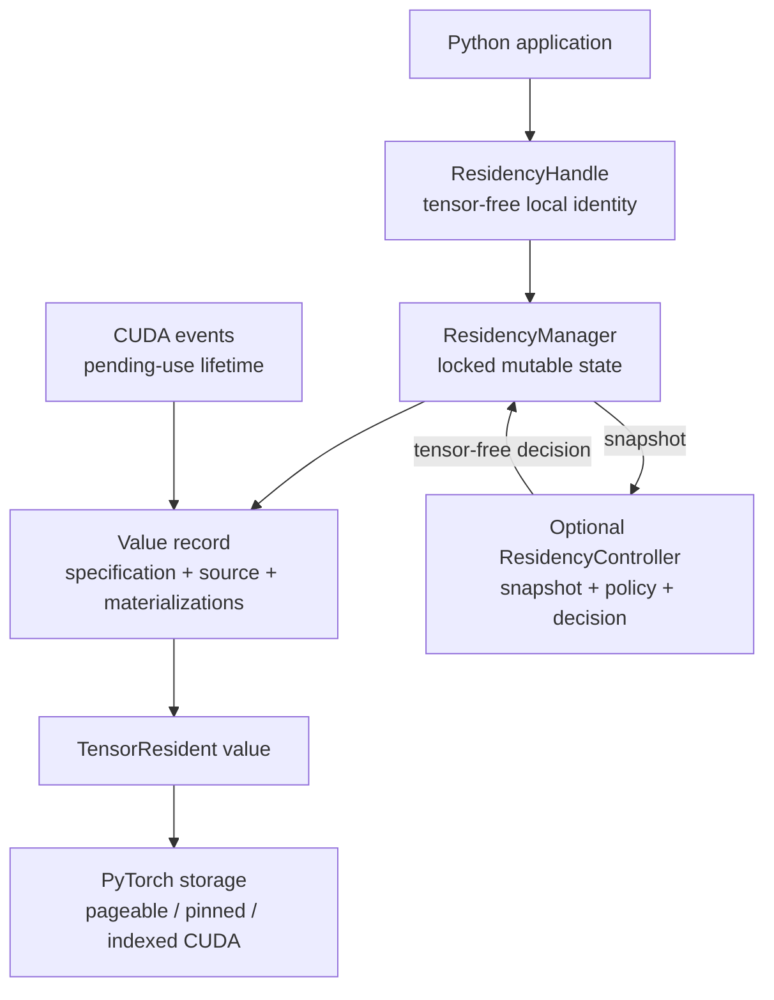
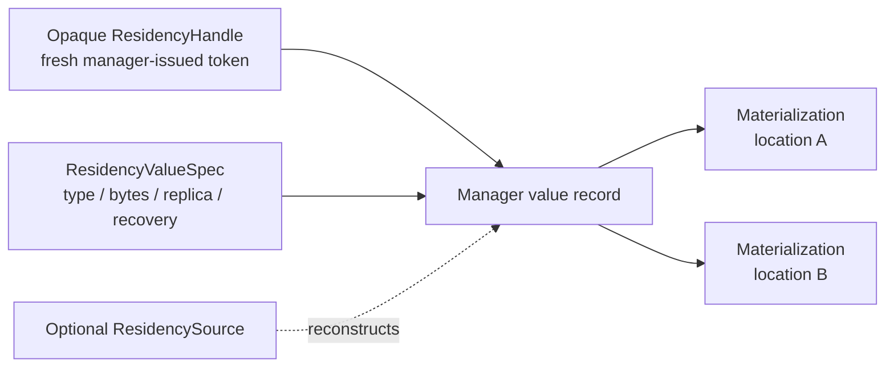

# Residency state and ownership internals

The stable residency state model gives one process-local manager
exclusive logical ownership of managed FHElium values. This page defines
opaque handles, value specifications, materializations, reconstruction, and alias
invariants. Transition execution and lifetime tokens are covered in
[Residency plans and execution internals](residency-plans-and-execution.md).

## Runtime stack

All runtime state is process-local Python state. Concrete materializations are
ordinary FHElium `TensorResident` objects backed by PyTorch storage. The manager
uses one reentrant lock to protect handle records, charges, locations,
reservations, and protection tokens; CUDA events extend storage lifetime after
a Python lease closes. The optional controller reads tensor-free snapshots and
returns a manager-bound plan without moving a tensor during `decide()`.

## State model

`model.py` defines tensor-free public state. `manager.py` owns the mutable
records and tensor-bearing materializations. `location.py` defines immutable
local location keys. Snapshots copy public state into frozen tensor-free
records rather than exposing manager dictionaries or concrete values.

## Handle identity

`ResidencyHandle[ValueT]` is an immutable, hashable, tensor-free token. The
manager generates a fresh unique handle for every `adopt` or `register_source`
call. Application code stores and passes the complete handle as an opaque
token. The issuing manager accepts the handle; other managers reject it.

The frozen handle stores `manager_id`, generated opaque `handle_id`, and
`value_type`. `manager_id` enforces manager ownership, `handle_id` distinguishes
registrations within that manager, and `value_type` preserves typed lease
lookup without retaining tensor storage. Public callers treat the complete
object as an opaque token.

Device location and materialization count are state associated with the
handle, not part of the token. Moving, copying, or dropping a materialization
preserves the same handle. Registering another value always creates another
handle, including when its contents match an existing registration.

The generic value type permits typed handle-to-lease lookup without retaining a
tensor-bearing value in the handle itself. Runtime materialization validation
still checks the concrete value against the specification.

## Value specification

`ResidencyValueSpec` freezes the storage specification for one handle:

| Field | Invariant |
| --- | --- |
| `value_type` | A concrete or base `TensorResident` class used for runtime validation. |
| `logical_nbytes` | Sum of declared tensor payload extents. |
| `storage_nbytes` | Conservative charge for each materialization; at least `logical_nbytes`. |
| `replica_mode` | Whether simultaneous steady replicas are allowed. |
| `recoverability` | Whether the final materialization may be reconstructed. |

`TensorResident.storage_nbytes` deduplicates direct tensor fields that share one
backing storage. The residency specification nevertheless requires
`storage_nbytes >= logical_nbytes`; overlapping views are charged
conservatively rather than relying on global alias analysis. `adopt` uses
`max(value.nbytes, value.storage_nbytes)`.

That value is a fixed per-replica managed charge and materialization ceiling,
not an equality requirement for every later allocation. Functional movement
can preserve logical tensor shape and stride while compacting a view's backing
span. The manager accepts an actual materialization at or below the registered
ceiling, reports its actual unique storage separately, and continues charging
the full fixed amount.

This charge drives manager accounting and, where a budget exists, admission.
Snapshots report PyTorch allocator measurements separately for comparison with
process-wide CUDA allocation.

## Location identity

`ResidencyLocation` contains only a storage class and normalized device:

- `PAGEABLE_HOST` uses canonical unindexed CPU storage;
- `PINNED_HOST` uses canonical unindexed, uniformly pinned CPU storage;
- `cuda_location(...)` requires an indexed CUDA device.

A manager records location state when a location is first budgeted or used.
Pageable host, pinned host, and available indexed CUDA devices are
valid local locations. The constructor validates `budgets` entries eagerly;
other valid locations receive unbudgeted accounting state lazily when a public
operation first uses them successfully. Multiple indexed CUDA devices may
coexist in one process-local manager.

One materialization contains a ready `TensorResident`, its logical and storage
byte counts, its fixed managed charge, and internal
read/hold/pending-event protection-token sets. The manager validates common
device placement, uniform CPU pinning, exact type and logical bytes, and that
actual storage does not exceed the registered charge before installation.

## Replica modes

`ReplicaMode.REPLICABLE` permits independent simultaneous materializations of
one managed value. `ensure` may add another location while retaining existing
locations.

`ReplicaMode.EXCLUSIVE` permits one steady materialization. `ensure` rejects an
attempt to add a replica when one already exists; `move` is the placement
primitive. A move can temporarily hold source and destination storage while a
copy completes, then removes the source before returning. This bounded transfer
state is not exposed as two independently usable replicas.

The manager also indexes backing-storage pointers. A newly installed
materialization must own storage independent of every other managed
materialization. Cross-handle or cross-location storage aliases are rejected
rather than charged ambiguously.

## Trust-based alias ownership

`ResidencyManager.adopt(...)` registers one live value and creates a
`MUST_PRESERVE` specification. The call transfers **logical alias ownership** to
the manager under the following caller-enforced rules:

1. the caller passes a ready value at the declared or inferred valid local
   location;
2. the manager validates its location, byte bounds, and independent storage;
3. the manager installs it and returns a tensor-free handle;
4. the caller stops retaining, reading, or mutating every concrete alias.

Step 4 applies after a successful return: retaining only the handle is
supported, while retaining, reading, or mutating the transferred object or any
pre-existing alias is unsupported. Public `TensorResident.to(...)` performs
functional movement and does not transfer logical ownership.

`acquire(...)` establishes the corresponding borrowing rules. During the
active lease, reading a borrowed value is supported and mutating it is
unsupported. After release, callers must retain no extracted alias and must not
read it, mutate it, or submit new CUDA work through it. The manager's managed
byte accounting, storage-independence and immutable-content invariants,
removal protection, and asynchronous lifetime safety apply only while callers
honor both the adoption and lease rules.

These rules are trust-based because both APIs expose direct Python
objects. Adoption installs the supplied object without a defensive copy, and
the borrowed mapping returns the concrete managed object rather than a
revocable proxy. The mapping rejects lookup and iteration after lease release,
but Python cannot revoke an object extracted while the lease was active.

## Reconstruction sources

`register_source(spec, source, ...)` registers a managed value without
loading a materialization. Its specification must use
`Recoverability.RECONSTRUCTIBLE`, and the source location must be valid locally.
`ResidencySource.load()` synchronously returns the exact registered
`TensorResident` value. The source is trusted to preserve that content and
its CKKS-state invariants. The manager validates runtime type, location, and byte
bounds. Each successful callback also transfers sole logical ownership of its
returned independent storage: retaining or mutating a returned alias after the
callback is unsupported. Registration issues a fresh opaque handle.

When a transition needs reconstruction, the manager:

1. records a temporary reservation at the declared source location and applies
   its budget when the location has one;
2. calls `load()` synchronously;
3. validates returned type, bytes, and location;
4. installs or transfers the value;
5. releases the temporary source charge.

For the complete interval in which a source callback is active, every
concurrent public operation that acquires or observes the same manager's state
is rejected with `ResidencyReentrancyError`. The exclusion is manager-wide,
not limited to the callback thread or to calls causally initiated by the
callback. It therefore rejects same-thread reentry, a callback-created worker,
and an unrelated thread that attempts observation or mutation during the
callback. Reading immutable `manager_id` and constructing a not-yet-entered
scope do not acquire state. The guard prevents partially constructed state
from being observed or mutated.

## Recoverability and last-copy invariants

`Recoverability.RECONSTRUCTIBLE` means a registered source can recreate the
managed value. The final live materialization may therefore be dropped while
the source remains registered.

`Recoverability.MUST_PRESERVE` means no source exists. The manager rejects
`drop` of its final materialization, preventing an accidental loss of the live
managed value. Applications change location with `move` and end the value
with `discard`.

`discard` is semantically different from dropping the last copy. It first
rejects active protections, then removes all materializations and its source,
and marks the identity discarded. Discarded records remain visible in
snapshots so stale-handle diagnostics can distinguish ended values from unknown
or foreign handles.

## Manager-owned values and controller-owned policy metadata

`ResidencyManager` owns handles, sources, materializations, budgets, leases,
and reservations. `ResidencyController` stores deterministic access epochs and
workload policy metadata and receives immutable tensor-free candidates while
planning.

A `ResidencyRequest` contains exact `(handle, location)` postconditions and
`MemoryReservation` declarations. A pure `ResidencyPolicy` orders
invariant-filtered candidates and exposes only configured fallback
tiers. The resulting `ResidencyDecision` contains the concrete manager-bound
plan, policy evidence, and the manager `state_version` against which it was
prepared. The manager remains responsible for validating and executing every
action.

This separation lets an application bypass automation and issue the same strict
primitive transitions or manual plans without changing handle identity or
manager semantics.

## Application mappings

Application state associates its program values with the opaque handles
returned by a local manager. Those associations do not enter handle equality.
After distributed transport, the destination rank adopts or registers
the received local value and records the newly issued handle.

## Concurrency and observation

Manager records are guarded by one reentrant lock. A monotonic `state_version`
changes when ownership, placement, reservations, leases, holds, pending-event
state, or observed locations change. A prepared decision carries the version
from its tensor-free snapshot; scope entry reaps completed events and checks the
expected version under the same lock before any reclaim or reservation
mutation. Mismatch raises `ResidencyStaleStateError` instead of silently
replanning.

A manager-wide source-callback access guard is checked before public operations
acquire or observe mutable state, so waiting and newly arriving threads reject
access rather than blocking
behind a callback that may be waiting for them. Snapshots are assembled while
holding the same state lock and contain no tensors. A handle remains immutable
and hashable across all transitions.

This locking establishes coherent handle, materialization, protection, and
accounting state. CUDA completion extends that state with event-backed pending
tokens after a Python lease closes.

## Source entry points

| Responsibility | First file |
| --- | --- |
| Tensor-resident movement and local byte measures | `fhelium/core/tensor_resident.py` |
| Handle, specification, replica mode, recoverability, source protocol | `fhelium/residency/model.py` |
| Canonical local locations | `fhelium/residency/location.py` |
| Owned value records and invariant enforcement | `fhelium/residency/manager.py` |
| Declarative requests and deterministic policy inputs | `fhelium/residency/request.py`, `fhelium/residency/policy.py` |
| State-bound automatic decisions and convenience use | `fhelium/residency/controller.py` |
| Tensor-free public observations | `fhelium/residency/snapshot.py` |

## Continue

- [Residency plans and execution internals](residency-plans-and-execution.md)
- [Residency lifetimes concept](../concepts/execution/residency-lifetimes.md)
- [Explicit residency tutorial](../tutorial/explicit-residency.md)
