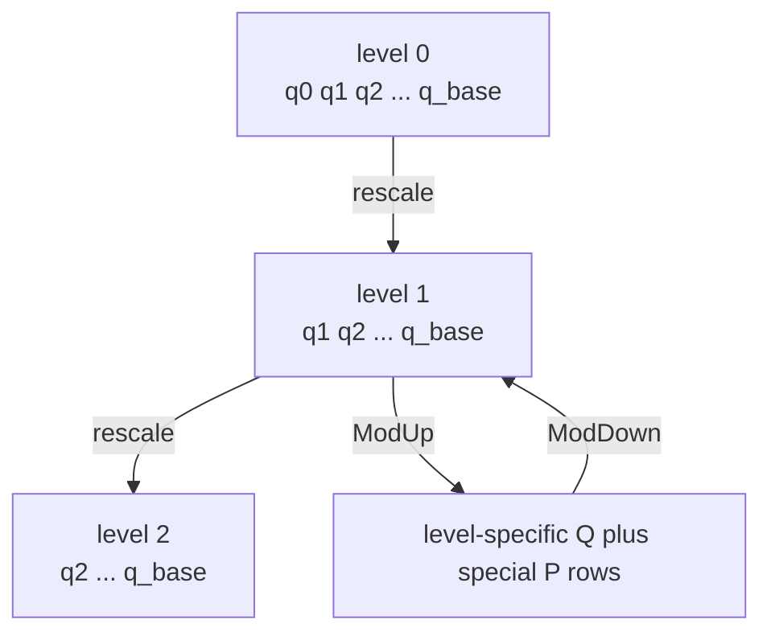
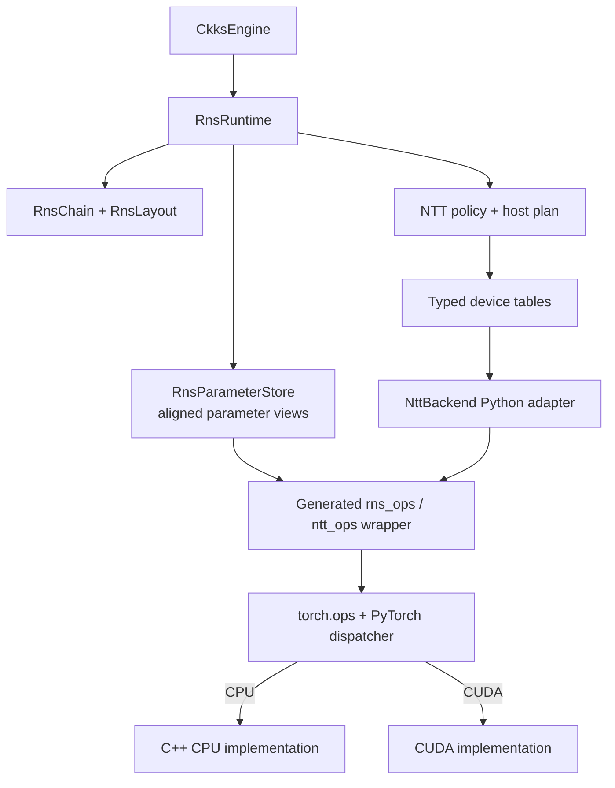
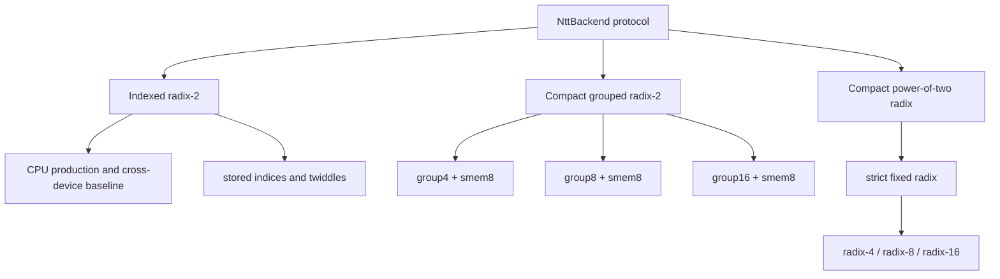
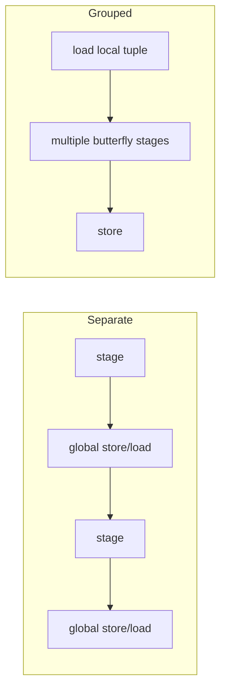
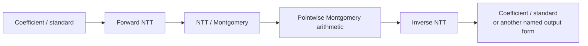

# RNS and NTT architecture

FHElium represents large CKKS moduli as dense residue rows and uses NTT-domain
pointwise arithmetic for polynomial multiplication. Correctness depends on
mapping every compact active row to the correct canonical modulus and transform
parameters.

## Canonical chain order

`RnsChain` uses canonical prime IDs in `[Q | P]` order:

```text
Q prime IDs: 0 ... num_q - 1
P prime IDs: num_q ... num_q + num_p - 1
```

At level $l$, the active Q basis drops the consumed Q prefix:

```text
Q_l  = Q[l:]
QP_l = Q[l:] + P
```



The dense tensor is compact at the current level, while `prime_ids` and runtime
layout map each row to canonical parameters.

## Placement-independent layout

`RnsLayout` describes:

- active Q or QP prime IDs;
- level-specific row counts and parameter slices;
- hybrid decomposition digit rows;
- stable level-zero key-digit indices;
- component-relative digit row IDs.

It intentionally contains no device assignment or communication policy. An
SPMD workload may partition prime IDs, but that partition does not redefine the
mathematical layout or native application binary interface (ABI).

## `RnsRuntime` responsibility

The runtime binds layout to device-resident arithmetic parameters and exposes
state-checked operations such as:

- canonical/lazy modular add/subtract;
- Montgomery multiply and conversions;
- row selection and extension/reduction helpers;
- forward/inverse NTT through the configured backend.

A caller must provide the correct level, basis, and row mapping. A native operator
must not infer a global prime solely from an ambiguous local row count.

## Implementation path

`CkksEngine` creates one `RnsRuntime` for its selected local device. Runtime
construction builds the canonical Q/P chain, Montgomery constants, a dense
`[parameter, limb]` tensor, the selected NTT plan, device-resident twiddle
tables, and one backend object. Arithmetic calls then pass exact tensor views
through generated wrappers to the shared PyTorch operator schemas.



For an operand with `k` compact active limbs, `RnsRuntime` selects a zero-copy
parameter view with exactly `k` columns in the same `prime_ids` order. NTT
backends similarly slice twiddles and parameter rows before invoking an
operator. The registered C++ implementation validates tensor axes and device;
it does not receive a Python level number or look up an engine.

## NTT backend protocol



The current canonical policy names are defined in
`fhelium/config/ntt.py`; read that file or the current API/CLI
instead of copying names from an old report.

Every name describes a complete policy. `group8` means three fused radix-2
stages, and `smem8` means eight radix-2 stages execute inside a shared-memory
tile. FHElium does not infer either property from a string suffix: one immutable
policy variant supplies only the factors meaningful to its algorithm family.
The policy registry is a discriminated union of indexed radix-2 execution,
compact grouped radix-2, and strict fixed-radix variants; it is deliberately
not one optional-field object covering every family.

### Indexed plans

The sole indexed policy, `radix2_indexed`, stores twiddle/index
tables. It is the CPU production backend and the cross-device validation
baseline for compact CUDA policies. CPU executes every stage for one
batch/limb row inside one native parallel region; CUDA launches one radix-2
stage at a time. Expanded twiddles contain only the nontrivial odd lane; the
old all-one even lane is not allocated.

### Compact plans

Compact policies retain smaller per-prime transform data and derive indices in
CUDA. They are CUDA backends. The maintained policies are
`radix2_compact_group4_smem8`, `radix2_compact_group8_smem8`, and
`radix2_compact_group16_smem8`; the group-8 policy is the CUDA default. CPU engines instead select
`radix2_indexed`. Their eight shared-memory stages are listed in
both the policy name and native ABI.

Plan objects are temporary construction values. `RnsRuntime` retains only a
typed `IndexedRadix2Tables`, `CompactRadix2Tables`, or
`CompactPowerOfTwoRadixTables` device package, never an optional-field superset
or a second host-resident copy of the plan. Indexed tables can reside on CPU or
CUDA; compact table packages currently reside on CUDA.

## Grouped radix-2 stages

A grouped backend combines several radix-2 butterfly stages in one launch:



This can reduce launches and global-memory round trips, but may increase:

- register pressure;
- shared-memory use;
- index arithmetic;
- occupancy loss;
- sensitivity to active row count and batch shape.

`group16` means four grouped radix-2 stages; it must not be described as a
distinct radix-16 algorithm.

## Genuine power-of-two radix transforms

This algorithm family has one shared mathematical plan, typed table package,
backend, and native ABI for strict fixed-radix policies. It has dedicated
radix-4, radix-8, and radix-16 CUDA butterflies and is not an alias for the
grouped radix-2 kernels.

The strict policies are `radix4_compact`, `radix8_compact`, and
`radix16_compact`. Every transform digit has exactly that radix. Consequently,
they require `logN` to be divisible by 2, 3, and 4, respectively; configuration
rejects an incompatible ring before any plan or GPU table is built. In
particular, `radix16_compact` rejects `logN = 14`. The function
`fhelium.compatible_ntt_backends(logN)` returns only names valid for a given
ring dimension.

Forward digits use decimation in frequency (DIF); inverse digits use the dual
decimation-in-time (DIT) order.

For one radix-$R$ digit, the plan chooses an outer root $\beta$ for each group
and a fixed primitive $R$-th root $\zeta_R$. The forward butterfly evaluates

$$
Y_l = \sum_{k=0}^{R-1} X_k
      \left(\beta\,\zeta_R^{\operatorname{bitrev}(l)}\right)^k.
$$

The table stores $\beta^1,\ldots,\beta^{R-1}$ for every digit group. Across a
complete transform these outer twists total exactly $N-1$ values per prime.
The fixed cyclic-root table contains only 4, 8, or 16 values per prime. Thus
the family remains $O(N)$ and does not
reintroduce an expanded indexed schedule.

Radix-4 uses a dedicated four-point cyclic NTT butterfly. Radix-8 uses a
dedicated 2x4 Cooley--Tukey butterfly: two radix-4 transforms, fixed
$\zeta_8^u$ coupling, and one combine step. Radix-16 uses a dedicated 4x4
Cooley--Tukey butterfly: four radix-4 column transforms, the fixed radix-16
coupling matrix, and four radix-4 row transforms. None loops over global
radix-2 stages or consumes radix-2 stage twiddles. Inverse DIT executes the
dual fixed-width digit order, applies inverse cyclic roots, and then the
inverse outer twist; the usual single $N^{-1}$ epilogue remains unchanged.

Shared-memory capacity and the production fusion depth are native CUDA
implementation choices, not Python policy fields. The compiled maximum and
current production default are both eight transform bits, corresponding to a
maximum 256-coefficient physical tile. Production Torch operators do not take
or transmit a `shared_memory_log_n` argument.

For an eligible strict schedule, the forward launcher chooses the largest
suffix of complete radix digits whose widths fit the native default; the
inverse launcher chooses the exact dual prefix. A realized selection may cover
fewer than eight bits because a digit is never split merely to fill the budget.
The selected digits execute consecutively after one coalesced tile load and
before one coalesced store, while preserving the digit-bit-reversed
intermediate layout after every individual DIF digit.

Eight is a measured static engineering choice rather than a mathematical
constant. It covers the profiled low-stride bottleneck, fits two complete
radix-16 digits or four radix-4 digits, and needs only two 256-element shared
buffers (4 KiB for int64 residues). A smaller budget misses the complete
two-radix16 region; a larger tile would reduce Cooperative Thread Array (CTA,
CUDA thread-block) supply and increase shared
memory and synchronization without demonstrated benefit.

The genuine-radix public names omit an `smem8` suffix because there is no
second public all-global policy identity: shared fusion is an internal
locality optimization that preserves the selected strict radix.
By contrast, the maintained compact radix-2 names expose grouping and smem8
because those names distinguish multiple selectable execution policies; the
`smem8` portion records the native implementation rather than a Python integer
passed on every operation. Result provenance should still record the exact
FHElium version in case internal tuning changes.

This is a genuine-radix locality optimization, not a radix-2 fallback.
Radix-4 assigns one worker to each four-point tuple. Radix-8 and radix-16 use
four-worker groups to evaluate their 2x4 and 4x4 factorizations through shared
scratch space, reducing each worker's live register vector. A separate
`fhelium_ntt_diagnostic_ops` namespace accepts a specified
`shared_memory_log_n` override for correctness tests and cross-GPU profiling;
the production backend never calls that namespace.

The exact supported schedules are:

| `logN` | compatible strict genuine-radix schedules |
|---|---|
| 14 | $4^7$ |
| 15 | $8^5$ |
| 16 | $4^8$, $16^4$ |
| 17 | none |

The power-of-two radix kernels may choose a different representative in the
lazy $[0,2q)$ interval than sequential radix-2 because modular additions are
associated differently. Forward results therefore compare exactly modulo
$q$, rather than necessarily bit-for-bit as signed integers. Canonical inverse
outputs are exact and all domain and representation states are unchanged.

The default remains `radix2_compact_group8_smem8`. A new algorithm family is
not promoted merely because it has fewer mathematical digits; radix-4/8/16 can
trade fewer launches for more register pressure and fixed-root arithmetic and
must win full CKKS workloads before becoming the default.

## Representation invariants

Backend methods must preserve the declared transitions:



NTT domain and Montgomery form are separate metadata dimensions even when a
valid public NTT ciphertext uses both.

## Batch axes and the native RNS ABI

Public RNS operands use `[..., limb, coefficient]`. A full ciphertext uses
`[component, *batch, limb, coefficient]`; the engine selects one component
before calling an RNS or NTT backend, leaving
`[*batch, limb, coefficient]`.

Native CUDA helpers collapse only that homogeneous batch prefix into a
zero-copy canonical view:

```text
[*batch, limb, N] -> [B_flat, limb, N]
```

For an unbatched component, `B_flat=1`. RNS parameters retain their independent
`[parameter, limb]` layout and are never interpreted as message batches.
Component axes, hybrid-digit axes, and message-batch axes must not be flattened
together merely because each is dense.

The collapse uses `view`, not an implicit packing copy. A caller that creates a
non-collapsible layout must expose its repacking step.
Native binary operators require equal `B_flat`, except for named shared-public
operand requirements that allow a singleton batch.

## High-risk layout and state cases

Whenever row mapping, tables, or kernels change, test:

- level zero and a middle level;
- the final legal active row configuration;
- one-row/singleton digit paths;
- Q and QP bases;
- compact current rows versus canonical parameter offsets;
- multiple `logN` values;
- indexed and compact families;
- every maintained compact group width and indexed execution;
- every compatible strict radix-4, radix-8, and radix-16 schedule;
- batched/component tensor axes;
- partial-limb inputs only where the operation supports them.

## Performance methodology

Benchmark NTT policy at three layers:

1. forward/inverse microbench for exact shapes and active rows;
2. CKKS operators that use the transforms;
3. complete workloads with keys, memory, and launch policy.

Do not promote the fastest level-zero transform automatically to every level or
workload.

## Continue

- [Multiplication, key switching, and rescale](multiplication-keyswitch-rescale.md)
- [Native operator workflow](native-operator-workflow.md)
- [Context and modulus chain](../concepts/ckks/context-and-modulus-chain.md)
- [CKKS cost model](../concepts/performance/cost-model.md)

## Source map

| Responsibility | Source |
| --- | --- |
| RNS chain, layout, and hybrid digit identity | `fhelium/engine/rns/{chain,layout,decomposition}.py` |
| Parameter materialization and aligned views | `fhelium/engine/rns/{montgomery,parameters,runtime}.py` |
| NTT policy definitions | `fhelium/config/ntt.py` |
| Host plans and typed device tables | `fhelium/engine/ntt/plans/`, `fhelium/engine/ntt/tables.py` |
| Python NTT backend adapters | `fhelium/engine/ntt/backends/` |
| RNS schemas and CPU/CUDA implementations | `csrc/ops/rns/` |
| NTT schemas and CPU/CUDA implementations | `csrc/ops/ntt/` |
| Shared modular helpers | `csrc/ops/common/` |
| Focused correctness and policy tests | `tests/test_ntt_backend.py`, `tests/test_native_operator_invariants.py` |
