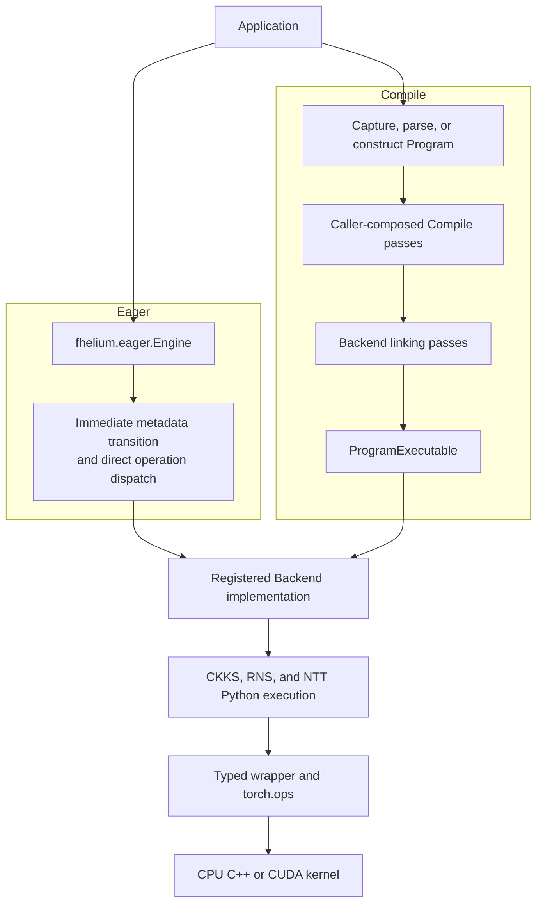

# Source tree

This map identifies the current implementation owners for common development
tasks. It emphasizes the Eager and Compile use models and the Backend execution
layer they share. Generated files and private helpers may move within a release
series.

## Repository map

```text
fhelium/
  config/          CKKS parameters, prime catalogs, NTT policy, security assessment
  values/          public CKKS values, keys, represented state, Tensor residency
  eager/           immediate Engine execution, key inventory, device-local dispatch
  ir/              xDSL Program, dialects, operation semantics, and analyses
  compile/         source capture, Compilation, workspaces, passes, and code generation
    frontend/       PyTorch capture and input-role declarations
    passes/         frontend, CKKS, lowering, Backend, distributed, and Program passes
    codegen/        generated Eager and Backend Python source models
  backend/         implementation registry, resources, linking, and Program execution
    ckks/           codec, cryptography, CKKS resources, and whole-operation algorithms
    rns/            modulus chains, layouts, parameters, resources, and RNS operations
    ntt/            plans, tables, resources, and configured NTT executors
    memory/         registered placement-transfer operations and resources
    distributed/    registered process-group operations and resources
  native/          extension loading, ABI diagnostics, CUDA inspection, typed wrappers
  runtime/         topology/memory observation, buffers, signatures, and CUDA Graphs
  distributed/     process setup, typed transport, and public value collectives
  rng/             cryptographic random-stream interface and implementations
  serialization/   versioned public-value serialization
  artifacts/       logical artifact references, generations, and repository policy
  residency/       live-value ownership, accounting, admission, plans, and lifetimes
  experimental/    opt-in bootstrap, multiparty CKKS, and JIT
    jit/            runtime bindings, provider assignment, region planning, executables
  legacy/          handwritten reference implementations used for differential work
  benchmarks/      benchmark definitions, evidence schemas, and built-in runners
  utils/           narrowly shared algorithms such as rotation decomposition
  _cli/            command-line entry points
csrc/
  ops/rns/         PyTorch schemas and CPU/CUDA residue arithmetic
  ops/ntt/         PyTorch schemas and CPU/CUDA NTT implementations
  ops/ckks/        PyTorch schemas and CPU/CUDA CKKS Tensor primitives
  ops/common/      shared native validation, parameters, and arithmetic helpers
  runtime/         CUDA device and peer-topology inspection extension
examples/          numbered Eager, Compile, execution, distributed, and research workflows
tests/             focused tests organized by owning package
packaging/         wheel, release, repository, and package-index tooling
docs/              user, concept, how-to, benchmark, developer, and API documentation
```

## Execution ownership at a glance



Eager executes a requested operation without an SSA graph. Compile owns Program
construction and transformation, then links a complete Program before running
it. Both paths invoke the `OperationImplementation` interface with Tensor
payloads and concrete resources.

## Public values and configuration

| Goal | First file(s) |
| --- | --- |
| Ciphertext payload and represented state | `fhelium/values/ciphertext.py` |
| Plaintext representations | `fhelium/values/plaintext.py` |
| Compressed plaintext representation | `fhelium/values/compressed_plaintext.py` |
| Key layouts and rotation-step identity | `fhelium/values/keys.py` |
| CKKS state vocabulary | `fhelium/values/state.py` |
| Tensor movement and value-local byte accounting | `fhelium/values/tensor_resident.py` |
| CKKS configuration and packaged primes | `fhelium/config/` |

Public value classes carry value state and Tensor storage. Execution services,
process groups, artifact names, and application cache policy remain with their
own packages.

## Eager execution

| Goal | First file(s) |
| --- | --- |
| Public operations, factories, and metadata transitions | `fhelium/eager/_engine.py` |
| Device-local direct Backend dispatch | `fhelium/eager/_operation_dispatch.py` |
| Evaluation-key inventory and placement | `fhelium/eager/_key_inventory.py` |
| Public/Program Tensor adaptation helpers | `fhelium/eager/_program_values.py` |
| Eager input checks | `fhelium/eager/_validation.py` |
| Device resource construction | `fhelium/backend/ckks/materialization.py` |

An `Engine` owns one CKKS configuration and creates per-device services lazily.
Evaluator operations dispatch from operand placement. Cross-device key copying
occurs only when the caller enables automatic key replication.

## IR and Compile

| Goal | First file(s) |
| --- | --- |
| Program ownership, parsing, printing, and interchange | `fhelium/ir/_program.py` |
| Registered dialect operations and types | `fhelium/ir/dialects/` |
| Operation meaning and effects | `fhelium/ir/_operation_specs.py`, `fhelium/ir/_operation_catalog.py` |
| Program analyses | `fhelium/ir/_analysis.py` |
| Compilation and caller-owned workspace | `fhelium/compile/_compilation.py`, `fhelium/compile/_workspace.py` |
| Pass and Pipeline protocol | `fhelium/compile/_pipeline.py` |
| Source capture and input roles | `fhelium/compile/frontend/` |
| Semantic-to-logical transformation | `fhelium/compile/passes/frontend/` |
| CKKS state and scheduling passes | `fhelium/compile/passes/ckks/` |
| CKKS-to-RNS/NTT composition | `fhelium/compile/passes/lowering/` |
| Implementation assignment and Backend linking passes | `fhelium/compile/passes/backend/` |
| Eager and Backend Python emission | `fhelium/compile/codegen/`, `fhelium/compile/passes/codegen/` |

A Program may retain unknown CKKS state until a selected pass requires and
assigns it. Compile passes may preserve a CKKS operation for a whole-operation
implementation or lower it to registered RNS and NTT operations.

## Backend execution

| Goal | First file(s) |
| --- | --- |
| Built-in implementation assembly | `fhelium/backend/assembly.py` |
| Implementation protocol and registry | `fhelium/backend/implementation.py` |
| OperationBackend, dispatch tables, and ProgramExecutable | `fhelium/backend/execution.py` |
| Backend workspace | `fhelium/backend/workspace.py` |
| Resource requirements and linked bindings | `fhelium/backend/resources.py` |
| CKKS operation classes and whole-operation implementations | `fhelium/backend/ckks/operations.py` |
| Codec | `fhelium/backend/ckks/codec/` |
| Encryption, decryption, Galois mapping, and key creation | `fhelium/backend/ckks/crypto/` |
| CKKS resource materialization | `fhelium/backend/ckks/materialization.py`, `fhelium/backend/ckks/resources.py` |
| Rescale and key-switch arithmetic | `fhelium/backend/ckks/rescale.py`, `fhelium/backend/ckks/operations.py` |
| Scheduled hoisted rotation execution | `fhelium/backend/ckks/rotation/` |
| RNS chain, layout, parameters, and decomposition | `fhelium/backend/rns/` |
| NTT context, resources, plans, tables, and executors | `fhelium/backend/ntt/` |
| Placement-transfer operations | `fhelium/backend/memory/` |
| Process-group operations | `fhelium/backend/distributed/` |

`OperationBackend` owns an implementation registry and an immutable
`BackendWorkspace`. Eager resolves and caches individual direct calls through
that owner. Compile callers use Backend-stage passes to resolve a Program's
operations, bind resources and materials, and create a `ProgramExecutable`.

## Native ABI and kernels

| Layer | Location |
| --- | --- |
| Torch operator loading and ABI checks | `fhelium/native/runtime.py`, `fhelium/native/_abi.py` |
| Compiled Torch extension and build manifest | `fhelium/native/torchops/` |
| Generated typed wrappers | `fhelium/native/wrapper/{rns_ops,ntt_ops,ckks_ops}.py` |
| Wrapper generator | `scripts/generate_native_wrappers.py` |
| Backend-neutral PyTorch schemas | `csrc/ops/<family>/*.cpp` |
| CPU dispatcher registrations and implementations | `csrc/ops/<family>/cpu/` |
| CUDA dispatcher registrations and implementations | `csrc/ops/<family>/cuda/` |
| Shared Tensor and RNS helpers | `csrc/ops/common/` |
| CUDA topology inspection | `fhelium/native/cuda/`, `csrc/runtime/cuda_info.{h,cpp}` |

Run `python scripts/generate_native_wrappers.py` after changing a native schema
or the generator, then regenerate the wrapper output.

## Experimental JIT, runtime, distribution, and storage

| Goal | Location |
| --- | --- |
| Experimental JIT | `fhelium/experimental/jit/` |
| CPU/CUDA topology and memory observation | `fhelium/runtime/topology.py`, `fhelium/runtime/memory.py` |
| Reusable buffers and CUDA Graphs | `fhelium/runtime/buffer.py`, `fhelium/runtime/cuda_graph.py` |
| Rank and process-group initialization | `fhelium/distributed/_state.py` |
| Typed value transport and collectives | `fhelium/distributed/_transfer.py`, `fhelium/distributed/_value_collectives.py` |
| Limb collectives and ciphertext reduction | `fhelium/distributed/_limb_collectives.py`, `fhelium/distributed/_ciphertext_reduction.py` |
| Artifact references and repository | `fhelium/artifacts/artifact.py`, `fhelium/artifacts/store.py` |
| Residency ownership and accounting | `fhelium/residency/manager.py`, `fhelium/residency/model.py` |
| Residency requests, policy, plans, and controller | `fhelium/residency/request.py`, `policy.py`, `plan.py`, `controller.py` |
| Leases and tensor-free snapshots | `fhelium/residency/lease.py`, `fhelium/residency/snapshot.py` |
| Versioned value serialization | `fhelium/serialization/` |
| Composable bootstrapping and presets | `fhelium/experimental/bootstrap/` |
| Multiparty CKKS | `fhelium/experimental/mpc/` |

## Focused test entry points

Start with the package that owns the changed behavior:

| Validation area | Representative tests |
| --- | --- |
| Public values and CKKS state | `tests/values/test_value_representation_invariants.py`, `tests/values/test_scale_management.py` |
| Eager CKKS arithmetic | `tests/eager/test_ckks_operation_correctness.py`, `tests/eager/test_inplace_api_semantics.py` |
| Compile and IR | `tests/compile/test_ir_stack.py`, `tests/compile/test_compile_stack.py` |
| Backend linking and execution | `tests/backend/test_backend_public_value_boundary.py`, `tests/backend/test_structured_operation_execution.py` |
| Native schemas and mutation | `tests/native/test_native_operator_invariants.py` |
| RNS/NTT execution | `tests/backend/test_ntt_backend.py`, `tests/backend/test_scalar_arithmetic.py` |
| Distributed execution | `tests/distributed/test_distributed_operation_execution.py`, `tests/distributed/test_distributed_transfer.py` |
| Runtime buffers and CUDA Graphs | `tests/runtime/test_execution_buffer.py`, `tests/runtime/test_cuda_graph_execution.py` |
| Residency | `tests/residency/test_resource_residency.py`, `tests/residency/test_residency_controller.py` |
| Artifacts and serialization | `tests/artifacts/test_artifact_store.py`, `tests/values/test_serialization.py` |

Repository test discovery is the final authority because test files can evolve.

## Recommended reading routes

For immediate execution:

```text
fhelium.values → fhelium.eager.Engine → Eager operation dispatcher
→ Backend implementation → RNS/NTT context → native wrapper → csrc kernel
```

For Program transformation and execution:

```text
fhelium.ir.Program → fhelium.compile Pipeline → Backend linking passes
→ ProgramExecutable → Backend implementation → native wrapper → csrc kernel
```

Read the focused tests beside each owner before changing an execution path.
They capture value-state, mutation, resource, singleton-row, last-level, and
Q/QP behavior that may not be visible from a benchmark.
