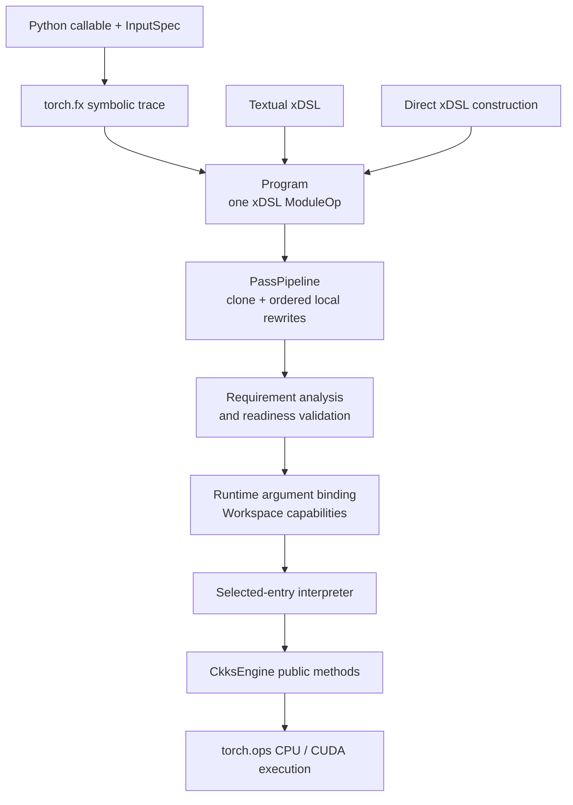

# JIT internals

`fhelium.experimental.jit` implements a source-independent xDSL program,
permissive local transformations, readiness validation, and selected-entry execution.
This page defines the internal vocabulary and the invariants an implementation
change or extension must preserve.

## Compilation and execution stack



PyTorch capture uses a transient FX graph and lowers it into the xDSL
`Program`, the sole retained compiler IR accepted by textual parsing and direct
construction.

Passes operate on xDSL operations and SSA values. Readiness then selects an
entry function and checks executable schemas, unresolved scheduling
obligations, materials, resources, engines, keys, and explicitly authorized
extensions. The interpreter executes the selected block and calls public
`CkksEngine` operations; tensor work therefore reaches the same generated
wrappers, PyTorch dispatcher, and CPU/CUDA native implementations used by
ordinary eager Python code.

`Workspace` is the retained runtime capability map. It carries concrete
engines, keys, material/resource bindings, extension handlers, and analysis
attachments; these Python objects are not serialized inside the xDSL module.

## xDSL vocabulary

FHElium uses xDSL terms with their standard meanings:

| Term | JIT use |
| --- | --- |
| `ModuleOp` | Top-level container owned by `Program.module` |
| `FuncOp` | Symbol-named callable region; readiness selects one top-level entry |
| `Region` and `Block` | Control-flow containers; the current interpreter consumes one single-block entry |
| `Operation` | Named unit with ordered operands/results, attributes, properties, regions, successors, and a location |
| `SSAValue` | Typed block argument or operation result connected to uses |
| `Attribute` | Immutable structural metadata, including types and dictionaries |
| Dialect | Namespace and registered vocabulary for operations/attributes |
| IRDL | Declarative registered operation/type constraints checked by xDSL verification |

`Program.walk()` traverses operations in structural preorder. `Program.functions`
returns registered top-level `func.func` operations. Transformation helpers use
xDSL replacement APIs so SSA uses move to replacement results without building
a parallel graph representation.

## Registered and open vocabulary

`create_ir_context()` registers xDSL `Builtin`, `Func`, and FHElium's structural
vocabulary, then enables unregistered objects. Registered FHElium types are:

| Textual type | Structural meaning |
| --- | --- |
| `!fhelium.encrypted<{...}>` | Encrypted value with an open state dictionary |
| `!fhelium.message<{...}>` | Public value; capture records `role = "static"` here for static values |
| `!fhelium.plaintext<{...}>` | Caller-owned encoded plaintext role |
| `!fhelium.material<{...}>` | Symbolic material identity |
| `!fhelium.resource<{...}>` | Symbolic execution-resource identity |

The registered operations are `fhelium.material.ref` and
`fhelium.resource.ref`. Each produces one result and optionally carries
`symbol` and `kind` string attributes in the general structural representation. The
execution schema requires a non-empty `symbol`.

Semantic, logical, `torch.call`, `fhelium.constant`, and lowered
`fhelium.ckks.*` operations currently use unregistered xDSL operation objects.
Their canonical executable schemas are enforced at readiness rather than by
IRDL construction. This placement permits intermediate and extension dialects
to coexist under one interpreter model.

`value_role()` recognizes only the registered FHElium encrypted, message, and
plaintext types. It returns `None` for an extension type. Passes must preserve
that result instead of reclassifying an unknown type as a public message.

## Parser and structural verification

`Program.parse()` creates the permissive context, parses one module, and passes
it to `Program.__init__`. The constructor calls `module.verify()`. Parsing
therefore enforces xDSL syntax, SSA structure, and constraints of registered
IRDL objects. It deliberately leaves these decisions to later consumers:

- selection of a callable entry function;
- support for unregistered operation/type names;
- completeness and numerical consistency of CKKS state;
- material/resource availability;
- backend parameters, engine, keys, and handlers;
- removal of pass scheduling obligations.

`Program.empty()` and `Program.from_function()` supply the current module
version attributes by default:

```text
fhelium.schema_version = "1"
fhelium.dialect_version = "0.1"
```

Module attributes can replace those defaults; the
readiness gate interprets the resulting values.

Textual imports retain the attributes supplied by the author. A missing version
is a readiness warning because readiness must select current semantics. A
present version with an unsupported value is an execution
error.

`to_text()` and `save()` print the current module without asserting readiness or
serializing workspace objects. The default printer preserves custom operations
and types; `generic=True` requests xDSL's generic format.

## Canonical frontend and execution schemas

Canonical schemas make textual import and execution deterministic. New writers
must emit the current names and attribute kinds; readers should reject a
malformed executable schema instead of inferring an alternative meaning.

### Capture module and input metadata

PyTorch capture records module attributes for:

- `fhelium.frontend = "torch.fx"`;
- `fhelium.program_name`;
- `fhelium.input_names` as an `ArrayAttr[StringAttr]` for runtime inputs;
- `fhelium.input_specs` as a canonical JSON string;
- `fhelium.output_structure` as a canonical JSON string.

Each captured runtime argument uses a FHElium role type. Its state dictionary
contains `input_spec`, a JSON string with `role`, `level`, `scale`, `slots`,
`batch_mode`, and `static_value`. Static parameters are specialized during FX
capture and omitted from the entry block.

The output descriptor preserves tuple, list, and mapping structure over the
flat `func.return` values. An imported function without the descriptor uses
the executor's scalar/tuple return convention.

### Literals and preserved calls

`fhelium.constant` has zero operands, one result, and a
`fhelium.literal` JSON string. Supported scalar values are `None`, Boolean,
integer, finite float, and string, with canonical descriptors for finite
complex values, `Ellipsis`, Torch dtype, device, and layout.

`torch.call` has one result and these required attributes:

- `fhelium.call.kind`: `"function"`, `"method"`, or `"module"`;
- `fhelium.call.target`: stable target symbol;
- `fhelium.call.arguments`: JSON descriptors for positional and keyword
  arguments.

Argument descriptors distinguish SSA operand indices, literals,
tuples, lists, mappings, and slices. Textual import does not import or execute
the target named by the string.

### Executable FHElium operations

The readiness validator owns the authoritative operation table. Its principal
schemas are:

- `fhelium.material.ref` and `fhelium.resource.ref`: zero operands, one result,
  required symbol;
- `fhelium.ckks.prepare.{add,multiply}.{message,plaintext,static}`: public value
  and ciphertext operands, one plaintext result, consistent `operation`,
  `source_role`, and `scale_mode` attributes;
- unary `negate`, `rotate`, `to_ntt`, `relinearize`;
- binary encrypted `add`, `subtract`, `multiply`;
- binary `add_plaintext` and `multiply_plaintext` with encrypted/plaintext
  operand roles;
- `rescale` with a `condition` and corresponding one- or two-operand
  form.

`fhelium.scheduling_obligations` is an `ArrayAttr[StringAttr]` used by lowering
passes to expose mechanics that remain to be materialized. The executable gate
rejects every remaining obligation.

When a schema changes, update the writer, validator, requirement analysis,
executor, textual round-trip tests, and generated API documentation together.

## Pass scope and legal no-op behavior

A `Pass` exposes a stable non-empty `name` and
`run(program, workspace) -> PassResult`. `PassPipeline.run()`:

1. validates the source and mutable workspace;
2. clones the source `Program` once;
3. invokes each pass in order on the current clone and the same workspace;
4. verifies the xDSL structure of every returned `PassResult.program`, wrapping
   a failure in `JitPassError` with the pass name;
5. records only each pass name, statistics, and diagnostics;
6. returns the final program, retained workspace, and reports.

The built-in leaf-operation helper visits operations in every top-level
function and block, excluding terminators and operations that own regions or
successors. Individual passes narrow that set by operation names, role
patterns, arity, and local traits. Execution analysis and readiness instead
inspect only the selected entry. Keep that difference visible when
adding a module-wide transform.

A pass is responsible only for patterns it recognizes. Unknown dialects,
unmatched role combinations, and unresolved local prerequisites remain in the
program. `PassResult.unchanged()` is a successful result and can report both
matched/skipped counts and diagnostics. Pipeline completion is not evidence of
execution readiness. Structural verification applies equally to changed and
unchanged results, so an invalid returned module cannot reach the next pass.

Pass statistics follow these meanings:

| Counter | Meaning |
| --- | --- |
| `matched` | Local candidates examined under the pass's matching rules |
| `transformed` | Matched candidates whose principal operation changed |
| `inserted` | Additional operations inserted |
| `removed` | Operations removed |
| `skipped` | Matched candidates retained after a failed local legality or readiness check |

`transformed + skipped` cannot exceed `matched`. Diagnostics explain local skip
or rewrite evidence; they are not retained program snapshots.

The default pipeline is intentionally inspectable and ends after conservative
late scheduling passes. Callers may append
`ValidateExecutableGraphPass` or `ValidateCipherStatesPass` when they want a
validation result inside a reported pass sequence. `Program.run()` always repeats
the independent executable readiness check.

## Execution trust boundary and readiness

`check_readiness(program, workspace, entry=...)` is the pure capability gate.
It runs requirement analysis and executable-graph validation without invoking
resolvers or handlers. The selected entry must be one top-level single-block
function with one final `func.return`.

The gate combines three sources of trust:

1. **Built-in schemas and interpreter branches** define core constants,
   references, audited public Torch targets, and CKKS behavior.
2. **Workspace capabilities** supply engines, engine-compatible evaluation
   keys, materials, and resources. A public key is checked for engine
   compatibility later, only when argument binding shows that an encrypted
   input requires online encryption.
3. **Trusted extension bindings** authorize operation names and Torch target
   symbols that the built-in executor does not own.

`run_program()` evaluates base readiness first and rejects its errors before
argument binding. It then binds positional/keyword entry values and adds the
runtime-dependent public-key diagnostic when an encrypted argument is a
Tensor. After that complete report is runnable, execution resolves
graph-external references and interprets operations in block order. Built-in
operation branches precede the extension handler lookup, so
`workspace["handlers"]` cannot override core semantics.

Public-only preserved Torch calls may use the executor's small audited target
set. Any `torch.call` whose operands or result touch encrypted/plaintext roles
requires a provided callable in `workspace["torch_handlers"]`. This rule makes
preserved text a symbolic request rather than authority to import arbitrary
Python.

A handler is trusted code. Readiness checks that it is callable; the caller owns
its operation semantics, side effects, type behavior, and resource safety.

## Typing and extension interfaces

### Custom pass

A custom pass can use only public JIT and xDSL types:

```python
from collections.abc import MutableMapping
from dataclasses import dataclass
from typing import Any

from fhelium.experimental import jit


@dataclass(frozen=True)
class RecordOperationCountPass:
    name: str = "record-operation-count"

    def run(
        self,
        program: jit.Program,
        workspace: MutableMapping[Any, Any],
    ) -> jit.PassResult:
        workspace["analysis/operation-count"] = sum(
            1 for _ in program.walk()
        )
        return jit.PassResult.unchanged(program)
```

Mutation-oriented passes should operate on the pipeline-owned clone, use xDSL
rewriter APIs, preserve result types/name hints where applicable, and return a
`PassResult` whose counts describe the actual change.

### Operation handlers

An extension operation handler has the conceptual type:

```python
(operation, operands: tuple[object, ...], workspace) -> object
```

A zero-result operation must return `None`; a one-result operation returns one
object; a multi-result operation returns a tuple with exactly the result count.
Bind it by operation name under `workspace["handlers"]`.

A `torch_handlers` value is called with the positional and keyword arguments
reconstructed from the canonical descriptor. Bind it by
`fhelium.call.target` string.

Material and resource resolvers receive:

```python
(symbol, kind, raw_binding, workspace) -> runtime_value
```

They run only during ``Program.run(...)``. Readiness requires the raw symbol to
exist in the corresponding map but does not call the resolver.

### Backend state validators

`ValidateCipherStatesPass` receives a `StateValidator` callable with
`(program, workspace) -> None`. A backend can use this extension point to check
parameter-specific state without turning its engine or parameter set into a
structural parsing prerequisite.

## Implementation map

| Responsibility | Source |
| --- | --- |
| Public package surface | `fhelium/experimental/jit/__init__.py` |
| Program ownership and interchange | `fhelium/experimental/jit/_program.py` |
| Registered/open xDSL vocabulary | `fhelium/experimental/jit/_dialect.py` |
| PyTorch FX capture | `fhelium/experimental/jit/_capture.py` |
| Frontend input roles | `fhelium/experimental/jit/_specs.py` |
| Retained mutable state | `fhelium/experimental/jit/_workspace.py` |
| Pure analyses | `fhelium/experimental/jit/_analysis.py` |
| Readiness and interpreter | `fhelium/experimental/jit/_execution.py` |
| Pass protocol and pipeline | `fhelium/experimental/jit/passes/_base.py` |
| Default composition | `fhelium/experimental/jit/passes/_default.py` |
| Executable schema gate | `fhelium/experimental/jit/passes/validate_executable_graph.py` |
| Backend/state validation hook | `fhelium/experimental/jit/passes/validate_cipher_states.py` |

Start validation with `tests/test_jit_ir.py`, `tests/test_jit_passes.py`,
`tests/test_jit_execution.py`, and `tests/test_jit_api.py`; then run the full
Python checks and documentation build.
