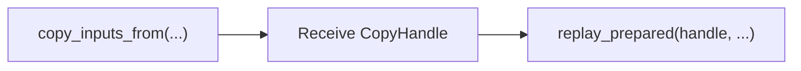

# Capture a repeated evaluator

CUDA Graph capture records a fixed rank-local CUDA execution schedule for repeated replay with compatible dynamic inputs. Use it after the calculation and its materials are prepared, keeping randomized setup, I/O, and dynamic collectives outside capture.

## Prerequisites

Have a CUDA-capable build, a CUDA prototype ciphertext, and a verified callable with stable state. The callable can execute Eager operations or a prepared linked calculation. A Compile Program is a calculation representation; `CudaGraphProgram` owns CUDA capture and replay storage for its execution. Complete callable specialization, linking, and first-use numerical setup before capture.

## 1. Establish a synchronized execution baseline

Write an ordinary callable and verify it across multiple inputs. This small schedule computes $-x$ using the configured Engine; `prototype_ciphertext` must already be on CUDA:

```python
def evaluator(source):
    return engine.negate(source)

schedule = evaluator
```

Before capture, record output error against a clear-message oracle, output depth and actual scale, polynomial domain, modulus basis, component count, synchronized latency, and peak allocated/reserved memory. `examples/18_runtime_cuda_graph.py` provides a complete matrix-vector evaluator with fixed diagonals and rotation keys.

## 2. Separate static and dynamic state

Bind fixed operation-ready weights, keys, and other schedule parameters in a closure or with `functools.partial`. Dynamic positional inputs contain tensors or serializable FHElium values supported by `ValueTreeSignature`. The fixed schedule may also call a previously linked executable:

```python
# Use this alternative after linking a one-input calculation.
schedule = executable.run
```

For a compiled callable, run `prepare(prototype_ciphertext)` and validate an ordinary execution before passing the callable as the schedule. Keep static numerical materials and Backend resources alive for all captures and replays that use them. Changing a fixed key, weight assignment, or operation schedule requires a new capture.

## 3. Exclude unsafe or dynamic work

Keep outside capture:

- key generation/loading;
- fresh-randomness encryption;
- request I/O and artifact misses;
- dynamic shape/depth/control flow;
- process-group initialization;
- dynamic distributed gather/reduction;
- cache admission and eviction.

Encrypt dynamic request data before replay and decrypt results afterward.

## 4. Capture from representative inputs

```python
from fhelium.runtime import CudaGraphProgram

program = CudaGraphProgram.capture(
    schedule,
    example_inputs=(prototype_ciphertext,),
    warmup=3,
)
```

The prototype must match every later input in structure and CKKS state. Its device may be part of the staging path, but device residency is deliberately separate from the signature.

## 5. Replay changing inputs

```python
result = program.replay(next_ciphertext, synchronize=True)
```

Use synchronization while validating correctness. For production scheduling, use the API's stream/event options rather than inserting unnecessary host barriers.

If input copy should overlap with other work, use the advanced split path:



Follow the current [Execution API reference](../api/fhelium/runtime/cuda_graph.md) for arguments.

## 6. Handle borrowed output correctly

By default, replay returns storage retained by the program and overwritten by a later replay. If a result must survive:

```python
owned_result = program.replay(next_ciphertext, copy_output=True)
```

Do not infer ownership from Python object identity alone. Test by retaining two results across replays and verifying that the owned path preserves both.

## 7. Use one instance sequentially

Do not concurrently replay one program instance. For concurrent workers, create separate instances and account for each instance's:

- stable input buffers;
- retained outputs;
- graph-private allocations;
- static closure/key/weight references;
- stream and event scheduling.

## 8. Benchmark the full replay path

Compare:

```text
uncaptured evaluator with the same numerical schedule
CUDA Graph replay including dynamic input staging
optional owned-output copy
```

Record one-time warmup/capture cost separately. A graph result that excludes input staging while the uncaptured path includes it is not a fair end-to-end comparison.

## 9. Close after submitted work completes

Call `program.close()` only after copies, replays, and consumers have completed. Release retained borrowed outputs and references according to the application's lifetime plan.

## Verify the outcome

Replay several distinct ciphertext inputs and compare decoded results with the same clear-message oracle. Retain an owned output across the next replay to verify its lifetime, and report input staging and optional output copies in the measured scope.

## Related documentation

- [CUDA Graph model](../concepts/execution/cuda-graph-model.md)
- [CUDA Graph tutorial](../tutorial/cuda-graph-matvec.md)
- [Value signatures and buffers](../concepts/execution/signatures-and-buffers.md)
- [Benchmark methodology](/benchmarks/methodology)
