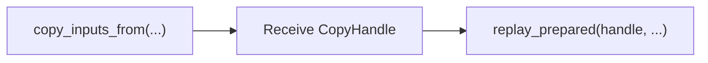

# Capture a repeated evaluator

Use CUDA Graph when the same rank-local CKKS schedule runs repeatedly with
exactly compatible dynamic inputs. Keep randomized setup, I/O, and dynamic
collectives outside capture.

## 1. Establish a synchronized eager baseline

Write an ordinary callable and verify it across multiple inputs:

```python
def evaluator(source, *, engine, weights, rotation_keys):
    # Fixed CKKS schedule
    ...
    return result
```

Before capture, record:

- output error against a cleartext oracle;
- output level, scale, polynomial domain, modulus basis, and component count;
- eager latency with correct CUDA synchronization;
- peak allocated/reserved memory.

## 2. Separate static and dynamic state

Bind static state into the callable:

```python
from functools import partial

schedule = partial(
    evaluator,
    engine=engine,
    weights=prepared_weights,
    rotation_keys=rotation_keys,
)
```

Good static state includes engine plans, fixed operation-ready weights, direct
rotation keys, and control flow. Dynamic positional inputs should contain only
tensors or serializable FHElium values supported by `ValueTreeSignature`.

## 3. Exclude unsafe or dynamic work

Keep outside capture:

- key generation/loading;
- fresh-randomness encryption;
- request I/O and artifact misses;
- dynamic shape/level/control flow;
- process-group initialization;
- dynamic distributed gather/reduction;
- cache admission and eviction.

Encrypt dynamic request data before replay and decrypt results afterward.

## 4. Capture from representative inputs

```python
from fhelium.execution import CudaGraphProgram

program = CudaGraphProgram.capture(
    schedule,
    example_inputs=(prototype_ciphertext,),
    warmup=3,
)
```

The prototype must match every later input in structure and CKKS state.
Its device may be part of the staging path, but device residency is deliberately
separate from the signature.

## 5. Replay changing inputs

```python
result = program.replay(next_ciphertext, synchronize=True)
```

Use synchronization while validating correctness. For production scheduling,
use the API's stream/event options rather than inserting unnecessary host
barriers.

If input copy should overlap with other work, use the advanced split path:



Follow the current [Execution API reference](../api/fhelium/execution/cuda_graph.md) for
arguments.

## 6. Handle borrowed output correctly

By default, replay returns storage retained by the program and overwritten by a
later replay. If a result must survive:

```python
owned_result = program.replay(next_ciphertext, copy_output=True)
```

Do not infer ownership from Python object identity alone. Test by retaining two
results across replays and verifying that the owned path preserves both.

## 7. Use one instance sequentially

Do not concurrently replay one program instance. For concurrent workers,
create separate instances and account for each instance's:

- stable input buffers;
- retained outputs;
- graph-private allocations;
- static closure/key/weight references;
- stream and event scheduling.

## 8. Benchmark the full replay path

Compare:

```text
eager evaluator
CUDA Graph replay including dynamic input staging
optional owned-output copy
```

Record one-time warmup/capture cost separately. A graph result that excludes
input staging while eager includes it is not a fair end-to-end comparison.

## 9. Close after submitted work completes

Call `program.close()` only after copies, replays, and consumers have completed.
Release retained borrowed outputs and references according to the application's
lifetime plan.

## Related documentation

- [CUDA Graph model](../concepts/execution/cuda-graph-model.md)
- [CUDA Graph tutorial](../tutorial/cuda-graph-matvec.md)
- [Value signatures and buffers](../concepts/execution/signatures-and-buffers.md)
- [Benchmark a workload](benchmark-a-workload.md)
