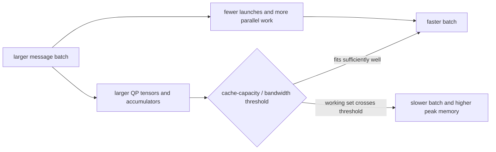

# Choose a homogeneous batch size

Homogeneous batching is an workload execution choice. It can
reduce launch overhead and execute several independent messages together, but
it also multiplies the active RNS/NTT working set. There is no batch size that
is optimal for every preset, level, GPU, and evaluator.

Use the runnable
[homogeneous batching tutorial](../tutorial/homogeneous-batching.md) before
following this guide.

## 1. Preserve one mathematical comparison

Compare the same logical messages and the same evaluator:

```text
batched:  evaluator(ciphertext with batch_shape=(B,))
looped:   [evaluator(member) for member in ciphertext.unbind_batch()]
```

Keep fixed:

- cleartext inputs and expected outputs;
- preset, level, scale, and active prime ids;
- NTT backend and exact keyset;
- evaluator schedule, graph mode, and hoisting policy;
- warmup, timed region, and synchronization rule.

All ciphertext members must have one effective encryption-key lineage.
Matching `context_id` values establish parameter compatibility but do not
prove key compatibility.

Validate batched ciphertext data exactly against a stacked loop result when
the paths begin from the same ciphertext members, then decrypt both against a
cleartext oracle.

## 2. Separate three reproducible questions

Do not report a single ratio as “batch performance.” Measure:

| Comparison | Question answered |
| --- | --- |
| Singleton batch `[1, ...]` vs an unbatched value | What does a singleton batch prefix cost? |
| One B4/B8 evaluation vs a loop over the same B members | Does batching reduce latency for the same logical work? |
| Complete batched evaluator vs complete loop, with peak memory | Which policy fits the deployed workload and memory budget? |

Run every side of these comparisons from the same installed build and with the
same evaluator. A development branch, an earlier commit, or an implementation
that readers cannot run is not a valid baseline for this public guide.

## 3. Estimate the active working set

A useful first proxy for one ModUp/NTT key-switch digit is:

$$
W_{digit}=B\cdot |QP_{active}|\cdot N\cdot 8\ \text{bytes}.
$$

This is not the full peak. NTT read/write traffic, key rows, two key-switch
accumulators, automorphism temporaries, ciphertext outputs, and allocator
behavior add to it. It does explain why the same B can be favorable at a later
level and unfavorable at level zero.



The relevant comparison is the complete active set, not only
`W_digit < L2 size`. Multiple live tensors can cross the effective capacity threshold
even when one digit alone is smaller than L2.

## 4. Sweep the levels used by the evaluator

Level reduces the active Q rows. For
`Preset.slots32768_scale40_levels34_int64` in the reference configuration:

| Level | Active QP rows | One-message extended QP digit |
| ---: | ---: | ---: |
| 0 | 39 | 19.5 MiB |
| 5 | 34 | 17.0 MiB |
| 10 | 29 | 14.5 MiB |
| 15 | 24 | 12.0 MiB |
| 20 | 19 | 9.5 MiB |
| 25 | 14 | 7.0 MiB |
| 30 | 9 | 4.5 MiB |

Do not benchmark only level zero if production work mostly occurs near the end
of the chain.

## 5. Measure latency and peak memory together

Run:

```bash
python examples/15_homogeneous_batching.py \
  --preset slots32768-scale40-levels34-int64 --level 0 --batch-sizes 1,4,8

python examples/15_homogeneous_batching.py \
  --preset slots32768-scale40-levels34-int64 --level 20 --batch-sizes 1,4,8

python examples/15_homogeneous_batching.py \
  --preset slots32768-scale40-levels34-int64 --level 30 --batch-sizes 1,4,8
```

Repeat enough times for stable medians. If the production evaluator uses CUDA
Graph, compare batch graph with a loop captured under the same policy; graph
capture can remove much of the host-launch disadvantage of the loop.

## Reference measurement: RTX PRO 6000 Blackwell

The following data is a worked example, not a portable dispatch table.

| Field | Reference value |
| --- | --- |
| Date | 2026-07-24 |
| GPU | One NVIDIA RTX PRO 6000 Blackwell Max-Q |
| L2 | 128 MiB |
| Device | `cuda:0` |
| Presets | 40-bit scale family at each recorded slot capacity |
| Default backend | `radix2_compact_group8_smem8` |
| Timing | CUDA-synchronized warm runs; median wall latency |
| Correctness | Exact batched-vs-loop ciphertext data plus cleartext oracle |

Setup, key generation, and constant preparation were outside operator and
workload timing unless the row names an end-to-end public API.

### Singleton batch

For `[1, slots]` versus `[slots]`:

- NTT, plaintext multiply, relinearize, rotation, and decryption were generally
  within 0–4%;
- later-level rescale reached about 6% overhead;
- encode reached 12–13%, but the absolute difference was about 0.018 ms;
- complete matrix-vector (MxV) and rotate-many workloads were approximately at parity.

This establishes B1 compatibility; it does not predict B4/B8 scaling.

### Operator speedup over an explicit loop

Values below are `loop latency / batch latency`; values below one favor the
loop.

| Configuration | B | NTT | Rescale | Ct multiply | Relinearize | Rotate | Decrypt | Encrypt |
| --- | ---: | ---: | ---: | ---: | ---: | ---: | ---: | ---: |
| `logN = 14`, L0 | 4 | 2.33x | 3.58x | 3.82x | 3.55x | 3.57x | 2.65x | 3.42x |
|  | 8 | 3.21x | 6.80x | 7.26x | 5.49x | 5.90x | 4.24x | 5.57x |
| `logN = 16`, L0 | 4 | 0.86x | 0.54x | 0.72x | 0.92x | 0.92x | 1.60x | 1.05x |
|  | 8 | 0.63x | 0.53x | 0.67x | 0.72x | 0.74x | 1.24x | 0.82x |
| `logN = 16`, L30 | 4 | 1.93x | 3.47x | 3.47x | 1.52x | 1.57x | 2.58x | 2.38x |
|  | 8 | 2.27x | 5.11x | 2.29x | 1.55x | 1.56x | 3.66x | 3.37x |

The mechanism is operation-specific. Encode and decrypt can benefit while a
key-switch-heavy evaluator at the same level loses.

### `logN = 16` crossover

| Level | B4 NTT | B8 NTT | B4 relin | B8 relin | B4 MxV-8 | B8 MxV-8 |
| ---: | ---: | ---: | ---: | ---: | ---: | ---: |
| 0 | 0.85x | 0.63x | 0.92x | 0.72x | 0.84x | 0.70x |
| 5 | 0.90x | 0.82x | 0.89x | 0.76x | 0.84x | 0.73x |
| 10 | 1.01x | 0.88x | 0.88x | 0.89x | 0.87x | 0.81x |
| 15 | 1.12x | 0.92x | 0.98x | 0.94x | 0.98x | 0.86x |
| 20 | 1.35x | 1.08x | 1.08x | 0.95x | 1.09x | 0.92x |
| 25 | 1.54x | 1.45x | 1.26x | 1.16x | 1.26x | 1.12x |
| 30 | 1.96x | 2.26x | 1.51x | 1.55x | 1.76x | 1.71x |

On this GPU, B4 became useful earlier than B8. Key-switch and complete-workload
crossovers occurred later than the raw NTT crossover because keys,
accumulators, automorphism, and output tensors enlarge the working set.

### Complete workload and peak memory

| Workload/configuration | B | Batch | Loop | Speedup | Batch peak | Loop peak |
| --- | ---: | ---: | ---: | ---: | ---: | ---: |
| MxV-8, `logN = 14`, L0 | 4 | 4.586 ms | 18.137 ms | 3.95x | 85 MiB | 26 MiB |
|  | 8 | 6.159 ms | 40.987 ms | 6.65x | 162 MiB | 34 MiB |
| MxV-8, `logN = 16`, L0 | 4 | 97.232 ms | 81.511 ms | 0.84x | 1512 MiB | 484 MiB |
|  | 8 | 233.103 ms | 163.607 ms | 0.70x | 3024 MiB | 620 MiB |
| MxV-8, `logN = 16`, L30 | 4 | 7.267 ms | 12.755 ms | 1.76x | 216 MiB | 74 MiB |
|  | 8 | 14.458 ms | 25.435 ms | 1.76x | 433 MiB | 84 MiB |
| Rotate-many-7, `logN = 16`, L0 | 4 | 52.581 ms | 34.573 ms | 0.66x | 2274 MiB | 1334 MiB |
|  | 8 | 115.457 ms | 68.966 ms | 0.60x | 4548 MiB | 2343 MiB |

## Hardware contrast: RTX A6000

A second measurement on 2026-07-25 used commit
`9f4a1756bc20dd17f172b70ae88b9cf1ffd855c4` and one NVIDIA RTX A6000
(SM86, 6 MiB L2, 47.4 GiB device memory). The same-build batch and loop paths
matched exactly at the ciphertext-data level. Singleton batches remained at
parity: the median loop/batch ratio was 1.001x for `logN = 14` and 1.000x for
both `logN = 15` and `logN = 16`.

The one-message QP digit size identifies whether increasing B creates a new
fit-to-spill transition:

| `logN` / level | Active QP rows | QP digit per message | Measured behavior |
| --- | ---: | ---: | --- |
| 14 / L0 | 9 | 1.125 MiB | B4/B8 eager evaluators benefited from launch amortization. |
| 14 / L3 | 6 | 0.750 MiB | B8 MxV-8 reached 2.55x. |
| 15 / L0 | 19 | 4.750 MiB | B1 nearly fits L2; B2 and larger crossed the effective capacity threshold. |
| 15 / L8 | 11 | 2.750 MiB | B2 MxV-8 was 1.08x, while B4 was 0.90x. |
| 16 / L0 | 39 | 19.500 MiB | B1 already streamed beyond L2; `radix16_compact` gave modest batch gains. |
| 16 / L25 | 14 | 7.000 MiB | B8 MxV-8 was 1.07x with `radix16_compact`. |
| 16 / L30 | 9 | 4.500 MiB | B8 MxV-8 was 1.09x with `radix16_compact`. |

The full active set remains larger than the digit proxy. The useful distinction
is whether B changes the cache-residency regime, not whether this one tensor is
smaller than the nominal L2 capacity.

CUDA Graph also changed the policy because it removed most of the explicit
loop's host-submission disadvantage. Values remain `loop / batch`:

| Configuration | Eager | Graph replay |
| --- | ---: | ---: |
| `logN = 14`, L0 B8 MxV-8, group8 | 1.65x | 0.91x |
| `logN = 14`, L0 B8 rotate-many-7, group8 | 1.56x | 0.82x |
| `logN = 15`, L0 B8 MxV-8, group4 | 0.89x | 0.85x |
| `logN = 16`, L0 B8 MxV-8, radix16 | 1.05x | 1.04x |
| `logN = 16`, L25 B8 MxV-8, radix16 | 1.07x | 1.03x |

On this A6000, `logN = 15` exposed the clearest fit-to-spill loss: one
level-zero message was close to the 6 MiB L2 capacity, while even B2 was not.
At `logN = 16`, L0 B1 was already larger than L2, so increasing B did not
introduce the same new cache transition. The genuine radix-16 backend reduced enough transform
work to retain small batch gains. This contrast shows why L2 size alone is not
a dispatch rule; backend structure and graph policy remain part of the
measured region.

## 6. Put the choice in application code

Use a transparent policy:

```python
def evaluate_requests(requests, *, use_homogeneous_batch, evaluator):
    if use_homogeneous_batch:
        return evaluator(Ciphertext.stack_batch(requests))
    return [evaluator(request) for request in requests]
```

In a real application, prefer creating the batch before encryption so
`stack_batch` does not add a copy. The snippet only makes the selection point
visible.

A reasonable starting policy for the reference GPU was:

```text
logN = 14:
    benchmark and normally batch B4/B8

logN = 16 level <= 15, key-switch-heavy workload:
    normally loop

logN = 16 level 20:
    test B4; normally loop B8

logN = 16 level >= 25:
    benchmark and normally batch B4/B8
```

For the measured RTX A6000, a more useful starting point was:

```text
logN = 14 eager evaluator:
    benchmark B4/B8

logN = 14 graph evaluator:
    compare against a graph-captured explicit loop

logN = 15 key-switch-heavy evaluator:
    begin with the explicit loop

logN = 16:
    begin with radix16_compact and treat measured batch gains as modest
```

Do not encode this table as a universal library heuristic. Re-run the example
when the GPU, backend, preset, level distribution, graph policy, workload, or
memory budget changes.

## Related documentation

- [Homogeneous batching tutorial](../tutorial/homogeneous-batching.md)
- [CKKS workload cost model](../concepts/performance/cost-model.md)
- [Benchmark a workload correctly](benchmark-a-workload.md)
- [Optimize a workload systematically](optimize-workload.md)
