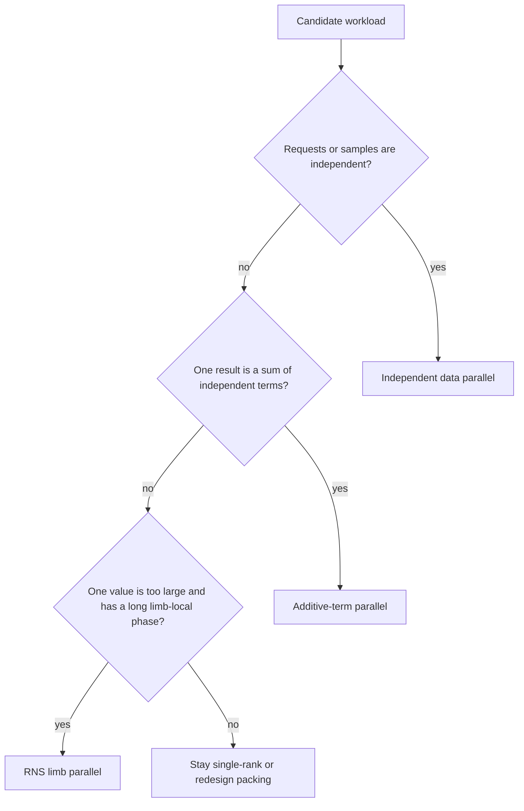
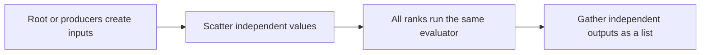
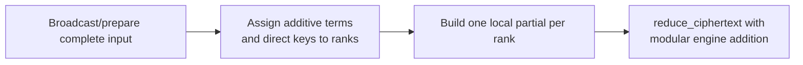

# Choose a multi-GPU partition

Choose a partition from the mathematical relationship among rank-local values,
then evaluate communication, keys, memory, and load balance. Do not infer a
partition from ciphertext shape alone.

## 1. Start from a correct single-rank evaluator

Keep a synchronized single-GPU eager implementation with a cleartext oracle.
Record its:

- operation and rotation counts;
- level schedule;
- required keys;
- latency by major phase;
- peak allocated/reserved memory;
- decrypt error.

This is the baseline and fallback.

## 2. Identify independent work

Use this decision tree:

## 3. Evaluate data parallelism

Choose independent ciphertext data parallelism when each rank owns a separate
request/sample.

Plan:

Advantages:

- low communication during evaluation;
- no ciphertext reduction;
- simple scaling and failure localization.

Check whether weights/keys are replicated and whether root encryption or output
gather becomes the bottleneck.

## 4. Evaluate additive-term parallelism

Choose additive-term parallelism when:

$$
\text{result}=\sum_r \text{partial}_r.
$$

Plan:

Advantages:

- expensive rotations/key switches can be partitioned;
- communication may occur mainly in the start and end phases.

Costs:

- input replication;
- per-rank complete active-row layout for local rotations;
- key placement and transient key movement;
- final typed reduction;
- imbalance when term costs differ.

## 5. Evaluate limb parallelism cautiously

Choose limb parallelism only when a single value/key is too large and the
program contains enough row-local work to amortize scatter/gather barriers.

Create contiguous `prime_ids` ranges, scatter them, perform only
operations with documented partial-layout semantics, and reconstruct every
expected active row before rescale, rotation, key switching, relinearization, or
decryption.

Repeated complete-row reconstruction points can erase local row-level gains.

## 6. Build a cost table

For each candidate, estimate:

| Cost | Data parallel | Additive-term parallel | Limb parallel |
| --- | --- | --- | --- |
| Input communication | Scatter | Broadcast | Scatter limbs |
| Output communication | Gather list | Typed ciphertext reduction | Reconstruct limbs |
| Key replication | Often complete evaluator set | Owned steps/common set | Complete-row owner/stage dependent |
| Local values | Independent full values | Full input + partial | Partial rows |
| Synchronization | Start/end | Start/end plus reduce | Every complete-row reconstruction point |
| Best use | Independent requests | Additive packed work | Long row-local phase |

Include topology and transient memory, not only steady retained bytes.

## 7. Validate world size one and two

Run the same worker under:

1. world size one;
2. two ranks with a small problem;
3. target rank count and problem;
4. uneven work distribution;
5. an empty-work rank that still participates in collectives.

Compare every final result to the same oracle and report maximum error per rank
or at the reconstructed root.

## 8. Keep graph capture local

If the local evaluator has a fixed schedule, capture one `CudaGraphProgram` per
rank. Leave dynamic input/key provisioning and typed final reduction eager.

## 9. Report the complete result

Record:

- partition and ownership rule;
- rank count, GPU topology, and launcher;
- local compute, input/key communication, and final gather/reduce separately;
- maximum and aggregate key memory;
- per-rank and global allocator peaks;
- load imbalance;
- correctness;
- startup and process-group setup.

## Related documentation

- [Communication semantics](../concepts/distributed/communication-semantics.md)
- [Independent ciphertext tutorial](../tutorial/spmd-independent-ciphertexts.md)
- [Rotation-parallel tutorial](../tutorial/spmd-rotation-parallel-matvec.md)
- [Limb-parallel tutorial](../tutorial/spmd-limb-parallel-pipeline.md)
