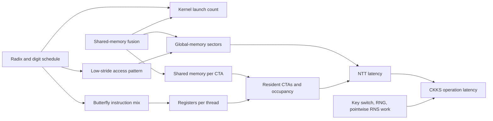

# Analyze and choose an NTT backend

This guide is for a deployment where the target GPU and CKKS preset are known,
but backend measurements are close, inconsistent, or different between raw
NTT kernels and CKKS operations. It explains how to identify the limiting
resource before selecting a `CkksEngine(ntt_backend=...)` policy.

For the screening command, decision thresholds, and a complete example result,
start with [Screen NTT backends on the target GPU](screen-ntt-backends.md).

## Establish the comparison definition

Hold these variables constant across candidates:

- GPU model, device index, clocks/power mode, and competing GPU activity;
- FHElium commit/version, PyTorch build, CUDA runtime, and driver;
- CKKS preset and therefore `logN`, Q/P prime counts, and residue dtype;
- semantic operation and input representation;
- warmup count, timed-run count, and repetition count.

Strict high-radix backends only support compatible ring dimensions. If radix
$R=2^b$ is strict, `logN` $L$ must satisfy $L \bmod b = 0$. An incompatible
backend is not a slower candidate; it is a different, invalid factorization and
is rejected.

Run the screening suite first and retain its raw evidence:

```bash
fhelium benchmark recommend ntt --suite kernel --preset slots32768-scale40-levels34-int64 \
  --device cuda:0 --output results/kernel.json
```

Then run the CKKS primitive suite under the same environment:

```bash
fhelium benchmark recommend ntt --suite ckks-primitive --preset slots32768-scale40-levels34-int64 \
  --device cuda:0 --output results/primitives.json
```

The JSON `evidence` array contains every operation/repetition timing rather than
only the final rank.

## Understand the score before interpreting it

For backend $b$ and operation $o$, the recommender first computes a latency
ratio against the best backend for that operation:

$$
r_{b,o} = \frac{\operatorname{median}(t_{b,o})}
                 {\min_j \operatorname{median}(t_{j,o})}.
$$

It then uses the equal-weight geometric mean across suite operations:

$$
S_b = \exp\left(\frac{1}{|O|}\sum_{o\in O}\log r_{b,o}\right).
$$

This prevents a millisecond-scale operation from numerically drowning out a
microsecond-scale operation solely because of units. It does **not** assert
that all operations matter equally to your application. A rotation-heavy
workload may need a different weighting, which is why the last decision must
use an application benchmark.

A gap below 3% is treated as a near tie. If the stable fallback is in that set,
the command selects it. High confidence additionally requires:

- at least three repetitions and five timed runs per operation;
- the same numerical winner in every repetition;
- at least 5% margin over the runner-up;
- at most 5% median within-run coefficient of variation.

## Map backend structure to GPU costs

The backends produce the same power-of-two NTT result, but
organize its factorization and stages differently:

- `radix2_compact_group4_smem8`, `group8`, and `group16` fuse groups of radix-2
  stages and use a compiled shared-memory region;
- `radix4_compact`, `radix8_compact`, and `radix16_compact` use genuine strict
  high-radix butterflies and require divisibility;
- `radix2_indexed` stores expanded schedules, is the CPU production default,
  and provides the cross-device validation baseline for compact CUDA policies;
  CUDA deployment screening ordinarily compares the compact candidates.

For a strict radix $R=2^b$ transform with $N=2^L$, the number of radix digits is

$$
D = \frac{L}{b}.
$$

If a shared-memory budget of $S$ transform bits fuses $H$ complete digits,

$$
H = \min\left(D, \left\lfloor\frac{S}{b}\right\rfloor\right).
$$

When $H>0$, those digits become one local region, giving approximately
$D-H+1$ digit-kernel launches instead of $D$. This reduces global round trips,
but it may also increase per-block resources. The compiled native policy owns
this tuning; the recommendation command does not alter it.

In the diagram, Cooperative Thread Array (CTA) means one CUDA thread block.



*Figure 1. Backend choice changes launch, memory-traffic, and occupancy costs;
CKKS operations then combine NTT latency with non-NTT work.*

### Global-memory traffic and coalescing

High radix reduces digit count, but a terminal low-stride butterfly can scatter
neighboring threads across distant addresses. If sectors per requested byte
increase, fewer launches may still lose to grouped radix-2. Shared-memory
fusion is valuable when it keeps that low-stride region local and makes global
loads/stores contiguous.

Inspect these profiler signals together:

- L1/L2 sectors and DRAM bytes per transform;
- global load/store efficiency or sectors per request;
- achieved bandwidth relative to the device peak;
- forward and inverse traffic separately.

A backend with similar arithmetic count but much higher sector traffic is
memory-layout limited, not mathematically doing more NTT work.

### Registers, shared memory, and CTA supply

A larger butterfly exposes more temporaries. Higher registers per thread can
reduce the number of resident CTAs. A larger shared tile can impose the same
limit at block granularity.
Compare:

- registers per thread;
- static/dynamic shared memory per block;
- active warps and achieved occupancy;
- eligible warps and issue-slot utilization;
- blocks resident per Streaming Multiprocessor (SM).

Do not optimize occupancy as an isolated percentage. Lower occupancy is a
problem only when it prevents the kernel from hiding instruction or memory
latency.

### RNS row count and cache behavior

One CKKS transform applies the same backend across multiple active Q/P prime
rows. More rows increase parallel work and can improve GPU saturation, but they
also enlarge the working set. A backend that wins a small kernel microbenchmark
can change position when key switching adds P rows or when the active Q suffix
shrinks at a later level.

If the production evaluator is dominated by a specific level, reproduce its
active rows instead of assuming level-0 QP measurements are sufficient.

### Why GPU architecture changes the result

The same 256-coefficient shared region can behave differently when devices have
different:

- register-file and shared-memory capacity per SM;
- warp/CTA residency limits;
- L1/L2 sizes and sector behavior;
- HBM/GDDR bandwidth and latency;
- instruction throughput and scheduling rules.

Therefore, a radix8 shared path can be a clear win on one GPU and lose to an
all-global path on another. Architecture labels such as `sm_86`, `sm_90`, and
`sm_120` are evidence, not sufficient explanations by themselves.

## Explain kernel-versus-primitive disagreement

Use the pattern, not only the aggregate rank:

| Result pattern | Likely interpretation | Next check |
| --- | --- | --- |
| Backend wins forward and inverse NTT, then wins CKKS primitives | NTT savings survive composition | Measure the real evaluator. |
| Strong kernel win becomes a primitive near tie | RNG, pointwise RNS work, allocation, or key switching dilutes NTT | Compare per-primitive evidence and application operation mix. |
| Forward wins but inverse loses | Direction-specific schedule, coalescing, or shared prefix/suffix behavior | Profile forward and inverse kernels separately. |
| Kernel suite and primitive suite choose different clear winners | Primitive composition changes active rows, call count, or cache/resource behavior | Count NTT calls and profile the dominant primitive. |
| Repetition winner changes or CV is high | Thermal state, clock drift, competing work, first-use effects, or insufficient runs | Stabilize the machine and repeat; do not encode a winner. |
| One backend fails correctness | Specification or implementation defect, not a performance result | Stop ranking and preserve the failing input/environment. |

The CKKS primitive suite times key use but excludes key generation. Its
`multiply_relinearize` measurement includes multiplication and relinearization;
`rotate_many_by_steps[4]` includes grouped decomposition/hoisting and four
rotations.
Those measurement definitions are intentional because users experience the composed
primitive, not an isolated internal NTT call.

One RTX A6000 measurement illustrates the final application check. For
`logN = 15`, the CKKS primitive suite recommended
`radix2_compact_group4_smem8`, while the staged graph-captured 128 x 128
rotation-parallel matvec selected `radix8_compact`. The primitive result was a
shortlist decision; the production evaluator changed NTT call composition,
rotation schedule, diagonal policy, and live working set. Preserve both results
under their actual measured scopes rather than treating either as a
contradiction.

## Profile only after the ranking poses a question

Do not collect every metric for every backend first. Use the recommendation to
form one contrast, such as “radix16 has fewer launches but loses inverse NTT to
group8.” Then profile the two candidates with the same input rows and inspect:

1. kernel launch count and duration;
2. registers and shared memory per launch;
3. active warps/CTAs;
4. L1/L2 sectors and DRAM bytes;
5. instruction mix and issue stalls.

Normalize traffic per transform and record whether the launch is a global digit
or the fused shared region. Aggregate counters across unlike kernels can hide
the actual bottleneck.

## Make the deployment decision

Use this order:

1. Reject correctness failures and incompatible strict radices.
2. Reject clearly slower candidates with the kernel suite.
3. Use the primitive suite to select among plausible candidates.
4. Keep the stable fallback for a near tie or inconsistent repetitions.
5. Benchmark the full production evaluator with representative levels, batch
   sizes, and rotation/key-switch schedule.
6. Pass the chosen backend name to every constructed engine that must
   reproduce the deployment.
7. Archive the command, JSON evidence, GPU/software provenance, and application
   benchmark together.

Do not turn one machine's winner into a library-wide default. A global default
requires separate cross-GPU, cross-preset, primitive, and real-workload policy
evidence. FHElium currently uses one static backend name across every
supported `logN` and GPU—there is no per-`logN` table, hardware dispatch, or
first-use autotuning—and this command deliberately makes no change to it.
