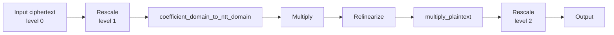

# Choose a preset and chain depth

Use this procedure before optimizing or distributing a new evaluator. The goal
is a parameter plan that has enough slots, legal state transitions,
realistic numerical range, and a reproducible correctness test.

## Maintained preset baselines

`Preset` members use the form
`slots{capacity}_scale{bits}_levels{count}_{dtype}`. The corresponding CLI value
uses hyphens, for example `slots8192-scale40-levels7-int64`. `levels` is the
public-level count; the number of ordinary one-level transitions available
from level zero is `levels - 1`.

The dtype suffix is required. Unsuffixed Python members and CLI values are not
accepted as aliases.

The `int32` family uses a 30-bit residue buffer and 28-bit structural Q/P
primes. The `int64` family uses a 62-bit residue buffer and 60-bit structural
Q/P primes. Both use the built-in 128-bit classical category, Gaussian error
standard deviation 3.19, and uniform-ternary secret sampling. The exact
installed prime values remain part of the resolved `CkksConfig` and context
identity. Preset level counts are fixed constants rather than values
recomputed from the current built-in budget data. Some int32 counts are limited
by the reviewed prime catalog before they reach the security-table bit budget.
A resolved `CkksConfig` is immutable so its cached prime sequences and security
assessment cannot diverge. Create a derived configuration with
`CkksConfig.parse(preset, **overrides)` rather than assigning fields or editing
modulus sequences in place.

| Python member | dtype | `logN` | slots | scale bits | public levels | transitions | Q / P rows | QP bits / budget |
| --- | --- | ---: | ---: | ---: | ---: | ---: | ---: | ---: |
| `Preset.slots8192_scale25_levels14_int32` | int32 | 14 | 8,192 | 25 | 14 | 13 | 15 / 1 | 407 / 430 |
| `Preset.slots16384_scale25_levels29_int32` | int32 | 15 | 16,384 | 25 | 29 | 28 | 30 / 2 | 816 / 868 |
| `Preset.slots32768_scale25_levels24_int32` | int32 | 16 | 32,768 | 25 | 24 | 23 | 25 / 4 | 740 / 1,747 |
| `Preset.slots65536_scale25_levels14_int32` | int32 | 17 | 65,536 | 25 | 14 | 13 | 15 / 6 | 543 / 3,523 |
| `Preset.slots8192_scale30_levels9_int64` | int64 | 14 | 8,192 | 30 | 9 | 8 | 10 / 1 | 391 / 430 |
| `Preset.slots8192_scale40_levels7_int64` | int64 | 14 | 8,192 | 40 | 7 | 6 | 8 / 1 | 400 / 430 |
| `Preset.slots8192_scale50_levels5_int64` | int64 | 14 | 8,192 | 50 | 5 | 4 | 6 / 1 | 371 / 430 |
| `Preset.slots16384_scale30_levels21_int64` | int64 | 15 | 16,384 | 30 | 21 | 20 | 22 / 2 | 810 / 868 |
| `Preset.slots16384_scale40_levels16_int64` | int64 | 15 | 16,384 | 40 | 16 | 15 | 17 / 2 | 821 / 868 |
| `Preset.slots16384_scale50_levels12_int64` | int64 | 15 | 16,384 | 50 | 12 | 11 | 13 / 2 | 781 / 868 |
| `Preset.slots32768_scale30_levels45_int64` | int64 | 16 | 32,768 | 30 | 45 | 44 | 46 / 4 | 1,650 / 1,747 |
| `Preset.slots32768_scale40_levels34_int64` | int64 | 16 | 32,768 | 40 | 34 | 33 | 35 / 4 | 1,660 / 1,747 |
| `Preset.slots32768_scale50_levels27_int64` | int64 | 16 | 32,768 | 50 | 27 | 26 | 28 / 4 | 1,650 / 1,747 |
| `Preset.slots65536_scale30_levels95_int64` | int64 | 17 | 65,536 | 30 | 95 | 94 | 96 / 6 | 3,311 / 3,523 |
| `Preset.slots65536_scale40_levels72_int64` | int64 | 17 | 65,536 | 40 | 72 | 71 | 73 / 6 | 3,300 / 3,523 |
| `Preset.slots65536_scale50_levels58_int64` | int64 | 17 | 65,536 | 50 | 58 | 57 | 59 / 6 | 3,320 / 3,523 |

The int32 level counts have distinct limiting reasons:

- `slots8192_scale25_levels14_int32` retains 23 bits of security-table margin;
- `slots16384_scale25_levels29_int32` retains 52 bits rather than consuming
  the budget to within one bit;
- `slots32768_scale25_levels24_int32` stops at the longest catalog prefix for
  which every modulus satisfies the native requirement
  $4q<2^{\mathtt{buffer\_bit\_length}}$;
- `slots65536_scale25_levels14_int32` stops before the scale catalog would
  duplicate a selected structural/P prime.

The lower int32 default scale also changes numerical error. In controlled
four-seed encryption measurements across the maintained ring sizes, the 99th
percentile absolute error was 8.00–8.63 times
$N/\mathtt{default\_scale}$ for both int32 and int64. This common normalized
distribution means int32 does not change the CKKS noise mechanism, but its
$2^{25}$ default scale yields larger absolute error than the int64 scale-40
family at the same ring. Treat a preset as a parameter baseline, not a
precision guarantee, and measure the workload's error distribution.

The scale width is a configuration input, not a certified precision result.
Choose it from the workload's error and range requirements, then validate the
observed error distribution. A 30-bit family provides more public transitions
within the same security budget; a 50-bit family allocates more scale bits per
transition and therefore provides fewer public levels.

## 1. Specify the cleartext workload

Write down:

- logical input/output shapes;
- slot packing and padding;
- every ciphertext-ciphertext and ciphertext-plaintext multiplication;
- where partial products are summed;
- required rotations and conjugations;
- expected input amplitude and worst-case intermediate magnitude;
- output error tolerance.

Build a cleartext oracle with the same packing and rotation convention.
Do not infer required depth from a high-level layer count alone.

## 2. Determine the slot requirement

A ring with `logN = k` has:

$$
N=2^k,\qquad \text{slots}=N/2.
$$

Include padding, masks, replicated blocks, and intermediate layouts—not only
logical vector length. Choose the smallest candidate ring that satisfies the
packing and security/configuration constraints, then validate on the intended
target ring.

## 3. Draw the level schedule

For each evaluator value, annotate:

```text
operation
level before
scale before
transition
level after
scale after
```

Count `rescale_to_next_level` calls, including operand preparation before
ciphertext-ciphertext multiplication. Addition does not consume a level, while
plaintext multiplication changes scale until a rescale.

A useful sketch is:



Ensure every rescale has another legal leading Q prime.

## 4. Choose scale and estimate range

Evaluate both fractional precision and integer headroom. Track approximate
cleartext magnitude through products and wide sums. Large packing reductions
can exhaust range even when multiplicative depth is shallow.

Test at:

- representative amplitude;
- expected maximum amplitude;
- positive and negative values;
- several random seeds;
- early, middle, and final legal levels used by the schedule.

Do not lower scale or bypass range checks solely to improve a benchmark.

## 5. Start with a fast smoke configuration

Use the smallest maintained slot capacity and scale family appropriate for
quick iteration, such as `Preset.slots8192_scale40_levels7_int64`, to validate
program structure, state transitions, and keys. Then rerun the same oracle and
schedule on the target slot, scale, and public-level baseline.

The smoke configuration does not prove target-level performance, memory, or
numerical behavior.

## 6. Record the configuration

For each tested configuration, record:

- preset and `logN`;
- default scale;
- number of Q and P rows;
- level at every checkpoint;
- active `prime_ids` where failures occur;
- component count/polynomial domain/modulus basis/residue representation;
- maximum absolute and relative error;
- input amplitude and random seed;
- value and key sizes.

## 7. Add parameter-limit tests

At minimum, include:

- one successful operation at the first level;
- one at a middle level;
- one at the last legal level;
- an expected failure when another rescale is impossible;
- realistic wide accumulation;
- persisted/reloaded values if the production path uses files;
- target source or installed-wheel environment.

## 8. Only then optimize or distribute

Keep the single-GPU eager evaluator as the baseline. Add hoisting, graph
capture, streaming, or SPMD one mechanism at a time and compare to the same
cleartext oracle.

## Related documentation

- [Scale and level lifecycle](../concepts/ckks/scale-and-level-lifecycle.md)
- [Context and modulus chain](../concepts/ckks/context-and-modulus-chain.md)
- [Evaluator operation transitions](../concepts/ckks/evaluator-operation-transitions.md)
- [Modulus-chain tutorial](../tutorial/modulus-chain-depth.md)
- [Benchmark a workload](benchmark-a-workload.md)
