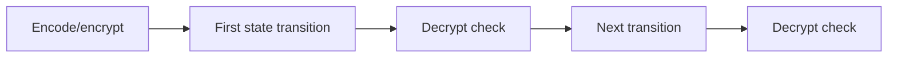

# Diagnose a value-state mismatch

When an operation rejects a value—or a lower-level experiment produces wrong
results—compare exact state in a fixed order. Do not begin by changing kernels
or disabling validation.

## 1. Reduce to one deterministic operation

Build the smallest reproducer with:

- a fixed preset and indexed device;
- deterministic input values and seed;
- one named operation;
- decrypt/cleartext comparison immediately afterward;
- state printed before and after;
- no graph, distributed execution, cache, or multi-stream overlap.

First establish whether single-GPU eager execution is correct.

## 2. Compare context and device

Check:

```text
value.context_id == engine.context.context_id
value.device == engine.device
ring dimension matches
```

A loaded value may be on CPU by default. Move it with `.to(...)` rather than
assuming a file remembers the original GPU.

## 3. Compare structure

Inspect:

```text
concrete value type
tensor dtype and dimensionality (ndim)
component count
limb count
ring dimension
prime_ids length and order
```

Two tensors can have equal shape but different context or row identity. A
partial-limb view does not contain the complete active-row layout merely
because its other metadata is valid.

## 4. Compare arithmetic state

Use this order:

1. level;
2. active `prime_ids`;
3. plaintext representation, where applicable;
4. modulus basis (`Q` or `QP`);
5. polynomial domain (`coefficient` or `ntt`);
6. residue representation (`standard` or `montgomery`);
7. scale;
8. component count.

Typical diagnoses:

| Symptom | Likely mismatch |
| --- | --- |
| Fresh ciphertext rejected by `multiply` | Still coefficient domain or not rescaled/prepared |
| Same-level addition rejected | Prime IDs, scale, polynomial domain, or modulus basis differ |
| Q value rejected by key-switch path | Key/value basis or active rows incompatible |
| Three-component value rejected | Operation requires two components or relinearization |
| `MaximumLevelError` | No remaining legal scale prime to drop |

## 5. Check stored key state and the external key relation

For key-requiring operations, verify:

- key context;
- Q/QP prime layout;
- NTT/residue representation;
- key type;
- rotation key's canonical signed step;
- whether the key is installed on the local engine/device.
- whether the application supplied a key with the required ciphertext,
  source-secret, and destination-secret relation.

Do not substitute a same-shaped key from another context, step, or externally
maintained lineage.

## 6. Inspect the operation requirements

List the required input and output state. For example:

```text
multiply:
  input: two compatible 2-component Q NTT/Montgomery ciphertexts
  output: 3-component Q NTT/Montgomery ciphertext

relinearize:
  input: compatible 3-component ciphertext + relin key
  output: 2-component coefficient ciphertext
```

Use the API docstring and focused tests as the source of truth.

## 7. Add transitions back one at a time

Once the single operation passes, restore the original chain incrementally:



For operations whose intermediate representation is not directly meaningful to
decrypt, first reach a legal decryptable checkpoint or compare against a
trusted single-GPU reference path.

## 8. Reintroduce execution mechanisms last

Add in this order:

1. in-place variants;
2. prepared plaintext or NTT reuse;
3. multi-stream copies;
4. CUDA Graph replay;
5. distributed transport/partition;
6. residency/prefetch policy.

At each step, preserve the same oracle, seed, level checkpoints, and error
threshold.

## 9. If the problem reaches native code

Capture:

- exact source commit and build/wheel origin;
- operator schema and generated wrapper status;
- shape/dtype/device and mutation or aliasing semantics;
- level-specific row start/stop and prime IDs;
- singleton/last-level/Q-vs-QP cases;
- synchronized CUDA error location;
- smallest `logN` and exact NTT backend that reproduce the issue.

Do not treat an asynchronous error reported at a later call as proof that the
later call caused it.

## Related documentation

- [Scale and level lifecycle](../concepts/ckks/scale-and-level-lifecycle.md)
- [Value model and identity](../concepts/ckks/value-model-and-identity.md)
- [Evaluator operation transitions](../concepts/ckks/evaluator-operation-transitions.md)
- [Basic CKKS tutorial](../tutorial/basic-ckks-workflow.md)
- [Native operator workflow](../developer/native-operator-workflow.md)
