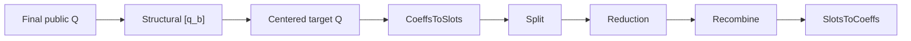

# Implement a bootstrap component

The experimental bootstrap component interfaces expose polynomial approximation, polynomial evaluation, linear-transform compilation and evaluation, and periodic reduction. Each component defines its coordinate, polynomial basis, tensor axes, arithmetic state, level/scale recurrence, mutation behavior, and numerical range.

## Polynomial approximation

An approximator chooses coefficients but not the homomorphic multiplication
DAG. Use ascending-degree coefficients and record the physical design interval:

```python
class MyApproximator:
    def approximate(self, function, *, domain=(-1.0, 1.0), name="polynomial"):
        coefficients = fit_with_my_method(function, domain)
        return bs.PolynomialApproximation(
            basis="power",
            coefficients=tuple(coefficients),
            domain=domain,
            name=name,
        )
```

The two built-in basis conventions are

$$
p(x)=\sum_{n=0}^{d}a_nx^n
$$

and

$$
p(x)=\sum_{n=0}^{d}a_nT_n(x).
$$

If `domain=(a, b)` is physical coordinate $t$, the coefficient coordinate is

$$
x=\frac{2t-(a+b)}{b-a}\in[-1,1].
$$

`PolynomialApproximation.evaluate_plaintext()` receives $x$, not $t$, and does
not normalize automatically. Its input may have any NumPy-broadcastable axes;
its output preserves those axes.

## Polynomial evaluation

Implement `required_levels()` and `evaluate()` to execute another multiplication
DAG:

```python
class MyEvaluator:
    def required_levels(self, polynomial):
        return my_depth(polynomial.coefficients)

    def evaluate(
        self,
        engine,
        ciphertext,
        polynomial,
        *,
        relinearization_key=None,
    ):
        return my_homomorphic_dag(
            engine,
            ciphertext,
            polynomial.coefficients,
            relinearization_key=relinearization_key,
        )
```

State the basis your evaluator accepts. The built-in evaluators consume a
two-component coefficient-domain standard-RNS Q ciphertext with axes
`[component, *batch, limb, coefficient]` and exact active `prime_ids`. Their
ciphertext products require a relinearization key and perform

```text
coefficient/standard/Q/two components
  -> NTT/Montgomery/Q/two components
  -> NTT/Montgomery/Q/three components
  -> coefficient/standard/Q/two components
  -> drop leading Q row and reinterpret at default_scale
```

A custom evaluator must report whether it follows that private fixed-scale
policy or preserves the core actual scale
$\Delta_{\rm product}/q_{\rm drop}$. It must not claim
`required_levels(polynomial) == d` unless every execution path advances by
exactly $d$ levels.
An evaluator may accept `relinearization_key=None` only on an execution path
whose polynomial DAG contains no ciphertext product, such as a constant or
linear built-in polynomial.

## Linear-transform compilation

A compiler returns immutable stages. A stage stores whatever numerical data the
matching evaluator understands:

```python
from dataclasses import dataclass

@dataclass(frozen=True)
class SparseStage:
    slots: int
    matrix: object

    def reference(self, values):
        return self.matrix @ values

class SparseCompiler:
    def compile(self, *, slots, direction, generator, scale=1.0):
        matrix = synthesize_sparse_map(slots, direction, generator, scale)
        return (SparseStage(slots, matrix),)
```

`reference()` is a plaintext oracle. Document its accepted axes and whether its
input is a raw physical coordinate or a normalized coordinate. The built-in
radix-2 reference uses exact shape `[slot]` and the convention

$$
T(C(a))=Sa.
$$

The compiler's `scale` argument multiplies numerical matrix values. It is not a
CKKS metadata scale.

## Linear-transform evaluation

```python
class SparseEvaluator:
    def required_rotation_offsets(self, transform):
        return tuple(rotations_used_by(transform.matrix))

    def required_levels(self, transform):
        return 1

    def evaluate(
        self,
        engine,
        ciphertext,
        transform,
        *,
        rotation_keys,
        rotate,
        encode_diagonal,
    ):
        return evaluate_sparse_map(
            engine,
            ciphertext,
            transform.matrix,
            rotation_keys=rotation_keys,
            rotate=rotate,
            encode=encode_diagonal,
        )
```

The callbacks provide rotation-key decomposition and diagonal encoding/cache
policy. A built-in diagonal stage encodes an unbatched `[limb, ntt_index]`
Montgomery plaintext at scale $\Delta_0$. For input scale $\Delta_j$ and leading
prime $q_j$, one stage returns

$$
\ell_{j+1}=\ell_j+1,\qquad
\Delta_{j+1}=\frac{\Delta_j\Delta_0}{q_j}.
$$

The output remains two-component coefficient-domain standard RNS over Q, with
unchanged batch axes and the leading `prime_ids` row removed. If a custom
evaluator uses another recurrence or state transition, report the differing recurrence or transition.

For a cyclic-diagonal map

$$
L(x)=\sum_kd_k\mathbin{\odot}\operatorname{Rot}_k(x),
$$

direct and BSGS evaluation are alternative schedules, not alternative maps. A
BSGS implementation should test the identity

$$
\operatorname{Rot}_g\left(
 \operatorname{Rot}_b(x)\mathbin{\odot}\operatorname{Rot}_{-g}(d_{g+b})
\right)
=
\operatorname{Rot}_{g+b}(x)\mathbin{\odot}d_{g+b}.
$$

## Periodic reduction (`modular_reduction`)

A reduction component must distinguish raw and normalized coordinates. Let
`input_bound` be $B$, raw input be $r$ with $|r|\le B$, and normalized input be
$x=r/B$. The built-in output target is

$$
\rho_B(x)=\frac{\sin(\pi Bx)}{\pi}.
$$

A custom component protocol can be as small as:

```python
class MyReduction:
    input_bound = 1024
    fuse_input_normalization = True
    requires_relinearization = False

    @property
    def required_levels(self):
        return 6

    @property
    def fused_input_divisor(self):
        return float(self.input_bound) if self.fuse_input_normalization else 1.0

    def reference(self, normalized_values):
        return my_plaintext_periodic_oracle(normalized_values)

    def evaluate(
        self,
        engine,
        ciphertext,
        *,
        relinearization_key=None,
        conjugation_key=None,
    ):
        del relinearization_key, conjugation_key
        # With fusion, ciphertext already represents x = r / input_bound.
        return my_periodic_reduction_without_ciphertext_products(
            engine, ciphertext
        )
```

The component interface specification must state:

- whether `reference()` accepts $r$ or $x$;
- whether `evaluate()` accepts $r$ or $x$ under each fusion setting;
- the raw admissible interval and output target;
- the polynomial basis and design interval;
- exact `required_levels` and output actual scale;
- whether `requires_relinearization` is true because evaluation performs a
  ciphertext-ciphertext product;
- whether ciphertext products or conjugation consume the supplied primitive
  keys;
- output level, component count, domain, basis, residue representation, and
  `prime_ids`;
- whether execution mutates or aliases an input.

`FullSlotBootstrap` expects `fused_input_divisor` to be the numerical factor
folded into CoeffsToSlots. Returning $B$ asserts that the reducer will receive
$x$ and must not divide by $B$ again. The reducer is a slotwise stage and does
not receive rotation keys. Its `evaluate()` method receives keyword-only
`relinearization_key` and `conjugation_key` values. A custom reduction that
does not multiply ciphertexts supports `relinearization_key=None`; built-in
reductions reject `None`. The full-slot topology always has a conjugation key
for branch splitting, so reducers may use that same primitive without a second
key declaration.

## Full-slot integration requirements

A component that is inserted into `FullSlotBootstrap` participates in this
state sequence:



The callable calculates

$$
\ell_{\rm out}=\ell_{\rm raise}+m_C+1+m_\rho+m_T.
$$

Its final scale is the actual SlotsToCoeffs recurrence, not necessarily
`default_scale`. A component must not hide a level, scale reinterpretation,
basis extension, NTT transition, or range normalization from its declared
state-transition specification.

## Test the behavior that matters

Test components independently before inserting them into a full bootstrap:

- compare `reference()` with the intended map on the documented coordinate;
- test raw-to-normalized equivalence using $x=r/B$;
- compare encrypted component output with the plaintext oracle;
- assert output level advancement and actual scale recurrence;
- assert component, batch, limb, and coefficient/NTT axes;
- assert domain, basis, residue representation, and exact `prime_ids`;
- compare direct and BSGS decoded outputs for the same mathematical map;
- run full-slot end-to-end refresh across several seeds and admissible ranges;
- measure the application's actual raw branch range and error distribution.

Do not weaken a tolerance to accommodate unexplained error. First determine
whether the implementation changed, the coordinate convention is wrong, or the
original error model was unsound. No identity payload or complete-pipeline
framework is required for these tests.
