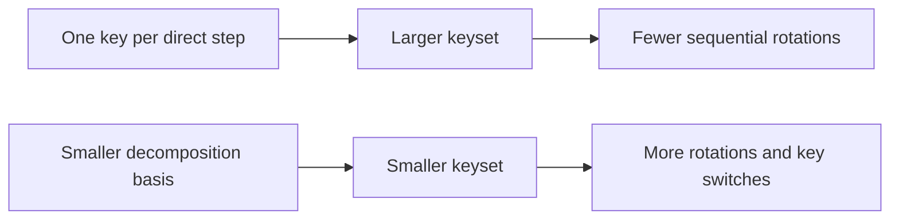

# Provision the minimum required keyset

Generate, load, move, and retain keys from the evaluator's operation
schedule. Avoid a default policy of creating every possible key on every rank.

## 1. Inventory key-requiring operations

From direct evaluator code, list:

| Operation | Possible key requirement |
| --- | --- |
| Public-key encryption | `PublicKey` |
| Decryption | `SecretKey` |
| Relinearize a three-component multiplication result | `RelinearizationKey` |
| Rotation by step $s$ | `RotationKey(s)` |
| Conjugation | `ConjugationKey` |
| Source-to-destination secret-key dependency change | `KeySwitchKey` |

Plaintext affine operations may not require secret or evaluation keys on a
worker after ciphertext provisioning.

## 2. Canonicalize the rotation steps

Derive steps from the actual packing algorithm. Normalize them with the same
ring/slot convention used by the engine, remove duplicates, and confirm each
step against the cleartext oracle.

Do not generate keys from matrix dimensions alone if padding, baby-step/giant-
step decomposition, or negative rotations change the schedule.

## 3. Decide direct keys versus decomposition

Compare two strategies:



Measure both latency and peak/transient memory. Key decomposition is not free,
and direct keys may dominate CUDA memory.

## 4. Assign keys to ranks

For each rank, write an ownership table:

```text
rank
local evaluator operations
required public/evaluation keys
whether secret key is permitted
host residency
CUDA residency window
```

Examples:

- independent data-parallel workers may share the same public evaluator keyset;
- offset-parallel ranks need only rotation keys for owned steps plus any common
  keys;
- root may retain the secret key while evaluator workers never receive it;
- limb-parallel complete-row stages may force key/value reconstruction on an
  owner rank.

## 5. Separate setup from steady state

Create or load and install keys before the measured evaluator region:

```python
secret_key = engine.create_secret_key()
public_key = engine.create_public_key(secret_key)
relin_key = engine.create_relinearization_key(secret_key)

engine.set_public_key(public_key)
engine.set_relinearization_key(relin_key)
```

Add only the rotation keys required by the schedule. Use the current API
reference for construction and installation signatures.

For a production evaluator, disable implicit secret-key generation and fail
clearly if a required key is missing.

## 6. Prove specialist key relations

A generic key-switch key has a direction that its tensor object does not store
symbolically. Generate it from the named source and destination secrets,
record that relation in application metadata, and verify the output only with
the destination secret:

```python
source_secret = engine.create_secret_key()
destination_secret = engine.create_secret_key()
source_public = engine.create_public_key(source_secret)

source = engine.encrypt_message(message, source_public)
source_to_destination = engine.create_key_switch_key(
    source_secret,
    destination_secret,
)
switched = engine.switch_key(source, source_to_destination)
decoded = engine.decrypt_message(switched, destination_secret)
```

Reversing the two secrets creates a different key. A matching `context_id` and
tensor layout establish parameter compatibility, not direction or lineage.

Conjugation uses a key specialized for the conjugation automorphism:

```python
conjugation_key = engine.create_conjugation_key(source_secret)
conjugated = engine.conjugate(source, conjugation_key)
```

Confirm the decoded result against `message.conj()` under the application's
packing convention. Neither specialist key is installed implicitly.

## 7. Choose a residency plan

Frequently reused common keys may remain on CUDA. Large per-user or phase-
specific keys may instead use:

- request-lifetime pageable host holds;
- bounded pinned/CUDA windows;
- short active leases;
- prefetch before the operation that needs them.

Account for both retained and transient material. A broadcast that eventually
keeps a key on one owner can still materialize temporary copies on peers,
depending on the collective used.

## 8. Validate custody and persistence

Before writing secret material, confirm:

- the selected path is protected;
- explicit secret serialization is authorized;
- encryption at rest and access-control lists (ACLs) are external and operational;
- evaluator workers do not receive secret keys unnecessarily;
- logs and benchmark metadata do not expose payloads;
- stale artifact references and context mismatches fail safely.

A sensitivity label is not encryption.

## 9. Report key cost

A performance or memory report should state:

- number of direct rotation keys;
- key decomposition strategy;
- aggregate and maximum per-rank key bytes;
- host and CUDA residency;
- whether setup/key movement is timed;
- transient peaks during distribution or prefetch.

## Related documentation

- [Key lifecycle](../concepts/ckks/key-lifecycle.md)
- [Key-materials tutorial](../tutorial/key-materials.md)
- [Residency lifetimes](../concepts/execution/residency-lifetimes.md)
- [Choose a multi-GPU partition](choose-multi-gpu-partition.md)
