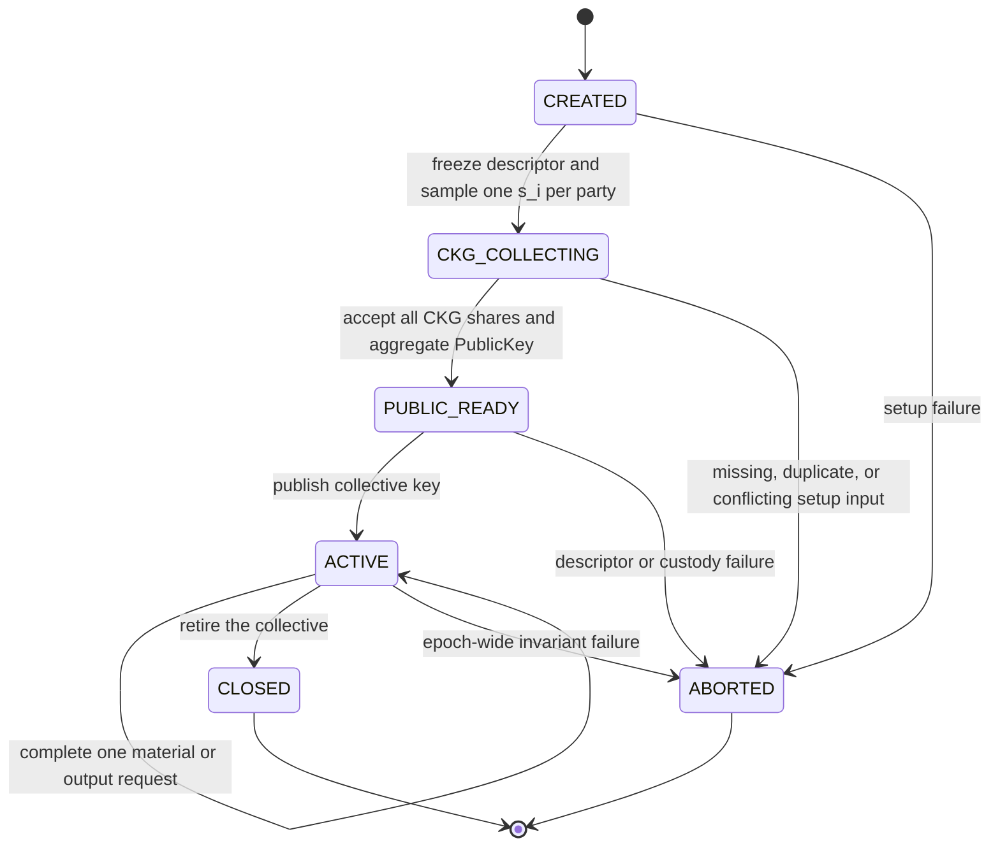
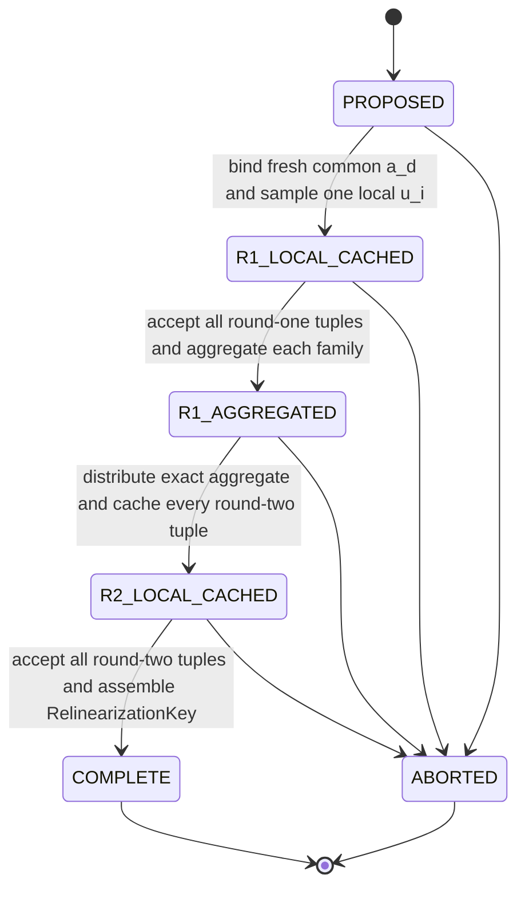

# Use multiparty CKKS

`fhelium.experimental.mpc` provides tensor operations for collective CKKS key generation, evaluation-key generation, collective decryption arithmetic, and public-key switching arithmetic. The functions operate on core FHElium keys and values plus raw engine tensors. The current implementation accepts a local CPU or CUDA `CkksEngine`.

> [!CAUTION]
> The supported arithmetic scope is correctness for compatible values. The
> current API provides no authentication, transcript binding, secure transport,
> malicious-party security, output-query control, reviewed output-error sampler,
> supported smudging/useful-precision parameter profile, privacy guarantee, or
> validated security composition for
> the secret-dependent output operations. Use synthetic data and throwaway keys.

In this guide, **honest execution** means that every application actor follows the stated message order with matching context, request, and payload data. This term describes reproducible control flow; it carries no semi-honest security claim.

Collective key generation (CKG) creates the collective public key. Two-round
relinearization-key generation (RKG) creates public evaluation material for
three-to-two-component relinearization.

The maintained local example is `examples/18_multiparty_ckks.py`. It
holds two in-process party records representing two cryptographic parties,
exercises the complete public
API, and never constructs the aggregate secret. The local process provides no
trust-domain or process isolation between those records.

## Separate arithmetic from application state

The `fhelium.experimental.mpc` namespace is a stateless arithmetic layer.
Every function receives its operands as arguments and returns either a raw tensor
message or a FHElium value. The application owns the protocol state around
those calls.

| `fhelium.experimental.mpc` operation | Application responsibility |
| --- | --- |
| Sample one local QP secret share | Assign the share to one cryptographic party and protect its process-local lifetime |
| Sample common-uniform engine tensors | Deliver the byte-identical tensor for one agreed request |
| Validate context, key/value state, tensor shape, dtype, device, and contiguity | Validate epoch, request, party, round, operation, freshness, and payload identity |
| Compute one protocol share | Cache the result before delivery and invoke each randomized share function once |
| Sum a nonempty sequence of shares | Require exactly one accepted logical contribution from every expected party |
| Return core `PublicKey`, `RelinearizationKey`, `RotationKey`, `ConjugationKey`, `Plaintext`, or `Ciphertext` values | Associate each result with the correct collective epoch and authorize its use |

The state names below are application labels for a dictionary, enum, or append-only application log. They do not define a FHElium `Party`, `Session`, `Coordinator`, transport, or persistence class.

## Freeze the collective descriptor

Create one application descriptor before secret sampling. At minimum, record:

```text
epoch_id                 application-defined unique label
party_ids                exact ordered set of cryptographic party identities
context_id               engine.context.context_id
ring_dimension           engine.config.N
q_prime_ids              engine.rns_layout.prime_ids(0)
qp_prime_ids             engine.rns_layout.prime_ids(0, include_p=True)
engine_dtype              engine.config.torch_dtype
key_digit_count          engine.rns_layout.key_digit_count
galois_generator         engine.galois_generator
```

Every process constructs a compatible engine and compares this descriptor before accepting a message. A cryptographic party is an independent trust domain. Process IDs, distributed ranks, and device indices describe execution topology and do not identify cryptographic parties. One party may use several internal ranks or devices and still emits one logical party contribution per protocol round.

Raw protocol tensors contain no epoch, request, party, round, operation, or collective-key identity. Associate each transported payload with an application envelope such as:

```text
epoch_id
request_id
party_id
protocol
round
context_id
operation_parameter       for example, one canonical rotation step
payload_identity          application-defined exact-byte identity or digest
payload
```

This envelope is application metadata. Its presence alone supplies no authentication or transcript security.

## Assign roles

| Role | Responsibility |
| --- | --- |
| Party | Holds one process-local level-zero QP secret share $s_i$ and any request-local RKG ephemeral $u_i$ |
| Aggregator | Collects exactly one accepted message per party and invokes the matching `aggregate_*` function |
| Evaluator | Uses collective public/evaluation keys and ciphertexts with `CkksEngine` |
| Fusion recipient | Collects Protocol-3 shares, fuses them to `Plaintext`, and obtains the decoded result |
| Destination recipient | Generates a compatible destination key pair, publishes its Q `PublicKey`, and decrypts a public-key-switch output with its own `SecretKey` |

An actor may hold several roles in a local run. Independent deployments preserve the intended trust boundaries outside FHElium.

## Preserve the tensor and value invariants

Let:

- $N$ be `engine.config.N`;
- $L_Q$ be `engine.rns_layout.row_count(0)`;
- $L_{QP}$ be `engine.rns_layout.row_count(0, include_p=True)`;
- $D$ be `engine.rns_layout.key_digit_count`;
- $B$ be `tuple(ciphertext.batch_shape)`; and
- $L_\ell$ be `ciphertext.limb_count` at its current level.

| Object or message | Required state and shape |
| --- | --- |
| Party $s_i$; RKG $u_i$ | Core `SecretKey`, complete level-zero QP, NTT/Montgomery, `[L_QP, N]`, matching context/dtype/device |
| CKG common $a$ | Contiguous engine-integral tensor `[L_Q, N]` from `sample_common_uniform(basis="Q")` |
| CKG share | Raw Q NTT/Montgomery tensor `[L_Q, N]` |
| Collective public key | Core Q `PublicKey` with data `[2, L_Q, N]` |
| RKG/Galois common $a_d$ | Contiguous engine-integral tensor `[D, L_QP, N]` from `sample_common_uniform(basis="QP", count=D)` |
| Each RKG family or Galois share | Raw QP NTT/Montgomery tensor `[D, L_QP, N]` |
| Relinearization key | Core QP `RelinearizationKey` with data `[D, 2, L_QP, N]` |
| Rotation/conjugation key | Core QP key with the complete digit layout; all calls bind the same requested automorphism |
| Protocol-3/4 source | Two-component coefficient-domain, standard-residue Q `Ciphertext`, data `[2, *B, L_ℓ, N]` |
| Caller-provided Protocol-3/4 coefficients | Contiguous engine-integral tensor `[*B, N]` on `engine.device` |
| Protocol-3 share | Coefficient/standard active-Q tensor `[*B, L_ℓ, N]` |
| Protocol-4 share | Tuple of two coefficient/standard active-Q tensors, each `[*B, L_ℓ, N]` |

`sample_common_uniform(..., count=None)` returns an unbatched `[limb, N]` tensor. Every explicit positive `count`, including `count=1`, retains the leading count axis.

Shape and context validation establish arithmetic compatibility. Collective lineage remains application metadata because raw tensors carry no semantic metadata and core values carry a `context_id` rather than a multiparty epoch ID.

## Run the collective state machine

Use one epoch state machine for the collective key and separate child state machines for material and output requests.



The transitions have these meanings:

| State | Invariant |
| --- | --- |
| `CREATED` | `epoch_id`, ordered `party_ids`, engine descriptor, and application policy are frozen |
| `CKG_COLLECTING` | Each party holds exactly one newly sampled $s_i$; the aggregator accepts one cached CKG contribution per party |
| `PUBLIC_READY` | One collective `PublicKey` has been assembled from the complete agreed party set |
| `ACTIVE` | Public evaluation and child material/output requests may run under the same fixed party shares |
| `CLOSED` | The application rejects new material and output requests for the epoch |
| `ABORTED` | The failed epoch produces no replacement key or request by silently reusing partial state |

A party-set, context, Galois-generator, or secret-share change starts a new epoch. Loss of one $s_i$ prevents later N-out-of-N material and output requests. Already-issued public/evaluation keys may still support public evaluation according to application policy.

## Generate the collective public key

Protocol 1 is a one-round request after the common Q tensor is distributed.

```python
from fhelium.experimental import mpc

# One application role samples and distributes these exact residues.
common_a = mpc.sample_common_uniform(engine, basis="Q")

# Run once in each party process with its local secret_share_i.
ckg_share_i = mpc.ckg_share(engine, secret_share_i, common_a)

# Run after the application accepts exactly one share from every party.
collective_public_key = mpc.aggregate_ckg(
    engine,
    ckg_shares_in_validated_party_order,
    common_a,
)
```

Each party caches `ckg_share_i` before attempting delivery. A transport retry retransmits that exact cached payload. Calling `ckg_share` again samples a new internal error and therefore creates a different logical message.

The result is a core Q `PublicKey`:

```python
ciphertext = engine.encrypt_message(message, collective_public_key)
```

The application never forms $s=\sum_i s_i$ as a `SecretKey`.

## Generate a relinearization key

Protocol 2 uses two orchestrated rounds. Track one request through this state machine:



The corresponding public calls are:

```python
digit_count = engine.rns_layout.key_digit_count
common_a_by_digit = mpc.sample_common_uniform(
    engine,
    basis="QP",
    count=digit_count,
)

# Party-local state for this request. Keep the same u_i across both rounds.
ephemeral_share_i = mpc.sample_secret_share(engine)
round1_i = mpc.rkg_round1_share(
    engine,
    secret_share_i,
    ephemeral_share_i,
    common_a_by_digit,
)

aggregate_round1 = mpc.aggregate_rkg_round1(
    engine,
    round1_messages_in_validated_party_order,
)

round2_i = mpc.rkg_round2_share(
    engine,
    secret_share_i,
    ephemeral_share_i,
    aggregate_round1,
)

relinearization_key = mpc.aggregate_rkg_round2(
    engine,
    round2_messages_in_validated_party_order,
    aggregate_round1,
)
```

Each round returns a tuple of two separate message families. Preserve that separation until `aggregate_rkg_round2` constructs the final key. Each party retains its own $u_i$ only through its round-two cached result; best-effort deletion provides no guaranteed device-memory zeroization.

A failed RKG request leaves the collective epoch active. Retry it under a new `request_id` with new common randomness, new party-local $u_i$, and newly computed messages.

## Generate rotation and conjugation keys

Each exact Galois-key request is a one-round child operation under an active epoch. Use one fresh common QP digit tensor for one requested key.

```python
rotation_step = 3
rotation_common = mpc.sample_common_uniform(
    engine,
    basis="QP",
    count=engine.rns_layout.key_digit_count,
)

rotation_share_i = mpc.rotation_key_share(
    engine,
    secret_share_i,
    rotation_common,
    rotation_step,
)

rotation_key = mpc.aggregate_rotation_key(
    engine,
    rotation_shares_in_validated_party_order,
    rotation_common,
    rotation_step,
)
```

Every party and the aggregator bind the same agreed signed step. The API canonicalizes the step, while the application envelope distinguishes this request from every other rotation, conjugation, RKG, and epoch request.

Conjugation uses the corresponding functions:

```python
conjugation_common = mpc.sample_common_uniform(
    engine,
    basis="QP",
    count=engine.rns_layout.key_digit_count,
)
conjugation_share_i = mpc.conjugation_key_share(
    engine,
    secret_share_i,
    conjugation_common,
)
conjugation_key = mpc.aggregate_conjugation_key(
    engine,
    conjugation_shares_in_validated_party_order,
    conjugation_common,
)
```

A later workload may request another exact rotation under the same collective
public key. Treat it as a new material request with a new request identity and
common tensor. The `fhelium.experimental.mpc` namespace performs no hidden
on-demand collective key generation.

## Evaluate with core FHElium APIs

The aggregate functions return core values. The evaluator uses them directly with `CkksEngine` and needs no party secret share.

For example:

```python
rotated = engine.rotate_with_key(ciphertext, rotation_key)

left = engine.coefficient_domain_to_ntt_domain(ciphertext)
right = engine.coefficient_domain_to_ntt_domain(ciphertext)
product = engine.multiply(left, right)
relinearized = engine.relinearize(product, relinearization_key)
squared = engine.rescale_to_next_level(relinearized)
```

Both secret-dependent output functions require a two-component coefficient-domain, standard-residue Q ciphertext. Relinearize a three-component multiplication result before opening an output request.

Preserve the epoch association externally. Matching `context_id` values establish parameter compatibility and do not prove that a ciphertext and key arose from the same collective secret.

## Open an unsafe collective-decryption request

Protocol 3 forms one secret-dependent share per party:

$$
d_i(X)=c_1(X)s_i(X)+e_i(X).
$$

Bind one exact source ciphertext and one output request identity before any party computes a share. Each party supplies its own compact coefficient error:

```python
decryption_share_i = mpc.unsafe_collective_decryption_share(
    engine,
    ciphertext,
    secret_share_i,
    smudging_error_coefficients=error_i,
)
```

The fusion recipient accepts exactly one share from every party and forms:

```python
plaintext = mpc.unsafe_fuse_collective_decryption(
    engine,
    ciphertext,
    decryption_shares_in_validated_party_order,
)
message = engine.decode(plaintext, is_real=True)
```

The fusion recipient receives every individual secret-dependent share and obtains the plaintext. FHElium supplies no reviewed distribution for `error_i`. Zero, tiny, fixed, or canceling errors are arithmetic-correctness fixtures with no privacy property. Large errors can destroy CKKS utility. This unresolved tradeoff is the reason the operation carries the `unsafe_` prefix.

## Open an unsafe public-key-switch request

Protocol 4 moves the output arithmetic to a compatible destination public key. The application request binds the source ciphertext and exact destination Q `PublicKey`. Party $i$ computes:

$$
\begin{aligned}
h_{0,i} &= c_1s_i + u_i\,pk'_0 + e_{0,i},\\
h_{1,i} &= u_i\,pk'_1 + e_{1,i}.
\end{aligned}
$$

```python
switch_share_i = mpc.unsafe_public_key_switch_share(
    engine,
    ciphertext,
    secret_share_i,
    destination_public_key,
    ephemeral_coefficients=ephemeral_i,
    smudging_error0_coefficients=error0_i,
    error1_coefficients=error1_i,
)

switched = mpc.unsafe_fuse_public_key_switch(
    engine,
    ciphertext,
    destination_public_key,
    switch_shares_in_validated_party_order,
)
```

The destination recipient decrypts `switched` with its own destination `SecretKey`. The caller owns freshness, distributions, destination-key provenance, and output authorization. FHElium validates arithmetic compatibility only.

## Apply retry, duplicate, and abort rules

The following rules support correct and reproducible executions. They provide no transcript or network security by themselves.

| Event | Application action |
| --- | --- |
| Delivery timeout | Resend the byte-identical cached message; do not invoke the share function again |
| Identical duplicate | Deduplicate by epoch, request, party, round, and exact payload identity |
| Conflicting duplicate | Abort the request |
| Missing expected party | Abort the request; never aggregate a reduced party set under the same epoch/request |
| Wrong context, common tensor, round, rotation step, source ciphertext, destination key, or shape | Abort the request |
| CKG failure | Abort the epoch and restart with a new epoch identity and new party shares |
| RKG/Galois failure | Keep the epoch only if its invariants remain valid; retry as an all-fresh material request |
| Protocol-3/4 failure after a share was disclosed | Record one secret-dependent exposure and require explicit authorization for a new request |
| Completed-result delivery failure | Retransmit the completed key/value; do not regenerate protocol shares |

Use these freshness lifetimes:

| Material | Lifetime |
| --- | --- |
| Party $s_i$ | Once per collective epoch |
| CKG common $a$ | Once per CKG epoch setup |
| RKG common $a_d$ and local $u_i$ | Once per RKG request; $u_i$ spans exactly rounds 1 and 2 |
| Rotation/conjugation common $a_d$ | Once per exact key request |
| Protocol-3 caller error | Once per authorized output request |
| Protocol-4 caller ephemeral and both errors | Once per authorized output request |

CKG, RKG, and Galois share functions sample internal errors on every invocation. Cache-before-send is therefore part of the application state machine.

## Map the local example to independent processes

Run the maintained example from the repository root:

```bash
python examples/18_multiparty_ckks.py --preset slots8192-scale40-levels7-int64
```

The example holds two party-local `SecretKey` objects in one Python process so it can demonstrate the complete arithmetic dataflow. It never sums them, installs an aggregate secret, or uses an aggregate secret for verification. Its fixed/canceling Protocol-3/4 coefficient tensors are named and documented as correctness fixtures.

Map the local structures to independent processes as follows:

| Local example | Independent-process application |
| --- | --- |
| Tuple of party secret shares | One process-local share in each independent party trust domain |
| One shared compatible engine | Independently constructed engines with an identical descriptor |
| List comprehension over parties | One application request to each immutable party identity and one accepted reply |
| One `common_a` Python object | Exact identical integer payload delivered to every party and reconstructed contiguously on `engine.device` |
| Python list order | Envelope validation against the frozen party set, followed by deterministic ordering |
| Direct `aggregate_*` call | Aggregator call after validating request metadata and the complete logical roster |
| Local destination key pair | Destination-owned key pair; only its Q public key enters Protocol 4 |

The `fhelium.experimental.mpc` namespace supplies no raw-message serializer or
transport. An application may move exact integer payloads through its chosen
mechanism and restore the required dtype, shape, contiguity, and engine device
before invoking its functions. Never send a party secret share or RKG
ephemeral through a generic key-broadcast path.

A party's internal ranks and devices may collaborate to compute one logical contribution. Rank count never substitutes for party count, and FHElium distributed collectives do not supply cryptographic membership or message authentication.

## Choose a supported scenario

### Public evaluation under a collective key

Two or more parties create one collective public key. A public evaluator encrypts synthetic inputs, performs additions or public-plaintext operations, and stores the resulting ciphertext. Parties remain offline during evaluation. No secret-dependent output request is opened.

Use this scenario to study collective-key setup, ciphertext compatibility, layout, and evaluator performance.

### Multiplication, rotation, and later material requests

Three parties complete CKG, one two-round RKG request, and one exact rotation-key request. The evaluator multiplies, relinearizes, rescales, and rotates a synthetic tensor. A later workload requests a second exact rotation under the same epoch using new request metadata and common randomness.

Use this scenario to study evaluation-key equations, hybrid-digit layouts, material-generation cost, and workload-driven key inventories.

### Designated synthetic-data fusion

All parties bind one evaluated two-component ciphertext, produce one Protocol-3 share each, and send them to a designated fusion recipient. The recipient fuses the shares and decodes the returned `Plaintext`.

Use this scenario only to measure arithmetic correctness and precision under declared toy output-error fixtures. The result establishes no privacy property.

### Switch a synthetic result to a destination key

A destination recipient generates a compatible throwaway key pair. All collective parties bind its Q public key and one evaluated ciphertext, then produce public-key-switch shares. The aggregator returns a ciphertext that the destination recipient decrypts with its own secret key.

Use this scenario to study Protocol-4 algebra, level/scale preservation, and destination-key interoperability. The result establishes no secure-recipient-output claim.

## Recognize unsupported scenarios

The current surface has no implementation or validated support for:

- production deployment or real private data;
- malicious or adaptive parties;
- chosen/related-ciphertext output-oracle safety;
- threshold $m$-of-$n$, quorum, dropout, share refresh, recovery, or dynamic membership;
- secure aggregation, authenticated transport, transcript binding, replay control, or output-query accounting;
- persistent secret-share custody or guaranteed zeroization;
- aggregate collective-secret construction, storage, or transfer;
- direct output from a three-component ciphertext before relinearization;
- automatic lineage inference from `context_id`;
- a reviewed Protocol-3/4 error sampler or useful-precision parameter profile; or
- collective bootstrap-key planning beyond the functions exported by `fhelium.experimental.mpc`.

## Check a workflow before running it

- [ ] All inputs and keys are synthetic or throwaway.
- [ ] The epoch descriptor and exact ordered party set are frozen.
- [ ] Every party uses a compatible engine and one process-local QP secret share.
- [ ] Every request has an application identity, operation, round, and exact common input.
- [ ] Each randomized share function is invoked once per party/round and its result is cached before delivery.
- [ ] The aggregator accepts exactly one logical contribution from every expected party.
- [ ] RKG round 2 uses the same party-local $u_i$ as round 1.
- [ ] Rotation/conjugation requests use one fresh common digit tensor per exact key.
- [ ] Secret shares and RKG ephemerals never enter transport.
- [ ] Every output source is a two-component coefficient/standard Q ciphertext.
- [ ] Protocol-3/4 caller tensors and their lack of security parameters are recorded in the application security review.
- [ ] No aggregate collective `SecretKey` is constructed.

Continue with the [multiparty CKKS API](../api/fhelium/experimental/mpc.md),
[keyset provisioning guide](provision-keyset.md),
[value-state diagnosis guide](diagnose-value-state-mismatch.md), and
[key lifecycle concepts](../concepts/ckks/key-lifecycle.md).
