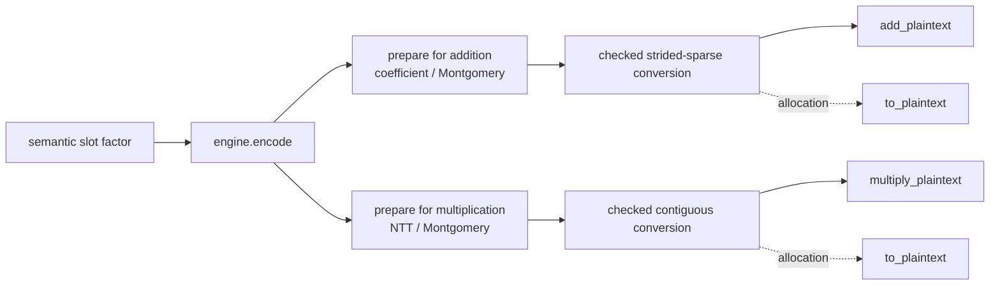

# Compress operation-ready plaintexts without changing CKKS semantics

**Example source:** [`examples/16_compressed_plaintext.py`](https://github.com/VisualDust/fhelium/blob/main/examples/16_compressed_plaintext.py)

This example converts a periodic operation-ready plaintext to exact
`CompressedPlaintext`, verifies dense-equivalent addition and multiplication,
and measures storage and evaluator cost. The evaluator reads the compact
operand directly rather than expanding a dense plaintext first.

Use this representation when a repeatedly used plaintext has exact repetition
or exact sparse structure **after CKKS encoding and arithmetic preparation**.
Keep using `Plaintext` when the encoded tensor is not exactly representable by a
supported layout or when compact storage does not improve the measured
workload.

## Run the complete example

Start with the default period on the 8,192-slot, 40-bit-scale baseline:

```bash
python examples/16_compressed_plaintext.py \
  --device cpu \
  --preset slots8192-scale40-levels7-int64 \
  --period 256 \
  --iterations 20
```

Use `--device cuda:0` to run the same example through CUDA. The command reports:

- the slot period and exact encoded unique count;
- dense and compact tensor bytes;
- bit-exact ciphertext equality against dense addition and multiplication;
- maximum cleartext error after compressed multiplication;
- synchronized dense and compressed evaluator medians.

Try several powers of two that divide the slot count:

```bash
python examples/16_compressed_plaintext.py --preset slots8192-scale40-levels7-int64 --period 64
python examples/16_compressed_plaintext.py --preset slots8192-scale40-levels7-int64 --period 512
```

A smaller `period` usually stores fewer unique encoded values, but storage
reduction alone does not predict evaluator latency. Measure the operation,
level, batch shape, device, and period used by the deployed workload.

## 1. Identify the representation requirement

`Plaintext` remains the general CKKS value. `CompressedPlaintext` is a separate
exact value for an **operation-ready RNS plaintext** whose encoded last axis can
be reconstructed without loss.

The two physical layouts are:

```text
dense Plaintext:      [*batch, limb, coefficient_or_ntt_index]
CompressedPlaintext:  [*batch, limb, unique_encoded_value]
strided implicit data:[*batch, limb]
```

The compression layout describes the encoded coefficient or NTT axis. It does
not describe semantic CKKS slot order. CKKS embedding permutes slots, and
integer coefficient rounding can destroy repetition that is visible in the
source message.

For example, a semantic slot vector with power-of-two period `r` has a specific
property under the current codec:

- its prepared coefficient representation is exactly strided sparse;
- its prepared NTT representation has `2 * r` exact values in contiguous
  repeated blocks.

The checked constructor verifies those claims against the actual dense tensor.
Do not infer compressibility from source-message appearance alone.

## 2. Understand the three encoded-axis layouts

Let the ring dimension be `N`, the compact width be `U`, and
`repeat_count = N // U`. For `N = 8`, `U = 2`, and compact data `[a, b]`, the
exact expansions are:

```text
cyclic:          [a, b, a, b, a, b, a, b]
contiguous:      [a, a, a, a, b, b, b, b]
strided_sparse:  [a, z, z, z, b, z, z, z]
```

For `strided_sparse`, `z` is one exact `implicit_data` value per batch member
and RNS limb. It is not assumed to be zero. The compact entries occupy indices
`u * repeat_count`; every other dense position uses that row's stored implicit
value.

The supported arithmetic is:

| Layout | Coefficient-domain addition | NTT-domain multiplication |
| --- | --- | --- |
| `cyclic` | Yes | Yes |
| `contiguous` | Yes | Yes |
| `strided_sparse` | Yes | No |

`strided_sparse` is coefficient-domain only. Multiplication requires a cyclic
or contiguous NTT-domain value. An application that needs both addition and
multiplication prepares and retains two separate exact compressed values.

For every layout:

- `N` and `U` must be powers of two;
- `0 < U < N`;
- `U` must divide `N`;
- `data` is integral and uses Montgomery residues;
- the value records its format version, ring dimension, context, level, actual
  scale, domain, basis, residue form, and exact `prime_ids`.

## 3. Build the dense operation-ready values first

The maintained example creates one periodic complex factor:

```python
period = 256
unique_index = torch.arange(period, dtype=torch.float64)
unique_slots = torch.complex(
    0.03 * torch.cos(unique_index * 0.07)
    + 0.001 * unique_index / period,
    0.02 * torch.sin(unique_index * 0.05),
)
factor = unique_slots.repeat(engine.num_slots // period)
```

Encoding alone does not select the arithmetic state. Prepare independently for
multiplication and addition:

```python
dense_multiply = engine.prepare_plaintext_for_multiplication(
    engine.encode(factor)
)
dense_add = engine.prepare_plaintext_for_addition(
    engine.encode(factor)
)
```

The multiplication value is NTT-domain Montgomery RNS. The addition value is
coefficient-domain Montgomery RNS. Both retain the level, actual scale,
context, basis, and active prime rows chosen by the engine.

## 4. Convert with bit-exact validation

For the periodic factor above, create the two compressed values as follows:

```python
compressed_multiply = fh.CompressedPlaintext.from_plaintext(
    dense_multiply,
    unique_count=2 * period,
    compression_layout="contiguous",
)

compressed_add = fh.CompressedPlaintext.from_plaintext(
    dense_add,
    unique_count=2 * period,
    compression_layout="strided_sparse",
)
```

`from_plaintext` checks the complete encoded last axis bit for bit. It raises
`ValueError` instead of approximating unequal values, changing encoding
semantics, or silently choosing another layout. On success it clones the
compact slice and, for `strided_sparse`, the implicit values. The compressed
value therefore does not retain the dense input's backing storage.

The conversion lifecycle has these operations:



Use decompression when a consumer requires an uncompressed dense value:

```python
restored_dense = compressed_multiply.to_plaintext()
assert torch.equal(restored_dense.data, dense_multiply.data)
```

`to_plaintext()` allocates the full `N`-element encoded axis. Evaluator kernels
do not call it.

## 5. Use the compressed operands directly

Multiplication accepts a compatible cyclic or contiguous NTT compressed
plaintext:

```python
ciphertext = engine.encrypt_message(message)
ciphertext_ntt = engine.coefficient_domain_to_ntt_domain(ciphertext)
compressed_result = engine.multiply_plaintext(
    ciphertext_ntt,
    compressed_multiply,
)
```

The operation preserves the ciphertext level and records the scale product:

$$
\Delta_{\mathrm{out}}
=\Delta_{\mathrm{ciphertext}}\Delta_{\mathrm{plaintext}}.
$$

It does not rescale implicitly. Apply the same rescale schedule you
would use with a dense prepared plaintext.

Addition accepts a compatible coefficient-domain compressed plaintext:

```python
compressed_sum = engine.add_plaintext(ciphertext, compressed_add)
```

Addition requires exact scale equality and preserves that scale. It modifies
only the `c0` component mathematically. The in-place form makes the storage
mutation visible:

```python
work = ciphertext.clone()
engine.add_plaintext_(work, compressed_add)
```

The homogeneous-batch shape requirement is unchanged. A genuinely unbatched
compressed plaintext broadcasts over a ciphertext batch. A compressed plaintext with a
nonempty batch prefix must match `ciphertext.batch_shape` exactly.

## 6. Verify equivalence against dense arithmetic

Compression is an exact storage and execution representation, not a numerical
approximation. Compare the resulting ciphertext tensors against the same
operation with the dense prepared plaintext:

```python
dense_product = engine.multiply_plaintext(ciphertext_ntt, dense_multiply)
compact_product = engine.multiply_plaintext(ciphertext_ntt, compressed_multiply)
assert torch.equal(compact_product.data, dense_product.data)


dense_sum = engine.add_plaintext(ciphertext, dense_add)
compact_sum = engine.add_plaintext(ciphertext, compressed_add)
assert torch.equal(compact_sum.data, dense_sum.data)
```

Then decrypt a representative result and compare it with the cleartext
operation:

```python
decoded = engine.decrypt_message(
    engine.ntt_domain_to_coefficient_domain(compact_product)
)
expected = message * factor
max_error = torch.max(torch.abs(decoded.cpu() - expected)).item()
```

Tensor equality verifies the compressed kernel against dense CKKS arithmetic.
The cleartext comparison separately checks the expected CKKS approximation
error.

## 7. Measure storage and evaluator cost separately

For cyclic and contiguous layouts, compact tensor storage scales with `U`
instead of `N`:

```python
dense_bytes = dense_multiply.data.numel() * dense_multiply.data.element_size()
compact_bytes = compressed_multiply.nbytes
storage_reduction = dense_bytes / compact_bytes
```

A `strided_sparse` value also stores one implicit value per batch member and
limb, so its payload is proportional to `U + 1` rather than only `U`.
Serialization metadata adds a small fixed overhead in either case.

The compact evaluator kernels read right-hand-side values directly, but they
still produce every ciphertext coefficient or NTT position. Compression can
reduce plaintext storage and right-hand-side memory traffic; it does not reduce
the ciphertext size or guarantee a speedup. Benchmark with synchronization and
report both storage and latency, as the maintained example does.

Keep lifecycle policy separate from representation. If both arithmetic states
are reused, retain `compressed_add` and `compressed_multiply` as two exact
values. FHElium does not hide one state behind an engine-owned conversion cache.

## 8. Serialize and move the exact compressed value

`CompressedPlaintext` participates in the core exact-value interfaces. For
example:

```python
compressed_cpu = compressed_multiply.to("cpu")
fh.save_value(
    compressed_cpu,
    "factor.safetensors",
    overwrite=True,
)

restored = fh.load_value(
    "factor.safetensors",
    expected_type=fh.CompressedPlaintext,
    device=engine.device,
)
```

The file preserves the compression-format version, compact and implicit tensor
metadata, cryptographic state, and exact encoded layout. Typed distributed
transport, residency helpers, execution signatures, and CUDA Graph validation
likewise treat the compressed value as an exact value rather than as a recipe
to re-encode semantic slots.

## 9. Recognize rejected layouts

Expect conversion or evaluation to fail in these cases:

- the source is a slots or approximate-coefficient `Plaintext`, not an
  operation-ready RNS plaintext;
- `unique_count` is nonpositive, not a power of two, equal to or larger than
  `N`, or does not divide `N`;
- the dense encoded axis is not bit-exactly representable by the requested
  layout;
- `strided_sparse` is requested for an NTT value or used for multiplication;
- the compressed value and ciphertext differ in context, level, basis,
  `prime_ids`, ring dimension, dtype, device, or required domain;
- a batched compressed plaintext has a different nonempty batch shape;
- addition scales are not exactly equal;
- an incompatible compression-format version is loaded.

A source vector can be semantically short, constant over blocks, or generated
from a low-dimensional formula and still fail exact encoded-axis validation.
That failure preserves the exact representation rule: use the dense `Plaintext`, or change the
application's packing and validate the resulting operation-ready value again.
Do not weaken the equality check or choose a larger `unique_count` unless the
new representation is still smaller than `N` and passes exact validation.

::: details Complete runnable source
<<< @/../examples/16_compressed_plaintext.py
:::

## Related API and implementation detail

- [Values and state API](../api/fhelium/core/ciphertext.md)
- [Serialization API](../api/fhelium/serialization/value.md)
- [Value model and identity](../concepts/ckks/value-model-and-identity.md)
- [CompressedPlaintext internals](../developer/compressed-plaintext-internals.md)
- [CKKS workload cost model](../concepts/performance/cost-model.md)
