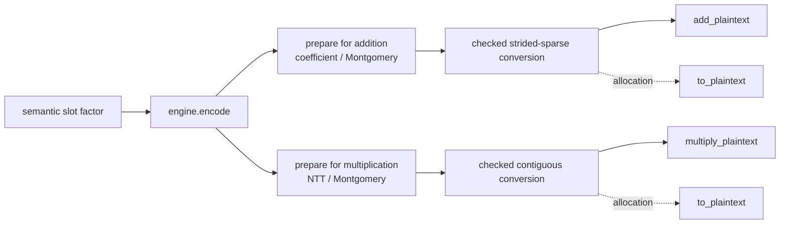

# Prepare and evaluate compressed plaintexts

**Example source:** [`examples/08_eager_compressed_plaintext.py`](https://github.com/VisualDust/fhelium/blob/main/examples/08_eager_compressed_plaintext.py)

This example prepares compressed plaintexts directly from one slot period in coefficient and NTT domains. It verifies dense-equivalent addition, multiplication, and in-place storage behavior, and compares storage and warmed evaluator latency. A separate `from_plaintext` example demonstrates bit-for-bit compression of an existing encoded Tensor.

Use this representation when a repeatedly used plaintext has bitwise repetition or lossless sparse structure **after CKKS encoding and arithmetic preparation**. Keep using `Plaintext` when the encoded tensor is not losslessly representable by a supported layout or when compact storage does not improve the measured workload.

## Run the complete example

Start with the default period on the 8,192-slot, 40-bit-scale baseline:

```bash
python examples/08_eager_compressed_plaintext.py \
  --device cpu \
  --preset slots8192-scale40-depth7-int64 \
  --period 256 \
  --iterations 20
```

Use `--device cuda:0` to run the same example through CUDA. The command reports:

- the slot period and encoded unique count;
- dense and compact tensor bytes;
- ciphertext equality modulo each active prime against dense arithmetic;
- coefficient and NTT addition, NTT multiplication, and in-place storage sharing;
- maximum cleartext error after compressed multiplication;
- synchronized dense and compressed evaluator medians in alternating order;
- effective PyTorch thread counts and inherited thread environment settings.

Try several powers of two that divide the slot count:

```bash
python examples/08_eager_compressed_plaintext.py --preset slots8192-scale40-depth7-int64 --period 64
python examples/08_eager_compressed_plaintext.py --preset slots8192-scale40-depth7-int64 --period 512
```

A smaller `period` usually stores fewer unique encoded values, but storage reduction alone does not predict evaluator latency. Measure the operation, depth, batch shape, device, and period used by the deployed workload.

## 1. Identify the representation requirement

`Plaintext` remains the general CKKS value. `CompressedPlaintext` is a separate operation-ready RNS value whose encoded last axis can be reconstructed without loss.

The two physical layouts are:

```text
dense Plaintext:      [*batch, limb, coefficient_or_ntt_index]
CompressedPlaintext:  [*batch, limb, unique_encoded_value]
strided implicit data:[*batch, limb]
```

The compression layout describes the encoded coefficient or NTT axis. It does not describe semantic CKKS slot order. CKKS embedding permutes slots, and integer coefficient rounding can destroy repetition that is visible in the source message.

For example, a semantic slot vector with power-of-two period `r` has a specific property under the current codec:

- its prepared coefficient representation is strided sparse without information loss;
- its prepared NTT representation has `2 * r` values in contiguous repeated blocks.

The checked constructor verifies those claims against the actual dense tensor. Do not infer compressibility from source-message appearance alone.

## 2. Understand the three encoded-axis layouts

Let the ring dimension be `N`, the compact width be `U`, and `repeat_count = N // U`. For `N = 8`, `U = 2`, and compact data `[a, b]`, the expansions are:

```text
cyclic:          [a, b, a, b, a, b, a, b]
contiguous:      [a, a, a, a, b, b, b, b]
strided_sparse:  [a, z, z, z, b, z, z, z]
```

For `strided_sparse`, `z` is the stored `implicit_data` fill value for one batch member and RNS limb. The compact entries occupy indices `u * repeat_count`; every other dense position uses that row's stored implicit value.

The supported arithmetic is:

| Layout | Coefficient addition | NTT addition | NTT multiplication |
| --- | --- | --- | --- |
| `cyclic` | Yes | Yes | Yes |
| `contiguous` | Yes | Yes | Yes |
| `strided_sparse` | Yes | Yes | Yes |

Addition preserves the matching input domain. Multiplication requires NTT operands. Compression describes physical repetition, so the same layout can represent different polynomials in coefficient and NTT domains; changing a domain label is not a polynomial transform.

For every layout:

- `N` and `U` must be powers of two;
- `0 < U < N`;
- `U` must divide `N`;
- `data` is integral and records standard or Montgomery residues;
- the value records its format version, ring dimension, depth, actual scale, domain, basis, residue form, and ordered `prime_ids`.

## 3. Prepare compact values or compress existing encoded data

The example creates one periodic complex factor:

```python
period = 256
unique_index = torch.arange(period, dtype=torch.float64)
unique_slots = torch.complex(
    0.03 * torch.cos(unique_index * 0.07)
    + 0.001 * unique_index / period,
    0.02 * torch.sin(unique_index * 0.05),
)
factor = unique_slots.repeat(engine.num_slots // period)
```

The direct path accepts one period and chooses its output domain:

```python
compressed_multiply = engine.prepare_compressed_plaintext(unique_slots)
compressed_add = engine.prepare_compressed_plaintext(
    unique_slots, polynomial_domain="coefficient"
)
```

To preserve a particular existing encoding bit-for-bit, use the full preparation and checked conversion below. The two routes need not choose identical rounded coefficients near floating-point quantization thresholds.

Encoding alone does not select the arithmetic state. Prepare independently for multiplication and addition:

```python
dense_multiply = engine.prepare_plaintext_for_multiplication(
    engine.encode(factor)
)
dense_add = engine.prepare_plaintext_for_addition(
    engine.encode(factor)
)
```

The multiplication value is NTT-domain Montgomery RNS. The addition value is coefficient-domain Montgomery RNS. Both retain the depth, actual scale, basis, and active prime rows chosen by the engine. The application retains their CKKS parameter provenance.

## 4. Convert with residue-equality validation

For the periodic factor above, create the two compressed values as follows:

```python
compressed_multiply = fh.CompressedPlaintext.from_plaintext(
    dense_multiply,
    unique_count=2 * period,
    compression_layout="contiguous",
)

compressed_add = fh.CompressedPlaintext.from_plaintext(
    dense_add,
    unique_count=2 * period,
    compression_layout="strided_sparse",
)
```

`from_plaintext` checks the complete encoded last axis bit for bit. It raises `ValueError` instead of approximating unequal values, changing encoding semantics, or silently choosing another layout. On success it clones the compact slice and, for `strided_sparse`, the implicit values. The compressed value therefore does not retain the dense input's backing storage.

The conversion lifecycle has these operations:



Use decompression when a consumer requires an uncompressed dense value:

```python
restored_dense = compressed_multiply.to_plaintext()
assert torch.equal(restored_dense.data, dense_multiply.data)
```

`to_plaintext()` allocates the full `N`-element encoded axis. Evaluator kernels do not call it.

## 5. Use the compressed operands directly

Multiplication accepts cyclic, contiguous and strided-sparse NTT/Montgomery compressed plaintexts:

```python
ciphertext = engine.encrypt_message(message)
ciphertext_ntt = engine.coefficient_domain_to_ntt_domain(ciphertext)
compressed_result = engine.multiply_plaintext(
    ciphertext_ntt,
    compressed_multiply,
)
```

The operation preserves the ciphertext depth and records the scale product:

$$
\Delta_{\mathrm{out}}
=\Delta_{\mathrm{ciphertext}}\Delta_{\mathrm{plaintext}}.
$$

It does not rescale implicitly. Apply the same rescale schedule you would use with a dense prepared plaintext.

Addition accepts a compatible coefficient-domain compressed plaintext:

```python
compressed_sum = engine.add_plaintext(ciphertext, compressed_add)
```

Addition requires equal scales and preserves that scale. It modifies only the `c0` component mathematically. The in-place form makes the storage mutation visible:

```python
work = ciphertext.clone()
engine.add_plaintext_(work, compressed_add)
```

The homogeneous-batch shape requirement is unchanged. A genuinely unbatched compressed plaintext broadcasts over a ciphertext batch. A compressed plaintext with a nonempty batch prefix must match `ciphertext.batch_shape` exactly.

## 6. Verify equivalence against dense arithmetic

Compression is a lossless storage and execution representation with the same numerical approximation. Compare the resulting ciphertext tensors against the same operation with the dense prepared plaintext:

```python
dense_product = engine.multiply_plaintext(ciphertext_ntt, dense_multiply)
compact_product = engine.multiply_plaintext(ciphertext_ntt, compressed_multiply)
assert torch.equal(compact_product.data, dense_product.data)


dense_sum = engine.add_plaintext(ciphertext, dense_add)
compact_sum = engine.add_plaintext(ciphertext, compressed_add)
assert torch.equal(compact_sum.data, dense_sum.data)
```

Then decrypt a representative result and compare it with the cleartext operation:

```python
decoded = engine.decrypt_message(
    engine.ntt_domain_to_coefficient_domain(compact_product)
)
expected = message * factor
max_error = torch.max(torch.abs(decoded.cpu() - expected)).item()
```

Tensor equality verifies the compressed kernel against dense CKKS arithmetic. The cleartext comparison separately checks the expected CKKS approximation error.

## 7. Measure storage and evaluator cost separately

For cyclic and contiguous layouts, compact tensor storage scales with `U` instead of `N`:

```python
dense_bytes = dense_multiply.data.numel() * dense_multiply.data.element_size()
compact_bytes = compressed_multiply.nbytes
storage_reduction = dense_bytes / compact_bytes
```

A `strided_sparse` value also stores one implicit value per batch member and limb, so its payload is proportional to `U + 1` rather than only `U`. Serialization metadata adds a small fixed overhead in either case.

The compact evaluator kernels read right-hand-side values directly, but they still produce every ciphertext coefficient or NTT position. Compression can reduce plaintext storage and right-hand-side memory traffic; it does not reduce the ciphertext size or guarantee a speedup. Benchmark with synchronization and report both storage and latency, as the example does.

Keep lifecycle policy separate from representation. If both arithmetic states are reused, retain `compressed_add` and `compressed_multiply` as two values. FHElium does not hide one state behind an engine-owned conversion cache.

## 8. Serialize and move the compressed value

`CompressedPlaintext` participates in the runtime value interfaces. For example:

```python
compressed_cpu = compressed_multiply.to("cpu")
fh.save_value(
    compressed_cpu,
    "factor.safetensors",
    overwrite=True,
)

restored = fh.load_value(
    "factor.safetensors",
    expected_type=fh.CompressedPlaintext,
    device=torch.get_default_device(),
)
```

The file preserves the compression-format version, compact and implicit tensor metadata, cryptographic state, and encoded layout. Typed distributed transport, residency helpers, execution signatures, and CUDA Graph validation likewise treat the compressed value as an encoded value rather than as a recipe to re-encode semantic slots.

## 9. Recognize rejected layouts

Expect conversion or evaluation to fail in these cases:

- the source is a slots or approximate-coefficient `Plaintext`, not an operation-ready RNS plaintext;
- `unique_count` is nonpositive, not a power of two, equal to or larger than `N`, or does not divide `N`;
- the dense encoded axis is not bit-exactly representable by the requested layout;
- multiplication is requested with coefficient-domain data;
- the compressed value and ciphertext differ in depth, basis, `prime_ids`, ring dimension, dtype, device, or required domain;
- a batched compressed plaintext has a different nonempty batch shape;
- addition scales are not exactly equal;
- an incompatible compression-format version is loaded.

FHElium cannot reject mismatched CKKS parameter provenance because neither runtime value stores a parameter identifier.

A source vector can be semantically short, constant over blocks, or generated from a low-dimensional formula and still fail encoded-axis reconstruction validation. That failure preserves the representation rule: use the dense `Plaintext`, or change the application's packing and validate the resulting operation-ready value again. Do not weaken the equality check or choose a larger `unique_count` unless the new representation is still smaller than `N` and passes reconstruction validation.

::: details Source
<<< @/../examples/08_eager_compressed_plaintext.py
:::

## Related API and implementation detail

- [Values and state API](../api/fhelium/values/ciphertext.md)
- [Serialization API](../api/fhelium/serialization/value.md)
- [Value model and identity](../concepts/ckks/value-model-and-identity.md)
- [CompressedPlaintext internals](../developer/compressed-plaintext-internals.md)
- [CKKS workload cost model](../concepts/performance/cost-model.md)

## Local views

`CompressedPlaintext` exposes the same `slice_batch`, `select_batch`, `unbind_batch`, `stack_batch`, and `slice_limbs` usage model as dense values. Batch selection preserves prime IDs; limb selection slices both stored rows and `prime_ids`. Any `implicit_data` is selected along the same logical axis. These slices share source storage and preserve depth, scale, and compression format. See [local batch and limb views](homogeneous-batching.md#local-batch-and-limb-views).

## Direct preparation from a periodic message

`Engine.prepare_compressed_plaintext` accepts one period of a slot message and returns contiguous NTT/Montgomery `CompressedPlaintext` data. It prepares the compact polynomial directly rather than encoding a full slot vector and then compressing its RNS rows:

```python
period = torch.linspace(-0.02, 0.03, 256, dtype=torch.float64)
compact = engine.prepare_compressed_plaintext(period)
```

The period length must be a power of two dividing $N/2$. For period $r$, set $U=2r$ (at least four for generator 3) and $R=N/U$. The full polynomial has the form $p(X)=a(X^R)$, with $a$ of degree below $U$. Preparation computes a $U$-point inverse embedding and quantizes those coefficients. Its NTT uses $\psi_N^R$, derived from the configured full-ring root, so each compact NTT entry represents $R$ consecutive full-ring entries in bit-reversed order. The selected depth, prime rows, Q/QP basis and actual scale are preserved.

Random rounding selects the words associated with coefficient positions $0,R,2R,\ldots$ and advances the stream by $N$ words per batch item, including the omitted zero coefficients. A reduced FFT may differ from a full FFT in floating-point roundoff near quantization thresholds; the API does not promise bit-for-bit agreement with every full-size FFT implementation. Use `from_plaintext` when the requirement is lossless compression of an already encoded Tensor.

The value also supports direct construction from compact RNS Tensor data. `representation` is the read-only value `"rns"`; no slot message is stored. Coefficient-domain standard and Montgomery residues can be stored and serialized in each compression layout. NTT values retain the same Montgomery representation requirement as ordinary `Plaintext`. Compressed arithmetic requires the representation specified by its operation. The existing Engine residue-conversion methods convert compact data and any sparse implicit rows together.

Compile captures direct preparation, compressed multiplication and addition, and live compact operands. A sparse operand's implicit row Tensor is a separate Program input or material. Returned sparse values retain both Tensors through the callable's output description. These storage components remain ordinary Tensor dataflow; execution does not expand the full plaintext.


## Compact arithmetic in matrix workloads

`prepare_compressed_plaintext(..., polynomial_domain="coefficient")` prepares sparse coefficient/Montgomery data directly from a period, including its zero implicit rows. The default `"ntt"` returns contiguous NTT/Montgomery data. Compressed addition accepts matching coefficient or NTT domains; multiplication accepts all three layouts in NTT/Montgomery form. `add_plaintext_` preserves the ciphertext's existing Tensor storage, and `zero_plaintext_like` clears both explicit and implicit compact entries.

`sum_plaintext_products`, `sum_plaintext_product_groups`, and `sum_rotated_plaintext_product_groups` accept ordinary, compressed, or mixed plaintext operands. Compact groups compose the existing multiplication and addition operations; rotated groups retain shared rotation preparation. Dense Eager groups retain their dedicated whole-operation implementation. Compile can fuse compact loads, modular products and accumulation, including the prologue of a following supported NTT. Cyclic loads use `i % U`, contiguous loads use `i // (N/U)`, and sparse loads select explicit or implicit entries according to `i % (N/U)`. No expanded plaintext Tensor is needed by these generated kernels.


## Construction and persistence

Direct construction checks the compact shape, compression layout, RNS state, and optional implicit row values. Batch views and prepared execution results retain already-established metadata without repeating those checks; execution still checks the Tensor payload requirements. The compression format version belongs to serialized value metadata rather than to each runtime plaintext. Existing version-1 value files retain the same representation and remain readable.
