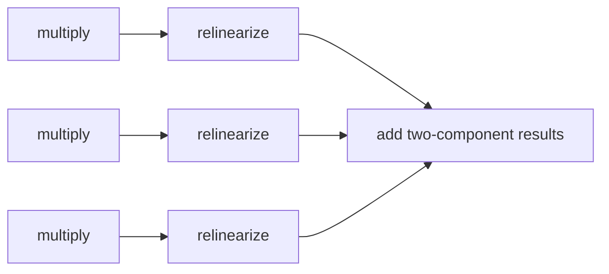
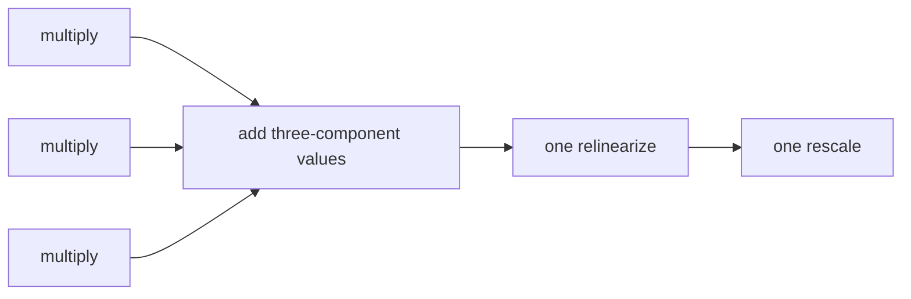

# Late relinearization and NTT reuse

**Example source:** [`examples/06_explicit_state_late_relinearization_ntt.py`](https://github.com/VisualDust/fhelium/blob/main/examples/06_explicit_state_late_relinearization_ntt.py)

This example accumulates three-component products before relinearization and
reuses fixed multiplication operands in NTT form. The tutorial explains the
state preconditions that make both optimizations valid.

## Run the example

```bash
python examples/06_explicit_state_late_relinearization_ntt.py \
  --preset slots8192-scale40-depth7-int64 \
  --pair-count 3
```

## 1. Prepare multiplication operands

```python
multiplicand_ntt = engine.coefficient_domain_to_ntt_domain(engine.encrypt_message(multiplicand))
multiplier_ntt = engine.coefficient_domain_to_ntt_domain(engine.encrypt_message(multiplier))
```

[`fhelium.eager.Engine.multiply`](../api/fhelium/eager.md) has these
fixed preconditions:

- both inputs have two components;
- both inputs are in the same NTT/Montgomery representation;
- depth, scale, basis, and active prime IDs are compatible;
- the caller established compatible CKKS parameter provenance;
- the result is a three-component NTT ciphertext;
- no implicit relinearization or rescale occurs.

## 2. Accumulate three-component products

```python
product = engine.multiply(multiplicand_ntt, multiplier_ntt)
accumulator = (
    product
    if accumulator is None
    else engine.add(accumulator, product)
)
```

Compatible three-component products can be added before relinearization. This
turns a sum of products from:



into:



The optimization is valid only while all terms share a matching layout
and scale. An intervening operation that requires an ordinary two-component
ciphertext creates a point at which relinearization becomes necessary.

## 3. Relinearize and rescale once

```python
output = engine.rescale_to_next_depth(engine.relinearize(accumulator))
```

Relinearization key-switches the `c2` contribution back into two ciphertext
components. It is usually much more expensive than an elementwise modular
addition, so reducing its count is useful for dot products, matrix methods,
and polynomial schedules. The accumulated product still carries scale
$\Delta^2$; the rescale consumes one depth after relinearization.

## 4. Keep reusable operands in NTT form

```python
fixed = engine.coefficient_domain_to_ntt_domain(engine.encrypt_message(fixed_values))
source = engine.coefficient_domain_to_ntt_domain(engine.encrypt_message(source_values))

product = engine.multiply(source, fixed)
```

The example isolates the preparation pattern. In a larger loop, a compatible
fixed operand can remain in NTT/Montgomery form and be multiplied by several
prepared sources without repeatedly entering and leaving the polynomial
domain.

The application must still account for:

- the memory cost of retaining the prepared operand;
- its depth and scale;
- whether consumers mutate it;
- whether later operations require coefficient-domain form.

## 5. Inspect state instead of assuming it

The example prints:

```text
component count, polynomial domain, residue representation, and scale
```

Use those fields when debugging a schedule. A tensor with the expected shape
but the wrong domain or Montgomery representation is not a compatible operand.

For represented programs, the Compile stack can insert relinearization
automatically. [Compose and execute a pipeline from built-in Compile
passes](compose-and-execute-compile-pipeline.md) shows
`InsertRelinearizationPass` placing the operation in a transformed Program.

::: details Source
<<< @/../examples/06_explicit_state_late_relinearization_ntt.py
:::

## Related concepts and guides

- [Scale and depth lifecycle](../concepts/ckks/scale-and-depth-lifecycle.md)
- [Evaluator operation transitions](../concepts/ckks/evaluator-operation-transitions.md)
- [CKKS workload cost model](../concepts/performance/cost-model.md)
- [Optimize a workload systematically](../how-to/optimize-workload.md)
