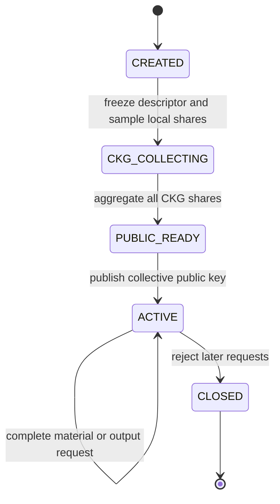
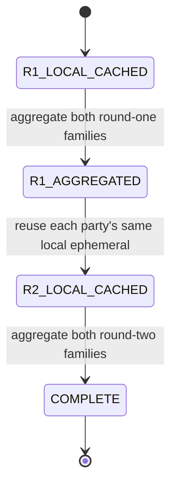

# Multiparty CKKS

**Example source:** [`examples/18_multiparty_ckks.py`](https://github.com/VisualDust/fhelium/blob/main/examples/18_multiparty_ckks.py)

This example holds two in-process party records representing two cryptographic
parties, constructs collective public and evaluation keys, runs CKKS evaluation, and executes
secret-dependent output operations. The tutorial follows its
application-owned protocol state in execution order.

Each record retains one additive secret share, and the example never constructs
or installs their aggregate secret. One process provides no trust-domain or
process isolation between those slots.

The data and keys are synthetic and throwaway. The goal is to show how
collective share messages become core FHElium keys and values that the
standard evaluator can consume.

## Tensor operation interface

`fhelium.experimental.mpc` is stateless tensor arithmetic. Its functions accept
local shares, common-uniform tensors, raw protocol messages, core
keys, and core ciphertexts. They return another raw message or a core
FHElium `PublicKey`, evaluation key, `Plaintext`, or `Ciphertext`.

Collective key generation (CKG) produces the public key. Two-round
relinearization-key generation (RKG) produces public evaluation material for
three-to-two-component relinearization.

| Protocol value | Representation |
| --- | --- |
| Party share and RKG ephemeral | Level-zero QP `SecretKey`, NTT/Montgomery, `[L_QP, N]` |
| CKG common tensor and share | Contiguous Q NTT/Montgomery tensor `[L_Q, N]` |
| RKG/Galois common tensor | Contiguous QP tensor `[D, L_QP, N]` |
| Each RKG family or Galois share | QP NTT/Montgomery tensor `[D, L_QP, N]` |
| Protocol-3/4 coefficient input | Contiguous compact integer tensor `[*batch, N]` |
| Protocol-3 share | Active-Q coefficient/standard tensor `[*batch, L_level, N]` |
| Protocol-4 share | Tuple of two active-Q coefficient/standard tensors |

Here, `N` is the ring dimension and `D` is the stable hybrid key-digit count.
The application assigns each local share to a cryptographic party, associates
raw tensors with requests, and decides when the complete expected party set has
contributed. The `fhelium.experimental.mpc` namespace creates no party,
transport, coordinator, or persistent protocol object.

::: info Current execution constraint
The current implementation accepts a local CPU or CUDA `CkksEngine`. The
example defaults to `Preset.slots8192_scale40_levels7_int64` for a small local run.
:::

::: danger Security scope
The supported arithmetic scope is correctness for compatible values under
honest ordered invocation. The current API provides no authentication,
transcript binding, secure transport, malicious-party security, output-query
control, reviewed output-error sampler, supported smudging/useful-precision
parameter profile, privacy guarantee, or validated security composition for the collective-decryption and
public-key-switch output operations. Use synthetic inputs, throwaway keys, and
labeled correctness fixtures only.
:::

Run the example from the repository root:

```bash
python examples/18_multiparty_ckks.py --preset slots8192-scale40-levels7-int64
```

## Follow the application-owned states

The example prints labels around stateless function calls. Its epoch takes this
path:



The labels are application control state. A context, roster, or local
share change begins another epoch. The detailed envelope, retry, duplicate,
abort, and independent-process rules are intentionally left to
[Use multiparty CKKS](../how-to/use-multiparty-ckks.md).

## 1. Create two local shares

The example samples one compatible QP share for each local party record:

```python
party_secret_shares = tuple(
    mpc.sample_secret_share(engine) for _ in range(2)
)
```

Both values have the same context, rows, dtype, and device, but remain distinct
party-owned secrets. Nothing adds them or turns them into a collective
`SecretKey`, including correctness checks.

## 2. Generate the collective public key

One-round collective key generation (CKG) creates the public encryption key for
the epoch. Every party receives the same byte-identical Q common tensor and emits one
contribution:

```python
ckg_common_a = mpc.sample_common_uniform(engine, basis="Q")
ckg_shares = tuple(
    mpc.ckg_share(engine, secret, ckg_common_a)
    for secret in party_secret_shares
)
collective_public_key = mpc.aggregate_ckg(
    engine, ckg_shares, ckg_common_a
)
```

The result is a core Q `PublicKey`. Encryptors need this public value, not
a party share. An independent deployment accepts one cached CKG message from
every expected party before aggregation.

## 3. Generate a relinearization key in two rounds

Ciphertext multiplication introduces an $s^2$ phase term. Relinearization-key
generation (RKG) creates the public key-switch material that maps that term
back to the collective $s$ relation without assembling $s$.

The RKG child request has its own application state:



The application creates one QP common tensor with a leading digit axis and one
request-local ephemeral per party:

```python
digit_count = engine.rns_layout.key_digit_count
rkg_common_a = mpc.sample_common_uniform(
    engine, basis="QP", count=digit_count
)
rkg_ephemeral_by_party = tuple(
    mpc.sample_secret_share(engine) for _ in party_secret_shares
)
```

It passes the same party-local ephemeral to both rounds:

```python
round1 = tuple(
    mpc.rkg_round1_share(engine, secret, rkg_ephemeral_by_party[i], rkg_common_a)
    for i, secret in enumerate(party_secret_shares)
)
aggregate_round1 = mpc.aggregate_rkg_round1(engine, round1)

round2 = tuple(
    mpc.rkg_round2_share(engine, secret, rkg_ephemeral_by_party[i], aggregate_round1)
    for i, secret in enumerate(party_secret_shares)
)
relinearization_key = mpc.aggregate_rkg_round2(
    engine, round2, aggregate_round1
)
```

Both rounds retain two separate message families. A delivery retry retransmits
the byte-identical cached message. After an aborted RKG request, its replacement
uses a new request identity and all-fresh request material; it never replaces
one round while retaining randomness from another.

## 4. Generate rotation and conjugation keys

Rotation and conjugation apply Galois automorphisms, which transform the secret
relation. Their evaluation keys switch each transformed relation back to the
collective relation expected by later operations.

The example performs two independent one-round requests:

```python
rotation_common_a = mpc.sample_common_uniform(
    engine, basis="QP", count=digit_count
)
rotation_shares = tuple(
    mpc.rotation_key_share(engine, secret, rotation_common_a, 1)
    for secret in party_secret_shares
)
rotation_key = mpc.aggregate_rotation_key(
    engine, rotation_shares, rotation_common_a, 1
)

conjugation_common_a = mpc.sample_common_uniform(
    engine, basis="QP", count=digit_count
)
conjugation_shares = tuple(
    mpc.conjugation_key_share(engine, secret, conjugation_common_a)
    for secret in party_secret_shares
)
conjugation_key = mpc.aggregate_conjugation_key(
    engine, conjugation_shares, conjugation_common_a
)
```

Each request uses fresh QP common material with shape `[D, L_QP, N]`. The
results are core key types with FHElium's complete level-zero key-digit layout.

## 5. Encrypt and evaluate normally

The synthetic message has real and imaginary components so rotation and
conjugation are distinguishable. Encryption uses only the collective public
key:

```python
source = engine.encrypt_message(message, collective_public_key)
```

Public evaluation then uses `CkksEngine` methods:

```python
rotated = engine.rotate_with_key(source, rotation_key)
conjugated = engine.conjugate(source, conjugation_key)
transformed = engine.add(rotated, conjugated)

product = engine.multiply(
    engine.coefficient_domain_to_ntt_domain(source),
    engine.coefficient_domain_to_ntt_domain(source),
)
squared = engine.rescale_to_next_level(
    engine.relinearize(product, relinearization_key)
)
```

`transformed` is the two-component source for collective fusion. `squared`
demonstrates consumption of the RKG result and becomes the public-key-switch
source. The application retains the epoch association; a matching `context_id`
alone does not establish collective lineage.

## 6. Fuse an unsafe collective-decryption output

Protocol 3 forms one secret-dependent share per party for an exact
coefficient-domain two-component ciphertext. The example supplies opposite
fixed coefficient impulses, which cancel for an arithmetic check but provide
no smudging or privacy property.

```python
p3_shares = tuple(
    mpc.unsafe_collective_decryption_share(
        engine,
        transformed,
        secret,
        smudging_error_coefficients=p3_error_by_party[i],
    )
    for i, secret in enumerate(party_secret_shares)
)
plaintext = mpc.unsafe_fuse_collective_decryption(
    engine, transformed, p3_shares
)
decoded = engine.decode(plaintext, is_real=False)
```

Fusion returns a core approximate-coefficient `Plaintext`. The expected
synthetic result is `roll(message, +1) + conj(message)`. The example checks it
without constructing an aggregate secret.

## 7. Switch an unsafe output to a destination key

Protocol 4 returns a ciphertext under a compatible destination key.
The destination creates a throwaway pair; only its Q public key enters party
share generation.

```python
destination_secret = engine.create_secret_key(modulus_basis="QP")
destination_public = engine.create_public_key(destination_secret)

p4_shares = tuple(
    mpc.unsafe_public_key_switch_share(
        engine,
        squared,
        secret,
        destination_public,
        ephemeral_coefficients=p4_ephemeral_by_party[i],
        smudging_error0_coefficients=p4_errors_by_party[i][0],
        error1_coefficients=p4_errors_by_party[i][1],
    )
    for i, secret in enumerate(party_secret_shares)
)
recipient_ciphertext = mpc.unsafe_fuse_public_key_switch(
    engine, squared, destination_public, p4_shares
)
recipient_decoded = engine.decrypt_message(
    recipient_ciphertext, destination_secret, is_real=False
)
```

The fixed ternary ephemerals and opposite component errors are correctness
fixtures, not fresh security randomness. Only the throwaway destination secret
decrypts this output. The caller owns distribution choice, freshness,
destination-key provenance, output authorization, and exposure accounting.

## 8. Inspect results and close

The example reports maximum and root-mean-square (RMS) error for the collective
transform and the public-key-switched `message**2` result, then moves its
application label to `CLOSED`.
Closing rejects later requests in the application workflow; it does not erase
key tensors, and best-effort Python deletion does not guarantee device-memory
zeroization.

::: details Complete runnable source
<<< @/../examples/18_multiparty_ckks.py
:::

## Continue with the complete operational guide

- [Use multiparty CKKS](../how-to/use-multiparty-ckks.md)
  covers epoch descriptors, message envelopes, cache-before-send, duplicate
  detection, retry and abort, freshness lifetimes, and mapping this local tuple
  to independent processes.
- [Multiparty CKKS API](../api/fhelium/experimental/mpc.md)
  provides exact signatures and value requirements.
- [Key material lifecycle](key-materials.md) explains core key state and
  storage after aggregation.
- [Evaluator operation transitions](../concepts/ckks/evaluator-operation-transitions.md)
  explains coefficient/NTT and standard/Montgomery evaluator states.
