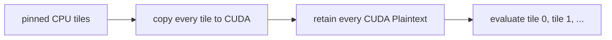

# Reusable value buffers

**Example source:** [`examples/12_reusable_value_buffer.py`](https://github.com/VisualDust/fhelium/blob/main/examples/12_reusable_value_buffer.py)

This example compares all-resident operation-ready plaintext weights with
application-managed double buffering from pinned host memory into two fixed
CUDA allocations. The tutorial explains source lifetime, transfer ordering,
and the resulting memory bound; the evaluator remains eager CKKS
code.

## Start with a small resource allocation

The example fixes its CKKS configuration to
`Preset.slots32768_scale40_depth34_int64` at depth `20`, which is the
configuration covered by the example's numerical evidence. For a practical
functional run, reduce only the resource-scaling knobs:

```bash
python examples/12_reusable_value_buffer.py \
  --num-tiles 4 \
  --plaintexts-per-tile 4 \
  --message-size 32
```

This example is CUDA-specific and selects `cuda:0` internally. It deliberately
does not expose preset or depth options: changing either would create a new
numerical validation target rather than a smaller residency experiment.

Run the documented large point only on a GPU with sufficient memory:

```bash
python examples/12_reusable_value_buffer.py
```

Use `--skip-all-resident` if the complete CUDA weight set cannot fit.

## 1. Compare two residency strategies

### All resident



### Double buffer

```text
transfer stream: tile 0 -> A    tile 1 -> B    tile 2 -> A
compute stream:                  use A          use B
```

Both modes call the same `evaluate_weight_tile` function and execute the same
arithmetic schedule. Their memory footprints follow the application's
placement and lifetime plan.

## 2. Prepare independent pinned-host values

```python
data = torch.empty_like(
    prototype.data,
    device="cpu",
    pin_memory=True,
)
data.copy_(prototype.data)
```

Pinned memory enables asynchronous host-to-device copies. Each `Plaintext`
still carries depth, scale, representation, polynomial domain, modulus basis, residue representation, and
prime IDs.

The example creates application-selected tiles. FHElium does not decide how
many values form a tile or in which order they are consumed.

## 3. Allocate two fixed-address CUDA trees

```python
buffers = [
    ReusableValueBuffer.like(host_tiles[0], device=torch.get_default_device())
    for _ in range(2)
]
```

[`ReusableValueBuffer`](../api/fhelium/runtime/buffer.md#reusablevaluebuffer) recursively
allocates a value/tensor tree on the target device. Later copies reuse
the same allocations.

The example records every tensor `data_ptr()` before and after the workload
and fails if any address changes.

## 4. Enqueue transfer and retain source lifetime

```python
copy_handle = buffer.copy_from(
    pinned_cpu_tile,
    stream=transfer_stream,
    non_blocking=True,
    wait_for=previous_read_done,
)
```

[`CopyHandle`](../api/fhelium/runtime/buffer.md#copyhandle) represents the enqueued copy. It
retains the source tree so Python cannot free pinned memory while CUDA is still
reading it.

`wait_for` prevents a transfer from overwriting a buffer whose previous
compute consumer has not finished.

## 5. Order compute without synchronizing the CPU

```python
with torch.cuda.stream(compute_stream):
    copy_handle.wait_on(compute_stream)
    output = evaluate_weight_tile(
        source,
        buffer.value,
        engine=engine,
    )
    read_done = torch.cuda.Event()
    read_done.record(compute_stream)
```

`wait_on` inserts an event dependency into the consumer stream. It does not
block the CPU waiting for the copy to finish. The recorded read event later
protects the buffer against premature overwrite.

## 6. Understand the memory bound

For $T$ tiles of size $B_{\mathrm{tile}}$:

$$
B_{\mathrm{all}}
\approx
T B_{\mathrm{tile}},
\qquad
B_{\mathrm{double}}
\approx
2 B_{\mathrm{tile}}.
$$

Peak allocator measurements additionally include the shared ciphertext,
outputs, evaluator temporaries, CUDA context state, and allocator reserve, so
they exceed the theoretical weight-only value.

The example reports both:

- `memory_allocated`: live tensor storage;
- `memory_reserved`: blocks retained by the PyTorch allocator.

## 7. Keep the benchmark semantics clear

Each tile contains operation-ready scalar plaintexts whose sum is the fixed
workload constant `0.125`. The preset, input depth, and weight sum are fixed;
`--num-tiles`, `--plaintexts-per-tile`, and `--message-size` scale the residency
experiment without selecting a different CKKS parameter set. Tiles are
evaluated sequentially, and the final tile output is checked against the same
expected scalar product. The fixed `atol=1e-5, rtol=0` check is supported by
evidence for this CKKS configuration, depth, and weight sum only.
Expected slot values approach and cross zero, so the check uses an absolute
criterion rather than a relative allowance that shrinks with the reference
value.

The example measures transfer and Residency behavior for each tile
independently. A complete neural-network layer would add an explicit output
accumulation step.

## 8. Close reusable buffers

```python
for buffer in buffers:
    buffer.close()
```

Closing the buffer makes ownership clear and releases target storage after all
stream consumers complete.

::: details Source
<<< @/../examples/12_reusable_value_buffer.py
:::

## Related concepts and guides

- [Value signatures and buffers](../concepts/execution/signatures-and-buffers.md)
- [Residency lifetimes](../concepts/execution/residency-lifetimes.md)
- [Stream resources with bounded memory](../how-to/stream-bounded-memory.md)
