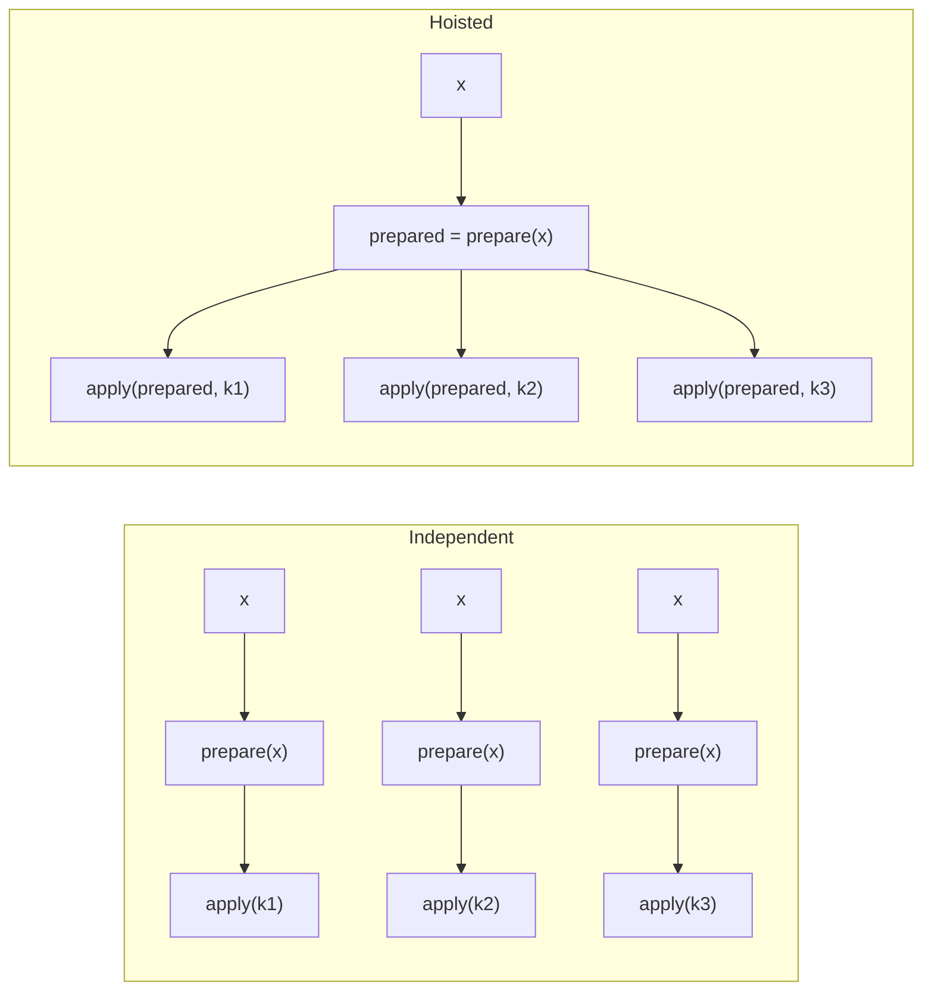

# Rotation hoisting

**Example source:** [`examples/07_rotation_hoisting_benchmark.py`](https://github.com/VisualDust/fhelium/blob/main/examples/07_rotation_hoisting_benchmark.py)

This example benchmarks caller-selected independent rotations against one
caller-selected hoisted group over the same source and direct keys. Rotation
hoisting shares decomposition and preparation derived from one ciphertext; it
is a scheduling choice rather than an implementation selected invisibly by a
backend.

## Rotation API

The method name identifies both cardinality and how the operation selects key
material:

| Method | Rotation selector | Key ownership | Result |
| --- | --- | --- | --- |
| `rotate_by_step` | One signed step | Engine inventory | One ciphertext |
| `rotate_with_key` | One self-described key | Caller | One ciphertext |
| `rotate_many_by_steps` | Ordered signed steps | Engine inventory | Ordered ciphertexts |
| `rotate_many_with_keys` | Ordered self-described keys | Caller | Ordered ciphertexts |

The step-based methods may use installed keys, generate direct keys when
allowed, or compose an available engine-owned key path. The key-based methods
use exactly the supplied direct key objects and do not install them.

Both sequence methods accept `use_hoisting`. `True` forms one scheduled group
from the direct keys in the supplied sequence. `False` executes those direct
rotations independently. Eager execution preserves the caller's offsets and
order; it does not search surrounding operations or regroup them.

## Run the benchmark

```bash
python examples/07_rotation_hoisting_benchmark.py \
  --preset slots32768-scale40-levels34-int64 \
  --counts 4,8,16 \
  --warmup 5 \
  --runs 20
```

Start with fewer runs when checking a new environment:

```bash
python examples/07_rotation_hoisting_benchmark.py \
  --preset slots8192-scale40-levels7-int64 \
  --counts 2,4 \
  --warmup 1 \
  --runs 3
```

## 1. Provision every direct key before timing

```python
for rotation_step in rotation_steps_all:
    _ = engine.rotation_key(rotation_step)
```

Lazy key creation must not appear in a rotation timing. The benchmark creates
the public key and all requested rotation keys before warmup.

## 2. Compare equivalent outputs

Independent path:

```python
[
    engine.rotate_by_step(ciphertext, rotation_step)
    for rotation_step in rotation_steps
]
```

Grouped path:

```python
engine.rotate_many_by_steps(
    ciphertext,
    rotation_steps,
    use_hoisting=True,
)
```

Both request the same set of rotated ciphertexts. The sequence-form API gives
the caller a way to select one hoisted group containing all direct requested
steps. Passing `use_hoisting=False` selects independent execution through the
same Eager API.

## Compile-time scheduling

Compile IR represents independent scheduling with primitive
`fhelium_ckks.rotate` operations. A caller-composed hoisting pass may search
rotations that share an input and replace one selected group with
`fhelium_ckks.hoisted_rotate_many`. The scheduled operation records the chosen
offsets and key symbols. It does not contain the memory budget or policy that
led to the choice.

`HoistRotationsPass` provides deterministic local grouping for callers that
want it. A resource-aware compiler can
instead read caller policy from its Compile workspace, compute groups under
the selected memory limit, and emit the same scheduled operation. The backend consumes that group;
it does not add offsets, split the group, or fall back to independent rotation.

## 3. What can be shared

A rotation applies a Galois automorphism and a key switch. When many rotations
use the same source ciphertext, decomposition and extension work derived from
that source can be prepared once and reused across direct rotation keys.

Conceptually:



The result still contains one ciphertext per requested step. Hoisting reduces
repeated preparation; it does not remove the per-key automorphism/key-switch
work or output memory. The currently selected group therefore remains visible
in the Program rather than existing only inside a native implementation.

## 4. Benchmark without launch-order bias

The example alternates which path runs first on each measured iteration:

```python
if run_idx % 2 == 0:
    independent()
    hoisted()
else:
    hoisted()
    independent()
```

It also synchronizes CUDA around each timing interval, performs warmup, and
reports mean and median. This reduces bias from asynchronous launches,
one-time kernel setup, and temperature drift.

## 5. Interpret the result

The benchmark reports:

- one-by-one mean and median;
- grouped mean and median;
- speedup ratio;
- percentage mean-time saving.

Hoisting tends to become more valuable as the number of rotations from one
source increases. Actual benefit depends on active RNS rows, decomposition
shape, backend, GPU, key residency, and whether the surrounding algorithm can
consume all produced rotations.

::: details Source
<<< @/../examples/07_rotation_hoisting_benchmark.py
:::

## Related concepts and guides

- [Evaluator operation transitions](../concepts/ckks/evaluator-operation-transitions.md)
- [CKKS workload cost model](../concepts/performance/cost-model.md)
- [Benchmark a workload correctly](../how-to/benchmark-a-workload.md)
