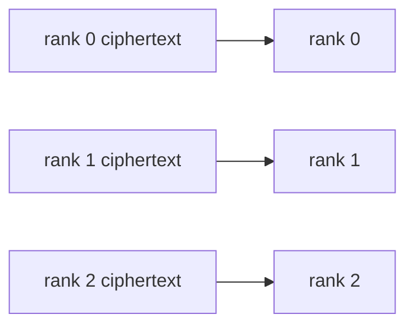

# SPMD over independent ciphertexts

**Example source:** [`examples/08_spmd_independent_ciphertexts.py`](https://github.com/VisualDust/fhelium/blob/main/examples/08_spmd_independent_ciphertexts.py)

This example scatters independent encrypted inputs, evaluates the same public
affine transform on every rank, and gathers distinct outputs. The tutorial
explains the data-parallel SPMD pattern and why its results are gathered rather
than reduced.

## Run on one process

```bash
python examples/08_spmd_independent_ciphertexts.py
```

## Run on two local GPUs

```bash
torchrun --standalone --nproc-per-node=2 \
  examples/08_spmd_independent_ciphertexts.py
```

The same source supports world size one and multiple ranks.

## 1. Initialize process-local SPMD state

```python
import fhelium.distributed as dist

dist.init()
engine = fh.CkksEngine(
    fh.Preset.slots32768_scale40_levels34_int64,
    device=dist.local_device(),
    allow_sk_gen=False,
)
```

`dist.init()` reads the standard `torchrun` rank environment and initializes a
real process group. Each process creates one local engine for one local CUDA
device. There is no multi-device engine object or hidden placement runtime.

## 2. Keep secret material on the data-owner rank

```python
if dist.get_rank() == 0:
    secret_key = engine.create_secret_key()
    public_key = engine.create_public_key(secret_key)
    encrypted_inputs = [
        engine.encrypt_message(message, public_key)
        for message in messages
    ]
else:
    secret_key = None
    encrypted_inputs = None
```

Only rank zero encrypts and decrypts. Worker ranks execute a public
plaintext-ciphertext affine transform and therefore need no key material.
`allow_sk_gen=False` guards against accidental local secret generation.

## 3. Scatter independent logical values

```python
local_input = dist.scatter_ciphertexts(encrypted_inputs, src=0)
```

Rank `r` receives the encrypted sample intended for rank `r`:



The typed collective transmits enough metadata to reconstruct the
receiver `Ciphertext`. It does not infer application sample identity.

## 4. Broadcast one shared public parameter

```python
weight = dist.broadcast_plaintext(root_weight, src=0)
```

The model weight is one logical [`Plaintext`](../api/fhelium/core/plaintext.md#plaintext) replicated
to every rank. This is different from scattering independent request
ciphertexts.

## 5. Evaluate the same program locally

```python
local_output = engine.rescale_to_next_level(
    engine.ntt_domain_to_coefficient_domain(
        engine.multiply_plaintext(
            engine.coefficient_domain_to_ntt_domain(local_input), weight
        )
    )
)

bias = engine.prepare_plaintext_for_addition(
    engine.encode(
        bias_message,
        level=local_output.level,
        scale=local_output.scale,
    )
)
local_output = engine.add_plaintext(local_output, bias)
```

Each rank owns its local activation and creates a rank-specific public bias.
The multiplication does not rescale implicitly, so the level transition is
visible in the source.

## 6. Gather; do not reduce

```python
outputs = dist.gather_ciphertexts(local_output, dst=0)
```

The outputs correspond to different samples and must remain separate:

```text
[output rank 0, output rank 1, ...]
```

An arithmetic reduction would add unrelated encrypted samples and change the
workload meaning. Rank zero decrypts each gathered output with the one retained
secret key.

## When to use this pattern

Use scatter/evaluate/gather when:

- ranks process independent requests or batch elements;
- every rank executes the same program;
- model plaintexts can be replicated;
- outputs must preserve request or sample identity.

For additive contributions to one output, use the
[rotation-parallel matrix-vector pattern](spmd-rotation-parallel-matvec.md)
instead.

::: details Complete runnable source
<<< @/../examples/08_spmd_independent_ciphertexts.py
:::

## Related concepts and guides

- [Rank-local SPMD model](../concepts/distributed/spmd-model.md)
- [Communication semantics](../concepts/distributed/communication-semantics.md)
- [Choose a multi-GPU partition](../how-to/choose-multi-gpu-partition.md)
