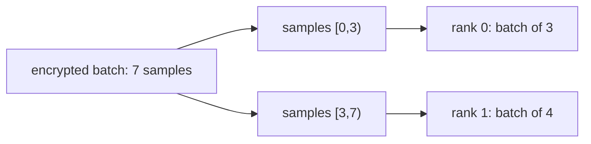

# Data-parallel encrypted batches

**Example source:** [`examples/21_distributed_batch_inputs.py`](https://github.com/VisualDust/fhelium/blob/main/examples/21_distributed_batch_inputs.py)

This example starts with one encrypted batch of independent samples. The data owner assigns each rank a consecutive sample interval. Ranks evaluate the same public affine model on their sub-batches, then return their distinct outputs for decryption and concatenation in original sample order.

This is a centralized-input data-parallel workload. Other applications can provision rank-local inputs directly and do not need an input scatter.

## Run

```bash
python examples/21_distributed_batch_inputs.py --batch-size 7

torchrun --standalone --nproc-per-node=2 \
  examples/21_distributed_batch_inputs.py --batch-size 7
```

`--batch-size` is the global number of samples, not a per-rank size. The example requires at least one sample per participating rank. Seven samples on two ranks produce sub-batches of three and four samples. `--preset` selects the CKKS configuration. `dist.init()` uses rank-local CUDA devices when available and CPU otherwise; Tensor factories follow the selected PyTorch default device.

## 1. Encrypt one batch on the data-owner rank

Rank zero constructs a clear Tensor with shape `[batch_size, sample_width]`, creates one encryption key pair, and encrypts the entire batch:

```python
if rank == 0:
    secret_key = engine.create_secret_key()
    public_key = engine.create_public_key(secret_key)
    encrypted_batch = engine.encrypt_message(messages, public_key)
```

The resulting `Ciphertext` has `batch_shape=(batch_size,)`. Worker ranks need no keys for this plaintext-ciphertext model. Encryption and decryption remain on rank zero.

## 2. Choose sample intervals and create local views

The application uses a near-even consecutive partition:

```python
batch_ranges = [
    (owner * batch_size // world_size,
     (owner + 1) * batch_size // world_size)
    for owner in range(world_size)
]

if rank == 0:
    chunks = [
        encrypted_batch.slice_batch(start, stop)
        for start, stop in batch_ranges
    ]
else:
    chunks = None
```

`slice_batch(start, stop, dim=0)` indexes a **logical batch axis**, excluding the component and RNS axes. It retains the selected axis, including a one-item interval, and accepts negative `dim` values. Intervals are nonempty half-open ranges with nonnegative bounds. The result shares Tensor storage and preserves depth, scale, prime IDs, and representation state.

The same local slice interface is available on `Plaintext` and `CompressedPlaintext` when an application needs corresponding plaintext sub-batches. This example instead uses one shared, unbatched model weight.

The interval list is application policy. Neither `slice_batch` nor the collective chooses a partition or infers sample identity.

## 3. Scatter sub-batches

```python
local_input = dist.scatter_ciphertexts(chunks, src=0)
weight = dist.broadcast_plaintext(root_weight, src=0)
```

Each entry in `chunks` is a batched ciphertext; it need not contain the same number of samples as the other entries. The existing typed scatter transmits their shapes and state. It also handles communication packing when the source batch views are non-contiguous. No specialized batch-scatter API is required.



## 4. Evaluate the same model on every rank

For each sample $x_b$, the model is

$$
y_b = 1.25x_b - 0.003.
$$

The coefficients do not depend on rank or partition. Engine operations process the entire local batch; there is no Python loop over local samples:

```python
local_output = engine.rescale_to_next_depth(
    engine.ntt_domain_to_coefficient_domain(
        engine.multiply_plaintext(
            engine.coefficient_domain_to_ntt_domain(local_input), weight
        )
    )
)
local_output = engine.add_plaintext(local_output, bias)
```

The shared weight is broadcast. Each rank encodes the same bias using the result's depth and actual scale. Multiplication and rescale remain separate operations.

## 5. Gather and restore sample order

```python
outputs = dist.gather_ciphertexts(local_output, dst=0)
```

The source receives sub-batches in process-group-rank order. Since the chosen intervals are consecutive in that order, rank zero can decrypt each sub-batch and concatenate the clear results along their batch axis:

```python
decoded = torch.cat(
    [
        engine.decrypt_message(output, secret_key=secret_key, is_real=True)
        .cpu()[..., :sample_width]
        for output in outputs
    ],
    dim=0,
)
```

The reconstructed clear Tensor has shape `[batch_size, sample_width]` and is checked against the same affine model applied to the original input batch. An arithmetic reduction would add different samples together and change the workload meaning.

## Related usage models

- [Homogeneous batching](homogeneous-batching.md) compares single-device batched execution with per-sample execution. This example distributes sub-batches across ranks instead.
- [Rotation-parallel matrix-vector multiplication](spmd-rotation-parallel-matvec.md) distributes contributions to one result and therefore uses arithmetic reduction.
- [Communication semantics](../concepts/distributed/communication-semantics.md) distinguishes independent samples, additive partials, and RNS shards.

::: details Source
<<< @/../examples/21_distributed_batch_inputs.py
:::
