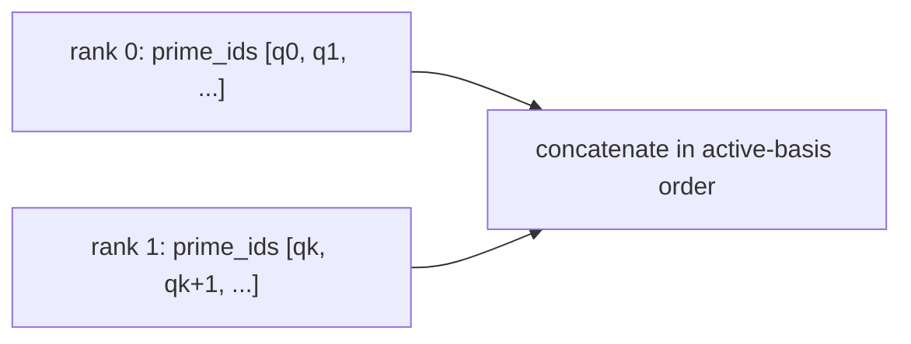

# Limb-parallel ciphertext pipeline

**Example source:** [`examples/10_spmd_limb_parallel_pipeline.py`](https://github.com/VisualDust/fhelium/blob/main/examples/10_spmd_limb_parallel_pipeline.py)

This example partitions one logical ciphertext along its active RNS-limb axis,
runs limb-local addition and multiplication, and reconstructs the complete
basis for global transitions. The tutorial identifies the required gather
points in that pipeline.

## Run on two GPUs

```bash
torchrun --standalone --nproc-per-node=2 \
  examples/10_spmd_limb_parallel_pipeline.py
```

The example evaluates $(a+b)^2$.

## 1. Define contiguous limb ranges

```python
ranges = [
    (
        rank * limb_count // world_size,
        (rank + 1) * limb_count // world_size,
    )
    for rank in range(world_size)
]
```

Each shard is created with:

```python
ciphertext.slice_limbs(start, stop)
```

The resulting value keeps an ordered contiguous interval of the parent
`prime_ids`. Rank number alone is not enough to reconstruct RNS identity.

## 2. Scatter and add limb-local values

```python
local_a = dist.scatter_ciphertext_limbs(shards_a, src=0)
local_b = dist.scatter_ciphertext_limbs(shards_b, src=0)
local_sum = engine.add(local_a, local_b)
```

Ciphertext addition is independent for each modulus row. Every rank can apply
the public engine operation to its local interval without receiving the
other rows.

## 3. Gather before a complete-row transition

```python
full_sum = dist.gather_ciphertext_limbs(local_sum, dst=0)
prepared_sum = engine.coefficient_domain_to_ntt_domain(full_sum)
```

NTT conversion preserves the level and operates independently on each modulus,
but the example reconstructs the complete ciphertext before repartitioning so
rank zero can derive and transmit one active-basis layout.

## 4. Multiply local intervals

```python
local_operand = dist.scatter_ciphertext_limbs(prepared_shards, src=0)
local_triplet = engine.multiply(local_operand, local_operand)
```

Once both operands satisfy the fixed preconditions, ciphertext multiplication
is independent per active modulus row. Each rank produces the same local
three-component structure over its own prime interval.

## 5. Reconstruct before relinearization

```python
full_triplet = dist.gather_ciphertext_limbs(local_triplet, dst=0)
result = engine.rescale_to_next_level(
    engine.relinearize(full_triplet, relinearization_key)
)
```

Relinearization uses the complete hybrid decomposition/key-switch layout, so it is
kept on rank zero after structural reconstruction. Worker ranks never receive
the relinearization key. The product carries the pending $\Delta^2$ scale;
rescale then drops one leading Q prime using cross-prime information and records
the actual output scale $\Delta^2/q_{\mathrm{drop}}$; it does not reset the
value to `default_scale`.

## Gather is not reduce

`gather_ciphertext_limbs` concatenates disjoint prime intervals:



It does not add the rows. An arithmetic reduction would combine residues that
belong to different moduli and destroy the ciphertext structure.

## When this pattern helps

Limb partitioning is useful when:

- one complete value or prepared parameter is too large for the desired
  per-device budget;
- there is enough expensive limb-local work between scatter/gather phases;
- the application can keep operations requiring every active row sparse and
  explicit.

It is less attractive when every operation immediately needs reconstruction;
communication then dominates the local modular arithmetic.

::: info The engine accepts validated local intervals
Rank-local operations still use public `CkksEngine` methods. The engine
validates context, device, ring dimension, modulus basis, and contiguous ordered
`prime_ids`; the distributed facade does not introduce a separate sharded
value type.
:::

::: details Complete runnable source
<<< @/../examples/10_spmd_limb_parallel_pipeline.py
:::

## Related concepts and guides

- [Communication semantics](../concepts/distributed/communication-semantics.md)
- [RNS and NTT architecture](../developer/rns-and-ntt.md)
- [Choose a multi-GPU partition](../how-to/choose-multi-gpu-partition.md)
