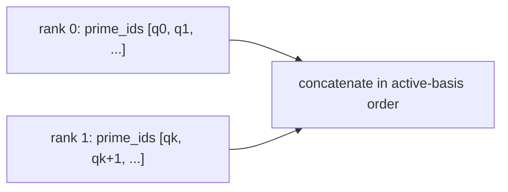

# Limb-parallel ciphertext pipeline

**Example source:** [`examples/23_distributed_rns_shards.py`](https://github.com/VisualDust/fhelium/blob/main/examples/23_distributed_rns_shards.py)

This example partitions one logical ciphertext along its active RNS-limb axis, runs limb-local addition and multiplication, and reconstructs the complete basis before relinearization and rescale. The application chooses each rank's interval; the scatter interface slices the source and transfers those views.

`--preset` selects the CKKS configuration. `dist.init` selects the rank-local CUDA device when available and CPU otherwise; the same source supports a world-size-one launch or multiple ranks.

## Run on two GPUs

```bash
torchrun --standalone --nproc-per-node=2 \
  examples/23_distributed_rns_shards.py
```

The example evaluates $(a+b)^2$.

## 1. Define contiguous limb ranges

```python
ranges = [
    (
        rank * limb_count // world_size,
        (rank + 1) * limb_count // world_size,
    )
    for rank in range(world_size)
]
```

These half-open intervals index the source ciphertext's stored limb axis. They are supplied in process-group-rank order and can have unequal lengths. Only the source rank supplies the ciphertext and interval list. For example, source `prime_ids=(4, 5, 6, 7)` with ranges `[(0, 2), (2, 4)]` produces shards with prime IDs `(4, 5)` and `(6, 7)`; the intervals are not global prime IDs.

The collective uses `Ciphertext.slice_limbs` to preserve the selected row descriptions. It does not choose a partition or validate cryptographic provenance. The source's local shard shares its original storage; remote shards use receive storage. To distribute values that are already prepared, use `scatter_ciphertexts`.

## 2. Scatter and add limb-local values

```python
local_a = dist.scatter_ciphertext_limbs(
    ciphertext_a,
    limb_ranges=ranges if dist.get_rank() == 0 else None,
    src=0,
)
local_b = dist.scatter_ciphertext_limbs(
    ciphertext_b,
    limb_ranges=ranges if dist.get_rank() == 0 else None,
    src=0,
)
local_sum = engine.add(local_a, local_b)
```

Ciphertext addition is independent for each modulus row. Every rank can apply the public engine operation to its local interval without receiving the other rows.

## 3. Choose where to prepare NTT form

```python
full_sum = dist.gather_ciphertext_limbs(local_sum, dst=0)
prepared_sum = (
    engine.coefficient_domain_to_ntt_domain(full_sum)
    if dist.get_rank() == 0 else None
)
```

NTT conversion preserves the depth and operates independently on each modulus, so this gather is a scheduling choice, not an NTT requirement. This example prepares the complete result on rank zero before scattering it again. Another schedule could retain the shards and transform them on their owning ranks.

## 4. Multiply local intervals

```python
local_operand = dist.scatter_ciphertext_limbs(
    prepared_sum,
    limb_ranges=ranges if dist.get_rank() == 0 else None,
    src=0,
)
local_triplet = engine.multiply(local_operand, local_operand)
```

Once both operands satisfy the fixed preconditions, ciphertext multiplication is independent per active modulus row. Each rank produces the same local three-component structure over its own prime interval.

## 5. Reconstruct before relinearization

```python
full_triplet = dist.gather_ciphertext_limbs(local_triplet, dst=0)
result = engine.rescale_to_next_depth(
    engine.relinearize(full_triplet, relinearization_key)
)
```

Relinearization uses the complete hybrid decomposition/key-switch layout, so it is kept on rank zero after structural reconstruction. Worker ranks never receive the relinearization key. The product carries the pending $\Delta^2$ scale; rescale then drops the complete leading Q depth group using cross-prime information and records the actual output scale $\Delta^2/M_{\mathrm{drop}}$, where $M_{\mathrm{drop}}$ is that group's prime product; it does not reset the value to `default_scale`.

## Gather reconstructs disjoint limb rows

`gather_ciphertext_limbs` concatenates disjoint prime intervals:



It does not add the rows. An arithmetic reduction would combine residues that belong to different moduli and destroy the ciphertext structure.

## When this pattern helps

Limb partitioning is useful when:

- one complete value or prepared parameter is too large for the desired per-device budget;
- there is enough expensive limb-local work between scatter/gather phases;
- the application can keep operations requiring every active row sparse and explicit.

It is less attractive when every operation immediately needs reconstruction; communication then dominates the local modular arithmetic.

::: details Source
<<< @/../examples/23_distributed_rns_shards.py
:::

## Related concepts and guides

- [Communication semantics](../concepts/distributed/communication-semantics.md)
- [RNS and NTT architecture](../developer/rns-and-ntt.md)
- [Choose a multi-GPU partition](../how-to/choose-multi-gpu-partition.md)
