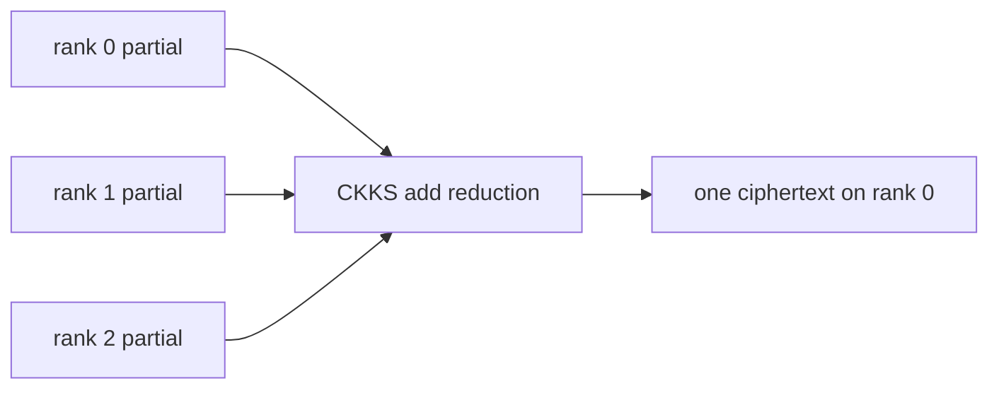

# Rotation-parallel matrix-vector multiplication

**Example source:** [`examples/09_spmd_rotation_parallel_mxv.py`](https://github.com/VisualDust/fhelium/blob/main/examples/09_spmd_rotation_parallel_mxv.py)

This example partitions the cyclic-diagonal terms and direct rotation keys of
one packed matrix-vector product across ranks, then reduces additive
ciphertext partials. The tutorial explains term ownership, key movement, and
the final reduction step.

## Run on two GPUs

```bash
torchrun --standalone --nproc-per-node=2 \
  examples/09_spmd_rotation_parallel_mxv.py \
  --size 8
```

The matrix size must divide the CKKS slot count, and the world size must not
exceed the matrix size.

## 1. Express matrix-vector multiplication with cyclic diagonals

For a packed vector `x`, the example evaluates:

$$
\mathbf{y}
=
\sum_{s=0}^{n-1}
\mathbf{d}_s \odot \operatorname{Rot}(\mathbf{x}, s),
$$

where $\mathbf{d}_s$ is the cyclic diagonal aligned with rotation step
$s$, and $\odot$ denotes slot-wise multiplication.

The diagonal aligned with step `s` is built by:

```python
row = torch.arange(num_slots) % size
column = torch.remainder(row - rotation_step, size)
diagonal = matrix[row, column]
```

Repeating the input vector periodically across all slots lets each slot block
evaluate the same small matrix-vector problem.

## 2. Replicate one encrypted input

```python
source = dist.broadcast_ciphertext(root_source, src=0)
```

Every rank needs the complete source because each rank rotates it by a
different subset of steps. This is one logical ciphertext replicated for
parallel evaluation, not independent data-parallel samples.

## 3. Partition terms by rotation step

```python
local_rotation_steps = list(
    range(dist.get_rank(), size, dist.get_world_size())
)
```

For two ranks and size eight:

```text
rank 0: steps 0, 2, 4, 6
rank 1: steps 1, 3, 5, 7
```

The cyclic assignment balances the number of diagonal terms. A production
algorithm may choose another owner function based on measured cost or
key locality.

## 4. Move only the direct keys each owner retains

Rank zero creates each key:

```python
source_key = engine.create_rotation_key(rotation_step, secret_key)
```

All ranks participate in the typed broadcast when the owner is remote, but
only that owner retains the transferred object:

```python
transferred_key = dist.broadcast_key(source_key, src=0)
if dist.get_rank() == owner:
    local_keys[rotation_step] = transferred_key
else:
    del transferred_key
```

The secret key never leaves rank zero. FHElium does not infer step ownership
or key placement.

## 5. Evaluate local diagonal terms

```python
rotated = (
    source.clone()
    if rotation_step == 0
    else engine.rotate_with_key(source, local_keys[rotation_step])
)
diagonal = engine.prepare_plaintext_for_multiplication(
    engine.encode(diagonal_slots, level=rotated.level)
)
term = engine.rescale_to_next_level(
    engine.ntt_domain_to_coefficient_domain(
        engine.multiply_plaintext(
            engine.coefficient_domain_to_ntt_domain(rotated), diagonal
        )
    )
)
```

All local terms reach the same level and scale, so they can be summed with
`engine.sum_ciphertexts`.

## 6. Reduce additive partials

```python
local_partial = engine.sum_ciphertexts(local_terms)
dist.reduce_ciphertext(local_partial, dst=0, engine=engine)
```

Unlike the independent-ciphertext example, rank identity is no longer part of
the result. Each local ciphertext represents a partial sum of the same
mathematical output, so a typed ciphertext addition reduction is correct.



Raw integer reduction of `ciphertext.data` is not a substitute for the typed
collective because receiver construction and CKKS compatibility remain part of
the operation.

## Capacity implication

This partition can reduce per-rank rotation-key residency, but the input is
replicated and every rank produces local terms. Measure:

- aggregate and maximum-rank key bytes;
- input replication;
- diagonal plaintext residency;
- reduction communication;
- load balance across step owners.

::: details Complete runnable source
<<< @/../examples/09_spmd_rotation_parallel_mxv.py
:::

## Related concepts and guides

- [Communication semantics](../concepts/distributed/communication-semantics.md)
- [Key lifecycle](../concepts/ckks/key-lifecycle.md)
- [Choose a multi-GPU partition](../how-to/choose-multi-gpu-partition.md)
