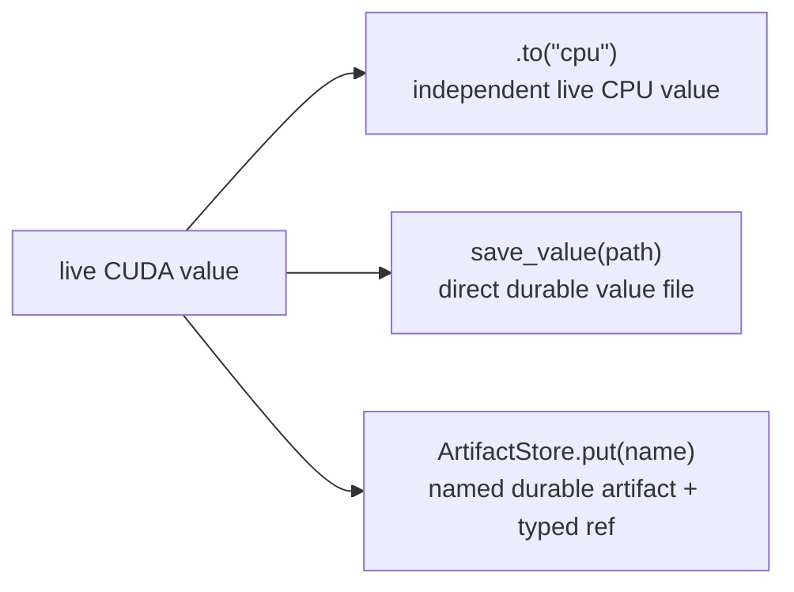

# Values, memory, and persistence

**Example source:** [`examples/03_plaintext_ciphertext_memory.py`](https://github.com/VisualDust/fhelium/blob/main/examples/03_plaintext_ciphertext_memory.py)

This example compares level-dependent value sizes, moves live values between
devices, and round-trips values through direct files and optional
artifacts. The tutorial separates three concepts that are easy to conflate:

1. a live value's current device residency;
2. a value file at a caller-selected path;
3. artifact naming and durability policy.

## Run the example

Use a temporary output directory:

```bash
python examples/03_plaintext_ciphertext_memory.py \
  --preset slots8192-scale40-levels7-int64 \
  --levels 0,1,2
```

Keep the generated files for inspection:

```bash
python examples/03_plaintext_ciphertext_memory.py \
  --preset slots8192-scale40-levels7-int64 \
  --levels 0,1,2 \
  --output-dir /tmp/fhelium-value-demo
```

## 1. Compare level-dependent value size

```python
plaintext = engine.encode(message, level=level)
ciphertext = engine.encrypt(plaintext)

print(ciphertext.limb_count)
print(ciphertext.nbytes)
print(plaintext.nbytes)
```

A ciphertext owns one tensor with shape
`[component, *batch, active Q limb, coefficient]`. This example is unbatched,
so its `*batch` prefix is empty. As the level increases, active Q rows are
removed and the dense tensor becomes smaller.

An unprepared or canonical plaintext can be much smaller than an
operation-ready RNS plaintext. Compare:

```python
canonical = engine.encode(factor_message, level=ciphertext.level)
prepared = engine.prepare_plaintext_for_multiplication(
    engine.encode(factor_message, level=ciphertext.level)
)
```

The prepared form pays storage for every active RNS row so that the arithmetic
operation does not need to perform that conversion at request time.

## 2. Move a live value functionally

```python
ciphertext_cpu = ciphertext.to("cpu")
factor_cpu = prepared.to("cpu")
```

Movement follows PyTorch-style functional ownership. The returned value owns
the new residency; the original CUDA value is not automatically destroyed.
To release its GPU allocation, remove every live reference to the original
value after synchronization and after all consumers have finished.

`torch.cuda.empty_cache()` concerns allocator-reserved blocks and is normally
not an object-level lifecycle operation.

## 3. Save one value file

```python
fh.save_value(
    ciphertext_cpu,
    "activation.safetensors",
    overwrite=True,
)
```

The core serialization API writes one versioned safetensors file. It preserves
the value type and cryptographic metadata but deliberately owns no
namespace, tenant, cache, or eviction policy.

Inspect without materializing tensors:

```python
metadata = fh.inspect_value("activation.safetensors")
```

Restore to the target device and require the expected type:

```python
restored = fh.load_value(
    "activation.safetensors",
    expected_type=fh.Ciphertext,
    device=engine.device,
)
```

## 4. Reuse a named value through `ArtifactStore`

The repository API deliberately uses different vocabulary from the direct
file codec:

| Mechanism | Write | Read |
| --- | --- | --- |
| Caller-owned value file | `fh.save_value(value, path)` | `fh.load_value(path)` |
| Named artifact repository | `store.put(name, value)` | `store.get(name_or_ref)` |

The shortest cache-style use does not require an `ArtifactRef`:

```python
from fhelium.artifacts import ArtifactStore

store = ArtifactStore(root / "artifact-store")

prepared = store.get(
    "model/example/prepared-factor",
    expected_type=fh.Plaintext,
    device=engine.device,
)
if prepared is None:
    prepared = engine.prepare_plaintext_for_multiplication(
        engine.encode(factor_message, level=ciphertext.level)
    )
    store.put("model/example/prepared-factor", prepared)

result_ntt = engine.multiply_plaintext(
    engine.coefficient_domain_to_ntt_domain(ciphertext), prepared
)
```

`get(name)` returns `None` only when that logical name has no current
generation. Corrupt payloads, checksum failures, context mismatches, and type
mismatches remain errors; they are not treated as cache misses.

### Persist a live value

`put` accepts a supported live FHElium value and publishes one durable
generation under a logical name:

```python
activation_ref = store.put(
    "requests/example/activation",
    ciphertext_cpu,
)
```

- `ciphertext_cpu` remains a live `Ciphertext` and continues to own its tensors
  after `put` returns. Publication does not move, offload, mutate, or destroy
  the input value.
- `activation_ref` is a tensor-free `ArtifactRef[Ciphertext]`; it contains no
  ciphertext tensor payload. It records the store identity, logical name,
  identified generation, value type, context identity, logical tensor bytes, and
  payload checksum.
- The store now owns an independent durable payload and binds
  `"requests/example/activation"` to that generation.

Materialize that generation by passing the reference back to the store:

```python
restored_activation = store.get(
    activation_ref,
    expected_type=fh.Ciphertext,
    device=engine.device,
)
```

`restored_activation` is a reconstructed live `Ciphertext` on the requested
device. It is distinct from both the tensor-free `activation_ref` and the
original `ciphertext_cpu` object. A checked `ArtifactRef` never produces
`None`: if its generation was replaced or deleted, `get(activation_ref)` raises
`StaleArtifactReferenceError`.

Applications that need the current generation rather than a particular
generation use the logical name:

```python
current = store.get(
    "requests/example/activation",
    expected_type=fh.Ciphertext,
)
if current is None:
    ...  # no current generation
```

### Value and reference lifecycle

| Operation | Live values | `ArtifactRef` values | Repository state |
| --- | --- | --- | --- |
| `activation_ref = store.put(name, ciphertext_cpu)` | `ciphertext_cpu` remains live and unchanged | `activation_ref` identifies the published generation | New durable payload becomes current |
| `del ciphertext_cpu` | Removes only that Python reference; allocator release follows ordinary PyTorch lifetime rules | `activation_ref` remains usable | Artifact remains current |
| `del activation_ref` | Does not affect any live value | Only the application reference disappears | Artifact remains current and can still be found by name |
| `restored = store.get(activation_ref)` | Creates a reconstructed live value on the requested device | `activation_ref` remains unchanged | Artifact remains current |
| `replacement_ref = store.put(name, replacement, overwrite=True)` | `replacement` remains live | `replacement_ref` is current; `activation_ref` becomes stale | Old payload is retired after active readers finish; no history is retained |
| `store.delete(replacement_ref)` | Existing `replacement` or `restored` values are not destroyed | `replacement_ref` becomes stale | Current name binding and payload are removed |

Deleting a live value, deleting an `ArtifactRef`, and deleting a repository
artifact are therefore three independent operations. Persisting a CUDA value
also does not release its CUDA allocation; remove all live CUDA references
when the computation no longer needs them.

### Supported persisted value state

Artifact payloads use the same value schema as `save_value`. Supported
types and their persisted state are:

| Value type | Tensor payloads | Persisted type-specific state |
| --- | --- | --- |
| `Plaintext` | Exactly one of `message` or `data` | Context ID, level, scale, representation, polynomial domain, modulus basis, residue representation, prime IDs, and the corresponding presence flag |
| `CompressedPlaintext` | `data` and optional `implicit_data` | Context ID, ring dimension, compression layout/version, level, scale, domain/basis/residue state, and prime IDs |
| `Ciphertext` | `data` | Context ID, level, actual scale, polynomial domain, modulus basis, residue representation, and prime IDs |
| `PublicKey`, `KeySwitchKey`, `RelinearizationKey`, `ConjugationKey` | `data` | Concrete key type, context ID, prime IDs, and domain/basis/residue state |
| `RotationKey` | `data` | The common key state plus canonical `rotation_step` |
| `SecretKey` | `data` | The common key state; persistence requires `allow_secret=True` and remains unencrypted |

Each tensor is snapshotted as a dense contiguous CPU payload. Logical shape,
dtype, value type, and supported cryptographic state are reconstructed;
original device, stride, storage offset, and tensor aliasing are not persistent
value identity. `get` defaults to CPU and materializes on another device only
when `device=...` requests it.

The schema does not persist an engine, `CkksConfig`, encoder, application object
graph, arbitrary `torch.Tensor`, Python containers, `EvaluationKeySet`, or
JIT `Program` objects. Persist a program through its textual IR interface,
persist supported component values separately, and reconstruct
application-owned aggregates.

### Generation replacement

```python
replacement_ref = store.put(
    "requests/example/activation",
    ciphertext_cpu,
    overwrite=True,
)

artifact_ciphertext = store.get(
    replacement_ref,
    expected_type=fh.Ciphertext,
    device=engine.device,
)
```

`ArtifactStore` is layered on the same typed value-file primitives. A SQLite
catalog records each logical name's one current generation, while immutable
store-controlled safetensors objects retain the payloads. The store adds
typed references, collections, checksums, and transactional replacement
without changing the reconstructed `Ciphertext` or `Plaintext` type.

Calling `put(..., overwrite=True)` publishes a new artifact ID for that name.
The returned reference identifies the new current generation; any earlier
reference for the same name becomes stale rather than remaining as loadable
version history. Without `overwrite=True`, putting an already-present name
raises `FileExistsError`.

In multiple processes, two callers may both compute a missing value before
either publishes it. SQLite guarantees that at most one create succeeds. A
losing caller can catch `FileExistsError`, discard its duplicate prepared
value if appropriate, and call `get(name)` to use the winner.

## 5. Prove the restored state is usable

```python
result = engine.rescale_to_next_level(
    engine.ntt_domain_to_coefficient_domain(
        engine.multiply_plaintext(
            engine.coefficient_domain_to_ntt_domain(restored_ciphertext),
            restored_factor,
        )
    )
)
decoded = engine.decrypt_message(result)
```

Round-trip tests should evaluate a real operation, not only compare bytes.
That catches lost level, polynomial domain, modulus basis, Montgomery, scale, or prime-ID
metadata that a raw tensor equality check could miss.

## Lifecycle summary



None of these operations implicitly destroys another live value. Residency,
durability, and application cache policy remain separate decisions.

::: details Complete runnable source
<<< @/../examples/03_plaintext_ciphertext_memory.py
:::

## Related concepts and guides

- [Value model and identity](../concepts/ckks/value-model-and-identity.md)
- [Serialization and artifacts](../concepts/execution/serialization-and-artifacts.md)
- [Manage artifacts by logical name](../how-to/manage-artifacts.md)
- [Residency lifetimes](../concepts/execution/residency-lifetimes.md)
