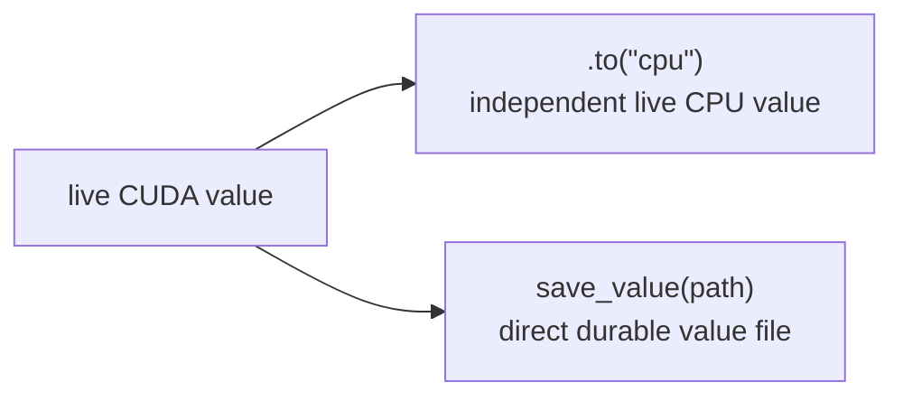

# Values, memory, and persistence

**Example source:** [`examples/09_value_files.py`](https://github.com/VisualDust/fhelium/blob/main/examples/09_value_files.py)

Example 09 follows a live value through device movement, a caller-owned file, and restored numerical evaluation. [Example 10](artifact-store.md) separately covers named storage and generation-specific references.

## Run the example

Use a temporary output directory:

```bash
python examples/09_value_files.py \
  --preset slots8192-scale40-depth7-int64 \
  --depth 0
```

Keep the generated files for inspection:

```bash
python examples/09_value_files.py \
  --preset slots8192-scale40-depth7-int64 \
  --depth 0 \
  --output-dir /tmp/fhelium-value-demo
```

## 1. Inspect typed payloads

The example prints each value's device and logical byte count. A ciphertext owns component and prime-row axes; an operation-ready plaintext carries RNS data, while an encoded plaintext may retain a smaller coefficient payload. The [modulus-chain example](modulus-chain-depth.md) covers how depth changes row counts.

## 2. Move a live value functionally

```python
ciphertext_cpu = ciphertext.to("cpu")
factor_cpu = prepared.to("cpu")
```

Movement follows PyTorch-style functional ownership. The returned value owns the new residency; the original CUDA value is not automatically destroyed. To release its GPU allocation, remove every live reference to the original value after synchronization and after all consumers have finished.

`torch.cuda.empty_cache()` concerns allocator-reserved blocks and is normally not an object-level lifecycle operation.

## 3. Save one value file

```python
fh.save_value(
    ciphertext_cpu,
    "activation.safetensors",
    overwrite=True,
)
```

The core serialization API writes one versioned safetensors file. It preserves the value type and cryptographic metadata but deliberately owns no namespace, tenant, cache, or eviction policy.

Inspect without materializing tensors:

```python
metadata = fh.inspect_value("activation.safetensors")
```

Restore to the target device and require the expected type:

```python
restored = fh.load_value(
    "activation.safetensors",
    expected_type=fh.Ciphertext,
    device=torch.get_default_device(),
)
```

## 4. Prove the restored state is usable

```python
result = engine.rescale_to_next_depth(
    engine.ntt_domain_to_coefficient_domain(
        engine.multiply_plaintext(
            engine.coefficient_domain_to_ntt_domain(restored_ciphertext),
            restored_factor,
        )
    )
)
decoded = engine.decrypt_message(result)
```

Round-trip tests should evaluate a real operation, not only compare bytes. That catches lost depth, polynomial domain, modulus basis, Montgomery, scale, or prime-ID metadata that a raw tensor equality check could miss.

## Lifecycle summary



None of these operations implicitly destroys another live value. Residency, durability, and application cache policy remain separate decisions.

::: details Source
<<< @/../examples/09_value_files.py
:::

## Related concepts and guides

- [Value model and identity](../concepts/ckks/value-model-and-identity.md)
- [Serialization and artifacts](../concepts/execution/serialization-and-artifacts.md)
- [Manage artifacts by logical name](../how-to/manage-artifacts.md)
- [Residency lifetimes](../concepts/execution/residency-lifetimes.md)
